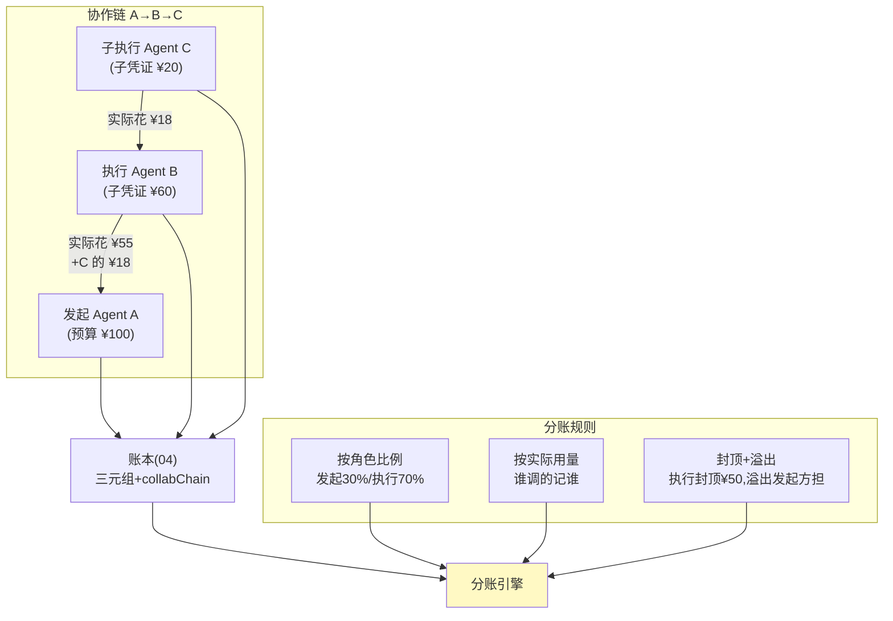

# 05-迭代四：多 Agent 分账——费用归因 / 分账规则 / 押金与追缴

> **定位**：多 Agent 协作任务（A 委托 B、B 调 C）的费用**归因**（谁发起/谁执行/谁受益三分）、**分账规则引擎**（按角色拆账）、**押金与预算代持**（下游 Agent 先押后用）、**超支追缴**（超了向谁追）。读者画像：要回答"多 Agent 干活，账怎么分"的读者。前置阅读：[04-迭代三-支付轨道与幂等](04-迭代三-支付轨道与幂等.md)、[教程 45-授权与最小权限]。
>
> **铁律 0**：分账自研「概念代码」。

---

## 一、四问

| 问 | 答 |
|----|----|
| **新增了什么需求** | ① 费用归因模型：每笔支出挂三元组（发起人/执行 Agent/受益方）+ 协作链（A→B→C 传递路径）② 分账规则引擎：按角色比例/按实际用量/封顶+溢出三种拆法可配 ③ 押金代持：上游 Agent 向下游划拨子预算（子委托凭证），下游超额自己垫或停 ④ 超支追缴：责任链判定（执行超预算→执行方；需求变更高成本→发起方）→ 追缴单 |
| **影响了哪些模块** | 新增 `split-svc`；04 账本事件增加 `collabChain` 字段；02 委托凭证支持"子凭证签发"（权限只能缩不能放——子凭证 scope ⊆ 父凭证） |
| **架构如何演进** | 单 Agent 账 → 协作账（费用沿委托链流动） |
| **上一版痛点** | 账本只有 sessionId——协作任务的账记在最后执行者头上，发起方月底看不懂自己的账（04 §六） |

**本迭代验收**：① 三元组归因覆盖 100% 支出 ② 子凭证权限收缩校验（放权签发被拒）③ 押金闭环（划拨-使用-回收差额）④ 追缴责任判定可回溯（依据事件链）。

---

## 二、费用归因与委托链



**核心不变式**：∑各环节实际支出 ≤ 父凭证额度——押在凭证链上强制，不靠事后对账。

## 三、押金与子凭证

- **划拨即子凭证**：A 给 B 划 ¥60 ≠ 转账，而是签发 scope 收缩的子凭证（工具集⊆、单笔上限⊆、时效更短）——A 的账上是一笔"代持支出"，B 的账上是"代持收入+自己的预算"。
- **回收**：任务结束，子凭证余额自动回收（差额冲正事件）——不需要 B"还钱"这个主动动作。

## 四、超支追缴（责任链判定）

| 情形 | 判定依据（事件链） | 责任方 |
|------|-------------------|--------|
| B 超子凭证硬闯被拦 | 拦截事件 | 无损失，记 B 违规 1 次 |
| B 变更需求导致 C 超支 | 需求变更事件先于超支 | B |
| A 给的预算客观不足（同类任务历史均值 > 预算） | 历史比价 | A |
| 无法判定 | 事件链断（缺埋点） | 平台责任——倒逼归因覆盖 100% |

## 五、测试与验证

```bash
# 1. 归因：A→B→C 全链跑一单 → 三元组+collabChain 完整、三级账单可切
# 2. 子凭证：尝试签发 scope/金额超过父凭证 → 拒绝
# 3. 押金：任务结束 → 余额自动差额冲正回收
# 4. 追缴：注入 B 需求变更 → 责任判 B；事件链断 → 判平台（告警）
```

## 六、本迭代痛点

账能分了，但**账本本身会被质疑**：财务要"改不了的账"，风控要"发现得了的异常"。→ 06 审计与反欺诈。

## 七、验收对照

| 验收项 | 标准 | 状态 |
|--------|------|------|
| 归因覆盖 | 100% | ✅ |
| 子凭证收缩 | 只缩不放 | ✅ |
| 押金闭环 | 自动差额回收 | ✅ |
| 追缴判定 | 可回溯 | ✅ |

**下一篇**：[06-迭代五-审计与反欺诈](06-迭代五-审计与反欺诈.md)。
