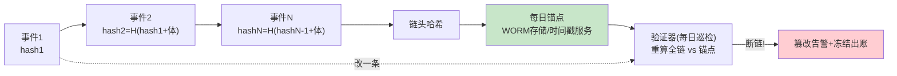
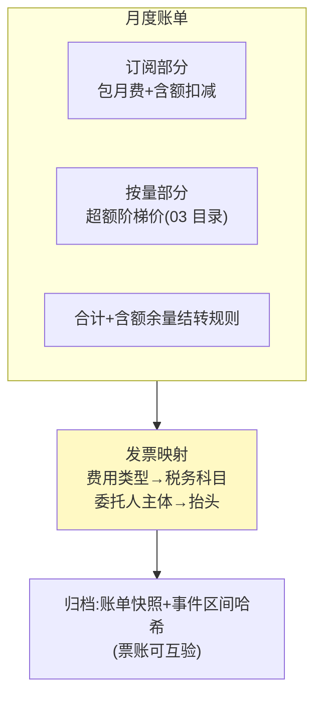

# 06-审计与反欺诈——hash 链账本 / 异常检测 / 发票合规

> **定位**：让账本**不可篡改**（hash 链：任何历史改动都验得出来）、消费异常**发现得了**（规则+CUSUM 缓变检测）、账单**过得了财务**（订阅 vs 按量混合账单、发票与税务字段）。读者画像：要回答"财务和内审凭什么信这本账"的读者。前置阅读：[05-多Agent分账](05-多Agent分账.md)、[教程 08-架构师进阶/09-Agent治理与合规框架]。
>
> **铁律 0**：hash 链与检测自研「概念代码」。

---

## 一、四问

| 问 | 答 |
|----|----|
| **新增了什么需求** | ① hash 链账本：每条事件含前一条 hash，外部锚点（每日把链头哈希写入 WORM 存储/打时间戳）——内部人改账必断链 ② 异常消费检测：规则层（同工具夜間高频/单委托人短时多 Agent 消费）+ 统计层（CUSUM 检测消费速率缓涨——凭证被盗用后的"温水煮青蛙"式盗刷）③ 混合账单：订阅（包月含额）+按量（超额部分）合并出账，含额扣减与阶梯价 ④ 发票合规：按费用类型映射税务科目、进项/销项字段齐全（概念，区域规则外置配置） |
| **影响了哪些模块** | `ledger-svc` 事件表加 `prevHash/hash`；新增 `fraud-svc`（检测+告警）；`metering-svc`（03）出账支持混合计费 |
| **架构如何演进** | 账本（事实）→ 可信账本（防篡改+能检测） |
| **上一版痛点** | 账分得清但可以被质疑：DBA 可改事件表；盗刷如果"慢慢刷"规则全无感；财务拿账单开不出票（05 §六） |

**本迭代验收**：① 篡改任一历史事件 → 链验证失败（≤1 天发现）② CUSUM 对速率+20%/周的盗刷 ≤7 天告警 ③ 混合账单含额/超额计算正确 ④ 事件→发票字段映射覆盖率 100%。

### 一.1 本节核对（四问口径）

| # | 核对项 | 判据 |
|---|--------|------|
| 1 | 四问齐全 | 新增需求 / 影响模块 / 架构演进 / 上一版痛点四行均有，无空答 |
| 2 | 演进与痛点对应 | "可信账本"对应 05 §六 痛点（账本可被质疑：DBA 可改表）；新增 fraud-svc 在 §三 有实现落点 |

---

## 二、hash 链与外部锚点



- 为什么链+锚点而不是区块链：内部审计场景不需要去中心共识，需要的是**"改了必被发现"的确定性**——链提供连续性证明，锚点提供时间证明，成本是区块链的千分之一。

### 二.1 本节核对（hash 链与外部锚点）

- [ ] 能说明链（连续性证明）与锚点（时间证明）各自分工，以及"为何不用区块链"的理由
- [ ] 图内：每条事件含前一条 hash；每日链头写入 WORM/时间戳；验证器重算全链比对锚点，改一条即断链→篡改告警+冻结出账

### 二.2 本节测试与验证（hash 链防篡改）

**前置条件**：hash 链账本（事件含 `prevHash/hash`）+ 每日锚点写入 + 验证器可跑 junit。

**材料 A——篡改注入测试**（junit）：

```java
@Test void 篡改任一历史事件即断链() {
    append(ev("charge", amt("10")));          // 事件1
    append(ev("charge", amt("20")));          // 事件2（hash2=H(hash1+体)）
    append(ev("charge", amt("30")));          // 事件3
    tamperMiddleEvent(amount: amt("99"));      // 直接改事件2的金额（绕过链接口）
    ChainVerifyResult r = verifier.verifyAll();
    assertFalse(r.ok());                       // 重算全链 ≠ 锚点 → 断链
    assertEquals(1, r.brokenAtIndex());        // 且能定位断在事件2
}
```

**步骤与断言**：

| # | 操作 | 预期（PASS 判据） |
|---|------|------------------|
| 1 | 材料 A 用例 | 全绿；断链可定位到被改事件索引 |
| 2 | 断链后查副作用 | 篡改告警发出 + 出账冻结（图内两条出边生效） |
| 3 | 未篡改对照链 | 验证器全链通过（无误报） |

**失败排查**：①未检出→hash 未覆盖金额字段（体序列化要含全部业务字段）；②无法定位→验证器只返回布尔（需返回断点索引）。

## 三、异常检测（两层）

| 层 | 检测 | 典型目标 | 延迟要求 |
|----|------|---------|---------|
| 规则 | 白名单外工具/夜间高频/同委托人多 Agent 并发消费 | 一次性跑飞、凭证复用 | 实时（闸门内） |
| 统计 | CUSUM 监控消费速率、工具分布漂移 | 温水盗刷、账号渐进失陷 | 天级 |

CUSUM 复用滑动窗口思想：消费速率对基线（前 28 天同周期）的偏差累积超阈告警——同款思路在可观测领域已验证（缓变检测见 [教程 08-架构师进阶/07-数据飞轮与持续改进] 联动）。

### 三.1 本节核对（异常检测两层）

- [ ] 规则层（实时、跑飞/凭证复用）与统计层 CUSUM（天级、温水盗刷/账号渐进失陷）的检测对象与延迟要求各能说出
- [ ] CUSUM 是对基线（28 天同周期）偏差的累积超阈告警，理解其对"+20%/周温水盗刷"的敏感性（§一 验收②）

### 三.2 本节测试与验证（两层异常检测）

**前置条件**：规则层（同工具夜间高频/同委托人多 Agent 并发）+ CUSUM（28 天同周期基线）可跑 junit。

**材料 B——两层检测测试**（junit）：

```java
@Test void 跑飞实时拦_温水七天告警() {
    // 规则层：同工具 1 分钟内 100 次（白名单外高频）→ 实时拦截
    for (int i = 0; i < 100; i++) feed(rule, charge("s1", "image-gen", amt("1"), at(2, 0)));
    assertTrue(rule.fired());                  // 实时（闸门内）触发
    // 统计层：消费速率每天 +20% 持续 7 天（28 天基线之上温水上涨）
    CusumDetector cusum = new CusumDetector(baselineOf28Days());
    for (int d = 1; d <= 7; d++) cusum.feed(baseline * Math.pow(1.2, d));
    assertTrue(cusum.alarmWithinDays(7));      // ≤7 天告警（§一 验收②）
    assertFalse(cusum.alarmWithinDays(2));     // 对照：正常波动期不误报
}
```

**步骤与断言**：

| # | 操作 | 预期（PASS 判据） |
|---|------|------------------|
| 1 | 材料 B 规则层段 | 当批内实时触发（延迟要求：闸门内） |
| 2 | 材料 B 统计层段 | ≤7 天告警；正常波动对照期无告警（不误报） |
| 3 | 基线消融对照 | 基线换成 7 天短周期 → 误报率上升（反证 28 天基线必要性） |

**失败排查**：①跑飞未拦→规则层在统计层之后串联（应在闸门内先行）；③温水不告警→CUSUM 偏差累积方向写反（只测下偏）。

## 四、混合账单与发票



### 四.1 本节核对（混合账单与发票合规）

- [ ] 账单分订阅（包月费+含额扣减）与按量（超额阶梯价）两部分，含额余量结转规则能说清
- [ ] 发票映射走"费用类型→税务科目、委托人主体→抬头"（区域规则外置配置），归档含账单快照+事件区间哈希实现票账互验

### 四.2 本节测试与验证（混合账单与票账互验）

**前置条件**：混合出账（订阅含额+超额阶梯）与发票映射、归档哈希可跑 junit。

**材料 C——账单三用例 + 票账互验测试**（junit）：

```java
@Test void 含额_超额_结转三用例与票账互验() {
    // 用例1：包月含额 100，实花 80 → 只收月费
    assertEquals(0, bill(subscribe(100), spendOf(80)).payable().compareTo(monthlyFee()));
    // 用例2：实花 150 → 超额 50 走阶梯价（03 目录）
    assertEquals(0, bill(subscribe(100), spendOf(150)).overage().compareTo(tiered(50)));
    // 用例3：结转——上月余 20 结转本月，本月实花 110 → 超额 = 110-100-20 = -10 → 0
    assertEquals(0, bill(subscribe(100).carryIn(20), spendOf(110)).overage().compareTo(amt0()));
    // 票账互验：账单快照 + 事件区间哈希 → 发票可反查到事件链
    Invoice inv = invoiceFor(bill);
    assertTrue(verifyAgainstChain(inv, ledger, bill.eventRange()));   // 哈希互验通过
    assertEquals("软件服务费", inv.taxSubjectOf("chat-token"));        // 费用类型→税务科目
}
```

**步骤与断言**：

| # | 操作 | 预期（PASS 判据） |
|---|------|------------------|
| 1 | 材料 C 三用例 | 含额内/超额阶梯/结转金额全部正确（§五 回归 4 的自动化形态） |
| 2 | 票账互验 | 发票 ↔ 账单快照 ↔ 事件区间哈希三层可互验 |
| 3 | 任一事件查发票映射 | 税务科目非空（映射覆盖率 100%，§一 验收④） |

**失败排查**：①结转算负数→overage 未做 max(0) 收口；②互验失败→快照未含事件区间端点哈希（区间不闭合）。

## 五、全篇回归验证

**回归断言**（§二-§四 链/检测/账单口径落实后，最终整体验收）：

**材料 A——篡改注入**：直接 UPDATE 中间事件体的金额字段。

**材料 B——温水盗刷**：模拟消费速率每天 +20% 持续 7 天。

| # | 操作 | 预期（PASS 判据） |
|---|------|------------------|
| 1 | 材料 A 篡改后次日巡检 | 断链告警；出账冻结 |
| 2 | 一次性跑飞（同工具高频） | 规则层实时拦截 |
| 3 | 材料 B 温水盗刷 | CUSUM ≤7 天告警 |
| 4 | 混合账单三用例：含额内 / 超额阶梯 / 结转 | 金额计算全部正确 |
| 5 | 任意事件查发票映射 | 税务科目非空；票-账哈希互验通过 |
| 6 | 本迭代验收四项（篡改可证 / 盗刷可检 / 混合账单 / 票账互验） | 全部覆盖，任一 FAIL 即回归不通过 |

**失败排查**：①未检→篡改未影响链上字段（hash 未覆盖金额）或锚点未写入；③告警慢→CUSUM 参考周期太短（用 28 天基线）；⑤映射空→费用类型枚举漏某类。

## 六、本迭代痛点

企业内闭环了；但 Agent 经济的主战场在**组织间**——向生态卖能力、从市场买工具。→ 07 开放与生态。

> 本节核对（一句话）：痛点（企业内闭环、主战场在组织间）与下一篇 07 开放与生态（商店分润/多币种/仲裁）一一对应即 PASS。

## 七、验收对照

| 验收项 | 标准 | 状态 |
|--------|------|------|
| 篡改可证 | 断链 ≤1 天发现 | ✅（§二.2 断言 1-2） |
| 盗刷可检 | 跑飞实时/温水 ≤7 天 | ✅（§三.2 断言 1-2） |
| 混合账单 | 三用例正确 | ✅（§四.2 断言 1） |
| 票账互验 | 哈希锚定 | ✅（§四.2 断言 2-3） |

> 本节核对（一句话）：四项验收（篡改可证 / 盗刷可检 / 混合账单 / 票账互验）分别锚定 §二.2 断言 1-2、§三.2 断言 1-2、§四.2 断言 1、§四.2 断言 2-3（§五 回归 1-6 整体复验），与本迭代验收段落口径一致即 PASS。

**下一篇**：[07-开放与生态](07-开放与生态.md)。
