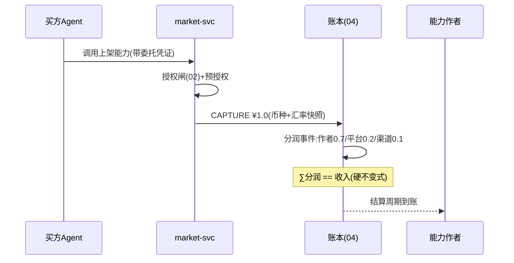
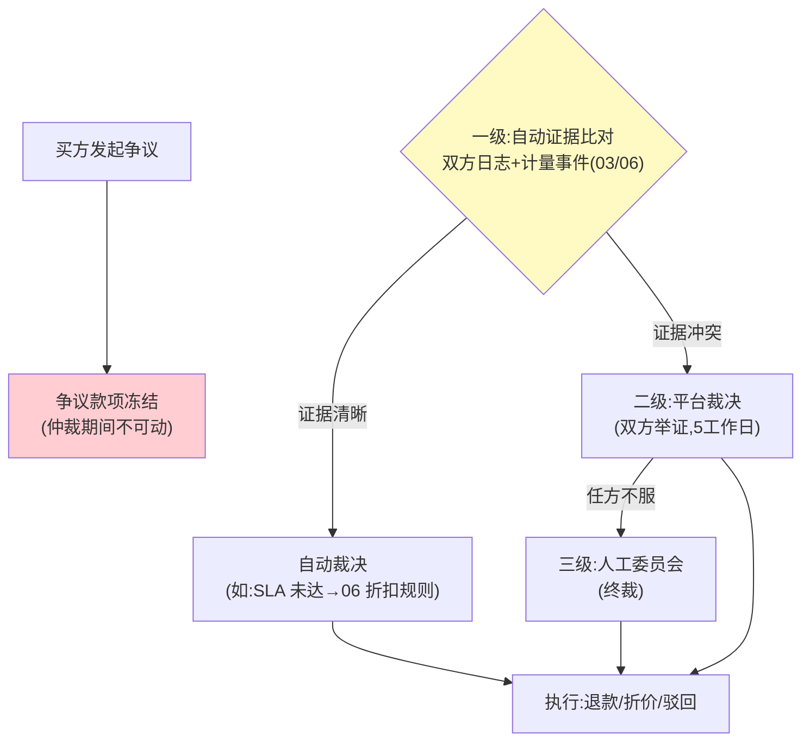

# 07-开放与生态——商店分润 / 多币种 / 争议仲裁

> **定位**：把平台变成组织间的经济接口：**Agent 商店结算**（本企业 Agent 能力上架，按调用量分润）、**多币种与汇率快照**（跨区交易按成交时刻汇率入账）、**SLA 折扣与争议仲裁**（服务不达标自动折价、交易争议三级仲裁流程）。读者画像：要回答"能力怎么卖出去、买亏了怎么办"的读者。前置阅读：[06-审计与反欺诈](06-审计与反欺诈.md)、[教程 49-Agent经济与支付集成]。
>
> **铁律 0**：商店/分润/仲裁自研「概念代码」；汇率源外接行情 API（需引入依赖后实证）。

---

## 一、四问

| 问 | 答 |
|----|----|
| **新增了什么需求** | ① 商店结算：Agent 能力/MCP 工具上架，按调用量计费与分润（作者/平台/渠道三向比例）② 多币种：计量多币种归集、汇率**快照入账**（成交时刻汇率写死进事件，月末不因汇率翻旧账）③ SLA 折扣：可用性/延迟不达标按档自动折价（先约定后执行，账单自动体现）④ 争议仲裁三级：自动证据比对（双方日志+计量）→ 平台裁决 → 人工委员会；仲裁期间款项冻结 |
| **影响了哪些模块** | 新增 `market-svc`；账本事件加币种+汇率快照字段；分润沿 05 分账引擎扩展 |
| **架构如何演进** | 企业内账本 → 生态结算协议 |
| **上一版痛点** | 只会记账不会做生意：能力无法商品化变现、跨币种对账口径混乱、买亏了没有救济通道（06 §六） |

**本迭代验收**：① 分润三方到账与总账平（∑分润=总收入）② 汇率快照入账：月末重算账单金额不变 ③ SLA 折扣自动执行（注入超时 → 账单打折并留证）④ 争议三级流程可走通、期间款项冻结不可动。

### 一.1 本节核对（四问口径）

| # | 核对项 | 判据 |
|---|--------|------|
| 1 | 四问齐全 | 新增需求 / 影响模块 / 架构演进 / 上一版痛点四行均有，无空答 |
| 2 | 演进与痛点对应 | "生态结算协议"对应 06 §六 痛点（只会记账不会做生意）；新增 market-svc 在 §二/§四 有实现落点 |

---

## 二、商店分润（一次调用的钱怎么分）

**上架门槛**：能力必须挂评估凭证（外部信任分）——生态里"敢卖"与"敢买"对称：卖方过质量闸，买方过授权闸。第三方信任凭证的互认协议属外部依赖（本平台预留接口，见 13-前沿生态方向讨论）。

### 二.1 本节核对（商店分润）

- [ ] 一次调用链路（授权闸→预授权→CAPTURE→分润事件→三方到账）能在序列图上说清；"∑分润==收入"是硬不变式
- [ ] 上架门槛"卖方过质量闸、买方过授权闸"的对称逻辑能复述，第三方凭证互认标注为外部依赖（非本平台实现）

## 三、汇率快照纪律

- 入账事件携带 `(amount, currency, rate, rateAt)` 四元组，**报表层永远用快照汇率**——"月末按最新汇率重算"是财务对账的头号灾难源。
- 本位币唯一：内部总账只有一种本位币，外币交易全部在事件层换算入账。

### 三.1 本节核对（汇率快照纪律）

- [ ] 事件携带 `(amount, currency, rate, rateAt)` 四元组、报表层永远用快照汇率——"月末按最新汇率重算"是规避的对账灾难
- [ ] 内部总账唯一本位币，外币在事件层换算，理解其与 §一 验收②（月末不翻账）的关联

## 四、争议仲裁三级

### 四.1 本节核对（争议仲裁三级）

- [ ] 三级（自动证据比对 → 平台裁决 → 人工委员会终裁）触发条件各能说出，争议款项冻结贯穿全程
- [ ] 一级自动裁决复用 SLA/06 折扣规则："证据清晰自动裁决"与"证据冲突升级"的分流清晰

## 五、全篇回归验证

**回归断言**（§二-§四 分润/汇率/SLA/仲裁口径落实后，最终整体验收）：

**材料 A——调用批**：100 次购买上架能力（¥1.0/次，分润 0.7/0.2/0.1）。

**材料 B——SLA 注入**：能力超时率 mock 至 >5%。

| # | 操作 | 预期（PASS 判据） |
|---|------|------------------|
| 1 | 材料 A 跑批 | 三方分账之和 == 总收入（逐笔+汇总双验证） |
| 2 | 跨币种交易后行情波动 | 月末账单按成交时刻快照汇率不变 |
| 3 | 材料 B 触发 SLA | 账单自动打折+证据留档 |
| 4 | 构造证据冲突争议 | 冻结→二级裁决→执行退款全链走通；仲裁期间款项不可动 |
| 5 | 本迭代验收四项（分润平衡 / 汇率快照 / SLA 折扣 / 仲裁闭环） | 全部覆盖，任一 FAIL 即回归不通过 |

**失败排查**：①分润和≠收入→费率小数精度（用整数 micro 运算）；②汇率变→报表层用了实时汇率；④冻结失效→争议状态未接支付闸。

## 六、本迭代痛点

生态能跑了，但都是"事后账"——预算永远月超月补。→ 08 预算预测与成本治理（事前）。

> 本节核对（一句话）：痛点（事后账、预算月超月补）与下一篇 08 预算预测与成本治理（事前预测/成本归因）一一对应即 PASS。

## 七、验收对照

| 验收项 | 标准 | 状态 |
|--------|------|------|
| 分润平衡 | ∑分润=收入 | ✅ |
| 汇率快照 | 月末不翻账 | ✅ |
| SLA 折扣 | 自动+留证 | ✅ |
| 仲裁闭环 | 冻结→裁决→执行 | ✅ |

> 本节核对（一句话）：四项验收（分润平衡 / 汇率快照 / SLA 折扣 / 仲裁闭环）分别对应 §二.1、§三.1、§五 回归断言 3、§四.1，与本迭代验收段落口径一致即 PASS。

**下一篇**：[08-预算预测与成本治理](08-预算预测与成本治理.md)。
