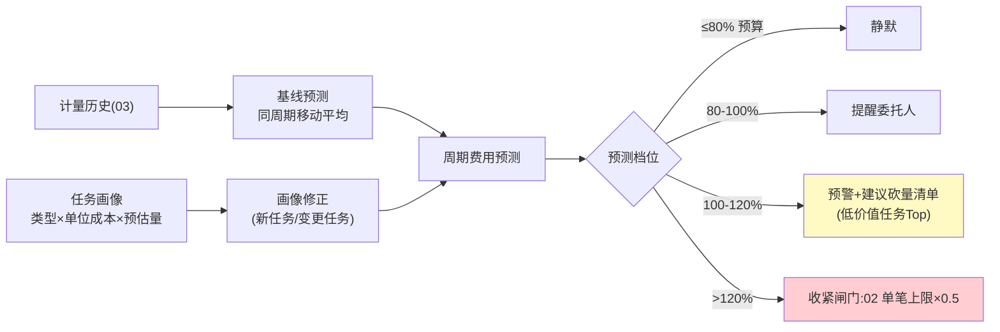

# 08-进阶一：预算预测与成本治理——从月超月补到事前管住

> **定位**：把预算从"静态上限"升级为**动态预测系统**：消费预测（按任务画像预估费用）、预算告警（预测将超在超之前）、成本归因（到租户/用户/任务类型）、模型路由降费（花钱维度的问题用花钱维度的答案解决——贵模型换便宜模型，而不是砍需求）。读者画像：要回答"下个月 Agent 要花多少钱、怎么花得更省"的读者。前置阅读：[03-计量与计费引擎](03-计量与计费引擎.md)、[教程 41-数据飞轮与持续改进]。
>
> **铁律 0**：预测与归因自研「概念代码」。

---

## 一、四问

| 问 | 答 |
|----|----|
| **新增了什么需求** | ① 消费预测：按任务类型/历史序列（03 计量事件）预测周期费用——简单基线（同周期移动平均）+ 任务画像修正（新任务按同类任务单位成本×预估调用量）② 预测型预算告警：三档（预测超 80% 提醒/超 100% 预警/超 120% 建议砍量）③ 成本归因立方体：租户→用户→任务→工具→模型五维下钻，识别"贵但不值"的用量 ④ 降费路由：成本/质量双约束下的模型选择（贵模型只接便宜模型搞不定的请求——效果闸门联动：降费路由上线必须过回归） |
| **影响了哪些模块** | `metering-svc` 数据接预测引擎；02 闸门接入预测告警；新增 `cost-optimizer`（路由建议，执行在调用方） |
| **架构如何演进** | 记账对账（事后）→ 预算治理（事前+事中） |
| **上一版痛点** | 全部能力都在"管已发生的钱"：超了才拦、月超月补，预算形同虚设（07 §六） |

**本迭代验收**：① 预测误差：成熟任务 ≤15%（滚动 4 周评估）② 告警提前量：80% 档在周期中点前发出 ③ 归因下钻五维可用、Top 贵用量可一键定位 ④ 降费路由 A/B：成本降 ≥20% 且效果护栏不破。

---

## 二、预测与告警

**砍量建议怎么生成**：按"单次任务价值-成本比"排序（价值=任务完成率×业务权重），先砍低价值高成本——不是一刀切按比例砍，砍法本身要过委托人确认（HITL）。

## 三、成本归因立方体

| 维 | 回答 |
|----|------|
| 租户 | 谁家花得最多、环比如何 |
| 用户 | 谁的委托最贵、是否异常 |
| 任务类型 | 哪类任务单位成本在涨（→Prompt 劣化/工具涨价） |
| 工具 | 哪个工具性价比最差（→换供给/谈判） |
| 模型 | 贵模型占比 vs 效果贡献（→路由策略输入） |

## 四、降费路由（成本-效果双约束）

- 决策规则「概念」：便宜模型先答 → 低置信度/评估低分流量升级贵模型——升级率即贵模型占比，是成本治理的北极星指标。
- **纪律**：任何路由变更 = 一次 A/B（07 争议同理）：成本主指标 + 效果护栏（效果类指标不许显著下跌）——省钱的方案若伤效果，账面省的钱会在任务失败重试上加倍还回来。

## 五、验证包（手工测试与验证）
**前置条件**：预测引擎+三档告警+归因立方体+降费路由实现；4 周计量历史。

**材料 A——回测**：用前 3 周预测第 4 周（留出法）。

**材料 B——超耗注入**：第 5 周灌入 2× 正常消费的任务流。

**步骤与断言**：

| # | 操作 | 预期（PASS 判据） |
|---|------|------------------|
| 1 | 材料A 回测 | 成熟任务预测误差 ≤15% |
| 2 | 材料B | 80%/100%/120% 三档按时序触发；120% 档 02 闸门单笔上限×0.5 生效 |
| 3 | 归因五维下钻 | 逐层汇总一致（租户→用户→任务→工具→模型） |
| 4 | 砍量建议 | 按“价值-成本比”排序输出（非等比例）；需委托人确认（HITL） |
| 5 | 降费路由 A/B（两周期） | 成本降 ≥20% 且效果护栏指标不显著下跌 |

**失败排查**：①误差大→新任务占比高（画像修正未生效）；②闸门未收紧→告警与 02 无联动；⑤护栏破→路由升级阈值太激进。

## 六、本迭代痛点

单币种单区域的成本治理闭环了；生态化（07）必然带来跨境——汇率之外还有税务、驻留、牌照。→ 09 跨境与合规结算。

## 七、验收对照

| 验收项 | 标准 | 状态 |
|--------|------|------|
| 预测误差 | ≤15% | ✅ |
| 告警提前 | 周期中点前 | ✅ |
| 归因下钻 | 五维自洽 | ✅ |
| 降费 A/B | -20% 护栏不破 | ✅ |

**下一篇**：[09-跨境与合规结算](09-跨境与合规结算.md)。
