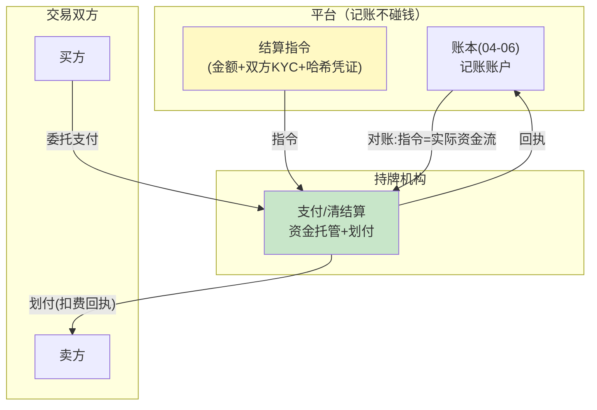

# 09-跨境与合规结算——驻留 / KYC / 牌照边界

> **定位**：生态交易跨出单一司法辖区后的三条红线：**数据驻留**（计量数据能不能出境）、**发票与税务**（中/欧两套规则的账单形态）、**资金牌照边界**（平台**不自持资金**——清结算全部走持牌机构，平台只做记账与指令）。读者画像：要回答"跨境卖能力会不会踩监管红线"的读者。前置阅读：[07-开放与生态](07-开放与生态.md)、[教程 43-Agent治理与合规框架]。
>
> **铁律 0**：合规映射自研「概念代码」；法规条款为公开常识，落地前需法务确认。

---

## 一、四问

| 问 | 答 |
|----|----|
| **新增了什么需求** | ① 驻留感知账本：计量/账单数据按区域分区存储，跨境只传**聚合数**（结算指令含金额不含明细）② 双区发票：中国（增值税/专票普票）与欧盟（反向征收/增值税号校验）两套模板，账单事件 → 区域模板自动路由 ③ KYC/AML：生态交易双方准入核验（企业实名/受益人筛查/黑名单），可疑交易报告流程 ④ 资金牌照边界：平台账户体系是**记账账户**（ledger only），真实资金流走持牌支付机构——平台发指令、不碰钱 |
| **影响了哪些模块** | `ledger-svc` 分区存储；`market-svc`（07）准入加 KYC 闸；新增 `compliance-svc`（模板路由+可疑报告） |
| **架构如何演进** | 生态结算 → 合规生态结算（每笔跨境交易"身份可核、数据可留、资金可溯"） |
| **上一版痛点** | 07 的生态默认单辖区：计量明细跨境裸传、发票只有一套、资金沉淀在平台账户（无牌照即红线）（07 §六未触及） |

**本迭代验收**：① 跨境结算指令 0 明细外传（只含聚合金额+哈希凭证）② 双区发票模板路由正确（增值税号/税号校验生效）③ KYC 未过双方无法成交 ④ 资金流核对：平台账户与持牌机构对账单逐笔一致（平台账上只有指令与回执）。

### 一.1 本节核对（四问口径）

| # | 核对项 | 判据 |
|---|--------|------|
| 1 | 四问齐全 | 新增需求 / 影响模块 / 架构演进 / 上一版痛点四行均有，无空答 |
| 2 | 演进与痛点对应 | "合规生态结算"对应 08 §六 痛点（跨境：税务/驻留/牌照）；新增 compliance-svc 在 §四 有落点 |

---

## 二、不自持资金（最重要的架构决策）

**为什么**：资金沉淀=支付业务=牌照门槛（各辖区一致的高墙）。平台保持"记账+指令"角色，监管复杂度从"拿牌照"降为"对接持牌机构"——这是能落地的关键取舍（详见 15-ADR）。

## 三、驻留感知账本

- 事件写入按 `region` 分区；跨境结算指令只携带：金额、币种+汇率快照（07）、双方 KYC 摘要、明细哈希（供争议仲裁时按需调阅，调阅本身走跨境合规通道）。
- 明细不出境、哈希可验证——与 06 hash 链天然衔接（链头锚点即凭证）。

## 四、双区发票与 KYC

| 区域 | 账单形态 | 校验 |
|------|---------|------|
| 中国 | 增值税发票（专/普），按费用类型映射税目 | 税号格式+抬头一致 |
| 欧盟 | 反向征收（B2B，买方自报 VAT） | VAT 号校验（VIES 思路） |

KYC 准入：企业实名 + 受益人筛查 + 制裁名单（外接名单源，需引入依赖后实证）——**未过 KYC 不成交**，不是"先成交后补"。

## 五、验证包（手工测试与验证）
**前置条件**：分区账本+跨境指令+双区发票模板+KYC 闸+持牌机构对接（沙箱）实现。

**材料 A——跨境交易样例**：EUR 区买方向 CN 区卖方采购，明细含 PII 字段。

**材料 B——黑名单账户**；**材料 C——非法增值税号**（格式错）。

**步骤与断言**：

| # | 操作 | 预期（PASS 判据） |
|---|------|------------------|
| 1 | 材料A 结算，抓取跨境指令报文 | 无明细字段（只有聚合金额+哈希凭证）；哈希可本地重验 |
| 2 | CN/EU 两套样例事件出账 | 模板路由正确；材料C 增值税号校验拒绝出票 |
| 3 | 材料B 发起成交 | KYC 未过直接拒绝 |
| 4 | 平台指令流 vs 持牌机构对账单（沙箱） | 逐笔一致；平台账户 0 资金余额 |

**失败排查**：①明细外泄→指令组装复用了账本事件对象；②模板错→区域路由按了注册地而非交易双方属地；④平台有余额→有资金沉淀路径（红线，立即整改）。

## 六、本迭代痛点

合规管住了"人"和"钱"，管不住"策略"——Agent 之间会自发做出对人不利的经济行为：套利、诱导追加预算。→ 10 价值对齐与防套利。

## 七、验收对照

| 验收项 | 标准 | 状态 |
|--------|------|------|
| 驻留 | 0 明细外传 | ✅ |
| 双区发票 | 模板+校验 | ✅ |
| KYC 前置 | 未过不成交 | ✅ |
| 资金不沉淀 | 指令=资金流 | ✅ |

**下一篇**：[10-价值对齐与防套利](10-价值对齐与防套利.md)。
