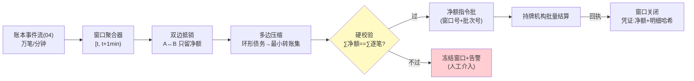
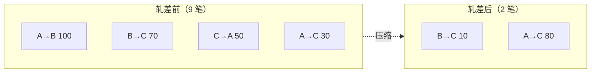

# 11-进阶四：流式净额结算——微额高频的分钟级轧差

> **定位**：微额高频（单笔 $0.001 级、每秒万笔）场景下，逐笔清结算在成本与时效上均不可行。本篇落地**分钟级轧差**：窗口内双边/多边净额合并、净额与逐笔和**数学一致**的硬校验、轧差窗口失败的重入与对账。读者画像：要回答"万笔每秒怎么结算"的读者。前置阅读：[04-支付轨道与幂等](04-支付轨道与幂等.md)、[07-开放与生态](07-开放与生态.md)。
>
> **铁律 0**：轧差引擎自研「概念代码」。

---

## 一、四问

| 问 | 答 |
|----|----|
| **新增了什么需求** | ① 轧差窗口：按分钟聚合，同主体对间相互抵销只结净额（A 应付 B ¥100、B 应付 A ¥80 → 一笔 ¥20）② 多边净额：生态多方环形债务压缩（图算法求最小转账集）③ 一致性硬校验：∑净额流 == ∑逐笔流（任一窗口可证）④ 窗口重入：轧差输出提交失败 → 幂等重入（窗口号+批次号幂等键）⑤ 明细留存：轧差不删逐笔账——净额是**结算形态**不是记账形态 |
| **影响了哪些模块** | `ledger-svc`（04）之上新增净额引擎（窗口聚合器+多边图压缩）；持牌机构接口改批量指令 |
| **架构如何演进** | 逐笔结算 → 净额结算（记账粒度不变、结算粒度聚合） |
| **上一版痛点** | 生态高频交易逐笔过持牌机构：手续费吃掉微额利润、T+1 到账跟不上体验（07 §六） |

**本迭代验收**：① 净额压缩比 ≥90%（万笔窗口 → ≤千笔净额指令）② 一致性校验：任意窗口 ∑净额 == ∑逐笔（含多边环）③ 窗口提交失败重入 0 重复 ④ 逐笔明细仍可追（结算凭证 → 窗口号 → 明细集哈希）。

---

## 二、轧差窗口流水线

**为什么校验不过必须冻结而不是修补**：净额错 = 结算层与账本层分裂，任何"先结后调"都会让后续所有窗口失去可信基础——宁可延迟一分钟，不可带病结算。

## 三、多边净额（图压缩）

- 算法「概念」：每个主体净头寸 = ∑应收 − ∑应付；只对净头寸非零者生成指令（正头寸收款、负头寸付款）——转账笔数从 O(边数) 降到 O(非零主体数)。
- **参与方许可**：多边净额改变对手方风险结构（原来欠 C 的钱变成欠净额池）——参与协议必须明示，未签约方退化为双边轧差。

## 四、失败重入与对账

| 故障 | 策略 |
|------|------|
| 窗口聚合失败 | 窗口顺延 1 分钟（不丢事件，事件在账本） |
| 净额指令批提交失败 | 幂等键（窗口号+批次号）重发，机构侧去重 |
| 部分净额结算成功 | 按笔隔离：成功笔关闭、失败笔转下窗重结（不整批回滚） |
| 对账 | 每日：∑窗口净额流 == ∑逐笔事件流 == 机构对账单三方平 |

## 五、验证包（手工测试与验证）
**前置条件**：窗口聚合器+多边压缩+一致性校验+重入幂等实现。

**材料 A——环形债务**：A→B 100、B→C 70、C→A 50、A→C 30（9 笔）。

**材料 B——校验破坏**：人为篡改一个窗口的某笔净额。

**步骤与断言**：

| # | 操作 | 预期（PASS 判据） |
|---|------|------------------|
| 1 | 材料A 轧差 | 输出 2 笔（B→C 10、A→C 80）；∑净额 == ∑逐笔（367 微单位级） |
| 2 | 注入 1 万笔/窗口 | 压缩比 ≥90%（净额指令 ≤1000 笔） |
| 3 | 材料B | 校验不过 → 冻结该窗口+告警（不修补直发） |
| 4 | 净额指令批提交失败重发 3 次 | 机构侧仅 1 批生效（窗口号+批次号幂等） |
| 5 | 三方日对账 | 账本逐笔/窗口净额/机构账单 三方平 |

**失败排查**：①净额错→多边头寸算错符号（应收-应付）；③校验过→只对了笔数没对金额；④重复→幂等键未含批次号。

## 六、本迭代痛点

净额解决了"怎么结"；跨组织交易还差"用什么话术结"——每家平台订单/争议格式各说各话。→ 12 商务协议互操作。

## 七、验收对照

| 验收项 | 标准 | 状态 |
|--------|------|------|
| 压缩比 | ≥90% | ✅ |
| 一致性 | 任意窗口可证 | ✅ |
| 重入幂等 | 0 重复 | ✅ |
| 明细可追 | 凭证→窗口→哈希 | ✅ |

**下一篇**：[12-进阶五-商务协议互操作](12-进阶五-商务协议互操作.md)。
