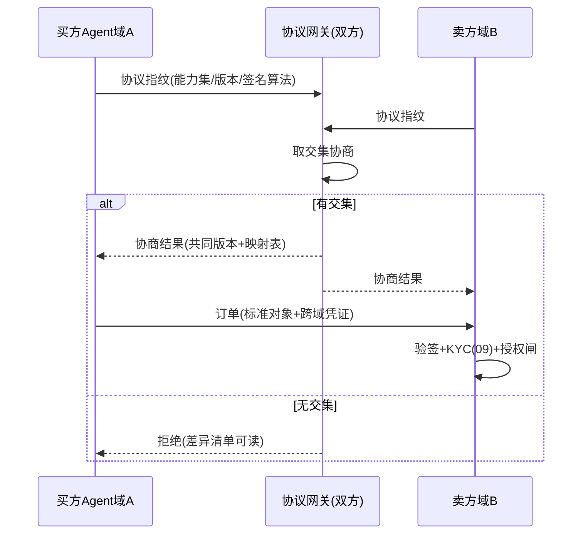

# 12-商务协议互操作——跨组织的订单/支付/争议通用语

> **定位**：对接行业 Agent 商务协议方向（订单/支付/争议的跨组织互操作标准）：**协议指纹与版本协商**（双方先对齐"我们说的是同一种话"）、**凭证跨域验签**（本平台委托凭证在对方域可验）、**订单与争议对象互认**（订单状态机/争议证据格式映射）。读者画像：要回答"跨组织 Agent 交易怎么互认"的读者。前置阅读：[07-开放与生态](07-开放与生态.md)、[11-流式净额结算](11-流式净额结算.md)。
>
> **铁律 0**：协议格式自研（JSON-LD 思路）「概念代码」；标准协议接入前需对官方规范逐条核实。

---

## 一、四问

| 问 | 答 |
|----|----|
| **新增了什么需求** | ① 协议握手：交易前双方交换协议指纹（支持的能力集+版本号+签名算法），取交集协商——话不对齐不成交 ② 凭证跨域：委托凭证加"跨域声明"（目标域/可验证凭证链），对方域用公示公钥验签 ③ 订单对象互认：订单状态机（创建/支付/履约/完成/争议）与字段映射表，本平台事件 ↔ 协议标准对象双向转换 ④ 争议证据互认：双方计量事件+哈希凭证按标准证据格式打包，进入 07 仲裁流程时格式免翻译 |
| **影响了哪些模块** | `market-svc`（07）加协议网关（指纹/协商/映射）；`authz-svc`（02）凭证加跨域声明；`compliance-svc`（09）KYC 结果按协议可验证格式输出 |
| **架构如何演进** | 单平台生态 → 协议化生态（从"进我家商店"到"说同一种商务语言"） |
| **上一版痛点** | 生态只有"进本平台"一种接入法：对方平台订单格式不同就得定制开发，每接一家改一遍（11 §六） |

**本迭代验收**：① 握手：版本/能力不交集的双方拒绝成交且原因可读 ② 跨域凭证：对方域验签通过/篡改拒绝/过期拒绝 ③ 订单双向映射往返无损（本方事件→协议对象→本方事件等价）④ 争议证据包双方域各自可独立验证哈希链。

### 一.1 本节核对（四问口径）

| # | 核对项 | 判据 |
|---|--------|------|
| 1 | 四问齐全 | 新增需求 / 影响模块 / 架构演进 / 上一版痛点四行均有，无空答 |
| 2 | 痛点承接可落地 | "每接一家平台改一遍定制"对应 11 §六；协议网关（指纹/协商/映射/验签/证据包）落在 §二/§三/§四有实现 |

---

## 二、协议握手与指纹

**指纹包含什么**：订单模型版本、支付轨道（净额/逐笔）、争议格式、凭证签名体系、语义字段（币种精度/时区/税务模型）——**语义差异比语法差异更容易出事故**（精度/时区错位=对账灾难）。

### 二.1 本节测试与验证（协议握手与版本协商）

**前置条件**：协议网关（指纹交换/取交集协商/差异清单）实现；域 A、域 B、域 C 三个测试域。

**材料 A——指纹对**：域 A 支持 order-v2/净额/争议-v2；域 B 只支持 order-v1/逐笔（部分交集）；外加无交集域 C。

**步骤与断言**：

| # | 操作 | 预期（PASS 判据） |
|---|------|------------------|
| 1 | 域 A ↔ 域 B 握手 | 协商到共同版本（order-v1）+ 映射表，成交 |
| 2 | 域 C 与 A/B 握手 | 拒绝成交，且差异清单可读（列出不交集项，非笼统拒绝） |
| 3 | 指纹语义字段核对 | 指纹含币种精度/时区/税务模型等语义字段、且协商后锁定（防中途换语义） |

**失败排查**：①C 不明原因被拒→差异清单未生成（取交集逻辑缺"可读差异"输出）；②协商后语义漂移→指纹语义字段未被锁定。

## 三、凭证跨域验签

- 委托凭证（02）加 `audience`（目标域）与凭证链（签发方→中间方→使用方），对方域验证：签名链完整 + audience 匹配 + 撤销状态（跨域撤销用短时效兜底：凭证 TTL ≤5min 时撤销延迟可忽略）。
- **域密钥公示**：各域公钥按 DID 思路公示（概念），指纹协商时交换并锚定（后续通信验签均用协商时锚定的密钥，防中途换钥）。

### 三.1 本节测试与验证（跨域验签三类伪造全拒）

**前置条件**：跨域验签（签名链完整 + audience 匹配 + 撤销）+ 协商时密钥锚定实现。

**材料 B——三类伪造凭证**：换 audience / 过期重放 / 中间人换钥。

**步骤与断言**：

| # | 操作 | 预期（PASS 判据） |
|---|------|------------------|
| 1 | 换 audience 凭证 | 跨域验签拒绝（audience 不匹配目标域） |
| 2 | 过期重放凭证 | 拒绝（TTL 兜底 + 撤销状态核验） |
| 3 | 中间人换钥 | 拒绝（验签仍用协商时锚定的密钥，非中途换的钥） |
| 4 | 正常跨域凭证 | 对方域验签通过（对照，确认防伪不误伤真凭证） |

**失败排查**：①换 audience 仍过→验签没查 audience；②换钥通过→协商时未锚定密钥（后续验签用了初次交换的钥之外的钥）。

## 四、订单与争议对象互认

| 对象 | 本平台表示 | 协议标准对象 | 映射要点 |
|------|-----------|-------------|---------|
| 订单 | 04 支付轨道 | 标准订单状态机 | 预授权↔RESERVED，冲正↔VOID |
| 支付 | CAPTURE 事件 | 支付确认 | 币种+汇率快照（07）四元组直传 |
| 争议 | 07 仲裁案卷 | 标准证据包 | 计量事件哈希+链锚点（06） |

**往返无损测试**是映射表的质量闸：任何字段映射必须有反向映射且往返等价——做不到的字段进入"不可翻译清单"，握手时明示（宁可不开通，不可静默丢语义）。

### 四.1 本节测试与验证（订单双向往返无损 + 争议证据双域互认）

**前置条件**：订单/支付/争议双向映射表 + 往返等价校验 + 证据包哈希链打包实现；两个测试域。

**步骤与断言**：

| # | 操作 | 预期（PASS 判据） |
|---|------|------------------|
| 1 | 100 笔订单双向转换往返 | 本方事件→协议对象→本方事件等价；往返无损 |
| 2 | 含不可翻译字段的订单 | 不可翻译字段进入清单，在握手中明示（清单非空时断言可见，不静默丢语义） |
| 3 | 争议证据包（计量事件哈希+链锚点）打包 | 双域各自独立验证，哈希链结论一致 |

**失败排查**：①语义静默丢→往返等价测试未纳入某字段（未进清单）；③结论不一致→证据打包漏了链头锚点。

## 五、全篇回归验证

**回归断言**（§二.1 握手协商、§三.1 跨域验签、§四.1 往返无损均通过后，最终整体验收）：

| # | 操作 | 预期（PASS 判据） |
|---|------|------------------|
| 1 | 域 A↔B 握手 + 材料 B 三类伪造 + 双向往返同一回归流程 | 协商成交 / 三类伪造全拒 / 往返等价，全链路贯通 |
| 2 | 争议证据包双域独立验证 | 双域哈希链结论一致 |
| 3 | 本迭代验收四项（握手 / 跨域验签 / 往返无损 / 证据互认） | 全部覆盖，任一 FAIL 即回归不通过 |

**失败排查**：整体任一验收 FAIL→回查 §二.1/§三.1/§四.1 对应排查项（差异清单/密钥锚定/往返测试遗漏）。

## 六、本迭代痛点

协议管住了"怎么交易"，没管"跟谁值不值得交易"——陌生对手方的履约风险裸奔。→ 13 经济信用体系。

> 本节核对（一句话）：痛点（陌生对手方履约风险裸奔）与下一篇 13 经济信用体系（履约量化/信用联动/坏账分担）一一对应即 PASS。

## 七、验收对照

| 验收项 | 标准 | 状态 |
|--------|------|------|
| 握手协商 | 交集/拒绝可读 | ✅ |
| 跨域验签 | 三类伪造全拒 | ✅ |
| 往返无损 | 等价+不可译明示 | ✅ |
| 证据互认 | 双域独立可验 | ✅ |

> 本节核对（一句话）：四项验收（握手协商/跨域验签/往返无损/证据互认）分别对应 §二.1 步骤、§三.1 步骤 1-3、§四.1 步骤 1、§四.1 步骤 3，与本迭代验收段落口径一致即 PASS。

**下一篇**：[13-Agent经济信用体系](13-Agent经济信用体系.md)。
