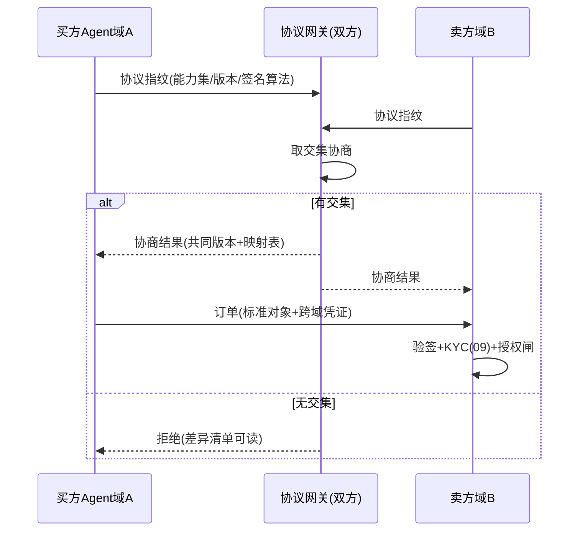

# 12-进阶五：商务协议互操作——跨组织的订单/支付/争议通用语

> **定位**：对接行业 Agent 商务协议方向（订单/支付/争议的跨组织互操作标准）：**协议指纹与版本协商**（双方先对齐"我们说的是同一种话"）、**凭证跨域验签**（本平台委托凭证在对方域可验）、**订单与争议对象互认**（订单状态机/争议证据格式映射）。读者画像：要回答"跨组织 Agent 交易怎么互认"的读者。前置阅读：[07-迭代六-开放与生态](07-迭代六-开放与生态.md)、[11-进阶四-流式净额结算](11-进阶四-流式净额结算.md)。
>
> **铁律 0**：协议格式自研（JSON-LD 思路）「概念代码」；标准协议接入前需对官方规范逐条核实。

---

## 一、四问

| 问 | 答 |
|----|----|
| **新增了什么需求** | ① 协议握手：交易前双方交换协议指纹（支持的能力集+版本号+签名算法），取交集协商——话不对齐不成交 ② 凭证跨域：委托凭证加"跨域声明"（目标域/可验证凭证链），对方域用公示公钥验签 ③ 订单对象互认：订单状态机（创建/支付/履约/完成/争议）与字段映射表，本平台事件 ↔ 协议标准对象双向转换 ④ 争议证据互认：双方计量事件+哈希凭证按标准证据格式打包，进入 07 仲裁流程时格式免翻译 |
| **影响了哪些模块** | `market-svc`（07）加协议网关（指纹/协商/映射）；`authz-svc`（02）凭证加跨域声明；`compliance-svc`（09）KYC 结果按协议可验证格式输出 |
| **架构如何演进** | 单平台生态 → 协议化生态（从"进我家商店"到"说同一种商务语言"） |
| **上一版痛点** | 生态只有"进本平台"一种接入法：对方平台订单格式不同就得定制开发，每接一家改一遍（11 §六） |

**本迭代验收**：① 握手：版本/能力不交集的双方拒绝成交且原因可读 ② 跨域凭证：对方域验签通过/篡改拒绝/过期拒绝 ③ 订单双向映射往返无损（本方事件→协议对象→本方事件等价）④ 争议证据包双方域各自可独立验证哈希链。

---

## 二、协议握手与指纹

**指纹包含什么**：订单模型版本、支付轨道（净额/逐笔）、争议格式、凭证签名体系、语义字段（币种精度/时区/税务模型）——**语义差异比语法差异更容易出事故**（精度/时区错位=对账灾难）。

## 三、凭证跨域验签

- 委托凭证（02）加 `audience`（目标域）与凭证链（签发方→中间方→使用方），对方域验证：签名链完整 + audience 匹配 + 撤销状态（跨域撤销用短时效兜底：凭证 TTL ≤5min 时撤销延迟可忽略）。
- **域密钥公示**：各域公钥按 DID 思路公示（概念），指纹协商时交换并锚定（后续通信验签均用协商时锚定的密钥，防中途换钥）。

## 四、订单与争议对象互认

| 对象 | 本平台表示 | 协议标准对象 | 映射要点 |
|------|-----------|-------------|---------|
| 订单 | 04 支付轨道 | 标准订单状态机 | 预授权↔RESERVED，冲正↔VOID |
| 支付 | CAPTURE 事件 | 支付确认 | 币种+汇率快照（07）四元组直传 |
| 争议 | 07 仲裁案卷 | 标准证据包 | 计量事件哈希+链锚点（06） |

**往返无损测试**是映射表的质量闸：任何字段映射必须有反向映射且往返等价——做不到的字段进入"不可翻译清单"，握手时明示（宁可不开通，不可静默丢语义）。

## 五、验证包（手工测试与验证）
**前置条件**：协议网关（指纹/协商/映射）+跨域验签+证据包打包实现；两个测试域。

**材料 A——指纹对**：域A 支持 order-v2/净额/争议-v2；域B 只支持 order-v1/逐笔（部分交集）；再加一个无交集域C。

**材料 B——三类伪造凭证**：换 audience/过期重放/中间人换钥。

**步骤与断言**：

| # | 操作 | 预期（PASS 判据） |
|---|------|------------------|
| 1 | A↔B 握手 | 协商到共同版本（v1）+映射表；C 握手拒绝且差异清单可读 |
| 2 | 材料B 三类 | 跨域验签全失败 |
| 3 | 100 笔订单双向转换往返 | 等价；不可翻译字段在握手中明示（清单非空时断言可见） |
| 4 | 争议证据包双域独立验证 | 哈希链结论一致 |

**失败排查**：①语义静默丢→往返等价测试未纳入某字段；②换钥通过→协商时未锚定密钥（后续验签仍用初次交换的钥）；④结论不一致→证据打包漏了链头锚点。

## 六、本迭代痛点

协议管住了"怎么交易"，没管"跟谁值不值得交易"——陌生对手方的履约风险裸奔。→ 13 经济信用体系。

## 七、验收对照

| 验收项 | 标准 | 状态 |
|--------|------|------|
| 握手协商 | 交集/拒绝可读 | ✅ |
| 跨域验签 | 三类伪造全拒 | ✅ |
| 往返无损 | 等价+不可译明示 | ✅ |
| 证据互认 | 双域独立可验 | ✅ |

**下一篇**：[13-进阶六-Agent经济信用体系](13-进阶六-Agent经济信用体系.md)。
