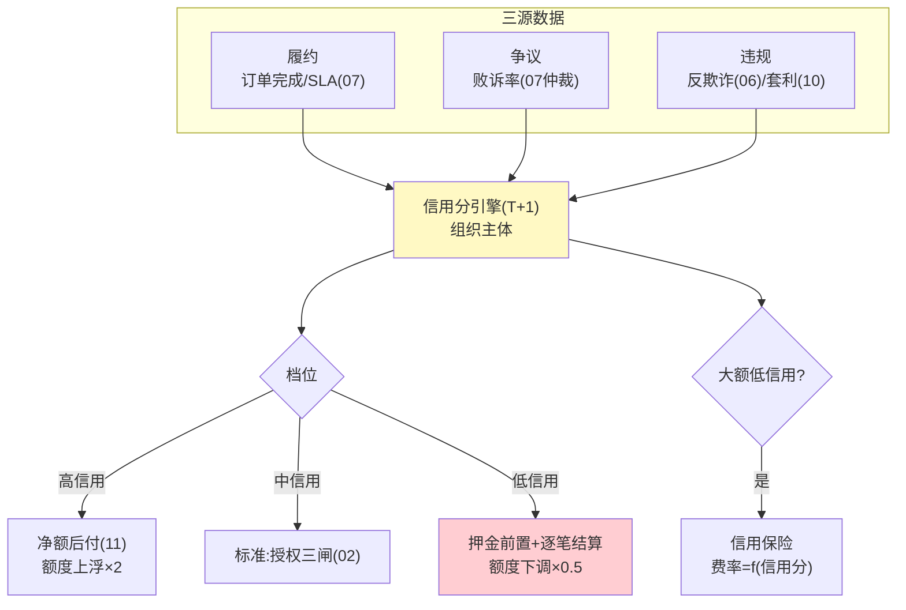
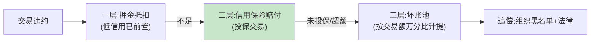

# 13-Agent 经济信用体系——履约可量化 / 信用即额度 / 坏账可分担

> **定位**：给交易主体（Agent 及其运营组织）建立**经济信用分**：履约/争议/违规历史量化成信用分，信用分**联动授权闸**（低信用=低额度=押金前置），并与保险机制衔接**分担坏账**。读者画像：要回答"陌生对手方敢不敢赊、违约了怎么办"的读者。前置阅读：[06-审计与反欺诈](06-审计与反欺诈.md)、[10-价值对齐与防套利](10-价值对齐与防套利.md)、[12-商务协议互操作](12-商务协议互操作.md)。
>
> **铁律 0**：信用模型自研「概念代码」。

---

## 一、四问

| 问 | 答 |
|----|----|
| **新增了什么需求** | ① 信用分模型：履约率（订单完成/SLA 达标）、争议率（败诉占比）、违规记录（06 反欺诈命中/10 套利命中）三源加权；主体=组织（Agent 归属组织担责）② 信用联动闸：信用档位映射交易额度与结算模式（高信用=净额后付、低信用=押金前置+逐笔）③ 信用档案披露：交易前可查对手信用摘要（互操作协议 12 的握手扩展）④ 坏账分担：信用保险（低信用大额交易投保，费率=信用函数）+ 坏账池分摊规则 |
| **影响了哪些模块** | 新增 `credit-svc`；02 授权闸加信用档位参数；07/11 结算模式按信用路由；12 握手指纹加信用摘要 |
| **架构如何演进** | 交易可信 → 交易对手可信（钱管住了，再管人） |
| **上一版痛点** | 协议互通后陌生对手方涌入，赊销裸奔：违约只能事后仲裁（周期长、追偿难）（12 §六） |

**本迭代验收**：① 信用分：三源数据 T+1 更新、档位可解释（每分变动可追到事件）② 联动：低信用主体自动降为押金+逐笔模式 ③ 披露：握手可查信用摘要（档位+近期争议率，不泄明细）④ 保险：大额低信用交易自动触发投保流程、费率=信用函数。

### 一.1 本节核对（四问口径）

| # | 核对项 | 判据 |
|---|--------|------|
| 1 | 四问齐全 | 新增需求 / 影响模块 / 架构演进 / 上一版痛点四行均有，无空答 |
| 2 | 痛点承接可落地 | "赊销裸奔、违约只能事后仲裁"对应 12 §六；信用分引擎落在 §二/§三/§四有实现的联动/反刷分/坏账分层 |

---

## 二、信用分与联动闸

**为什么主体是组织不是 Agent**：Agent 可换壳重开（新 ID 清零信用），组织跑不掉——信用锚定组织身份（KYC 主体，09），Agent 是组织的"授权消费行为人"（02 委托凭证的 principal 链）。

### 二.1 本节测试与验证（三源信用分 T+1 与档位联动）

**前置条件**：信用分引擎（T+1、组织主体）+ 档位映射授权/结算模式实现。

**材料 A——事件流剧本**：高履约主体（履约/SLA 达标）、低信用主体（多败诉+违规）。

**步骤与断言**：

| # | 操作 | 预期（PASS 判据） |
|---|------|------------------|
| 1 | 材料 A 各主体喂入订单/争议/违规事件，T+1 出分 | 每次分值变动可追到源事件（可解释） |
| 2 | 高信用主体 | 档位→净额后付（11）+ 额度上浮 ×2 |
| 3 | 低信用主体 | 信用降档 → 新交易自动切押金前置 + 逐笔结算；额度下调 ×0.5 |
| 4 | 主体身份核对 | 信用锚定组织 KYC 主体，非 Agent ID（principal 链） |

**失败排查**：①分值变动不可解释→三源事件与分值缺少归因映射；⑤模式未切→档位与 02/11 结算路由无联动。

## 三、信用档案与反刷分

| 风险 | 防线 |
|------|------|
| 刷履约（虚假订单冲高履约率） | 有效调用闸（10）前置：无下游真实使用的订单不计履约 |
| 争议和解刷低败诉率 | 和解不计入履约，只减半计争议 |
| 换壳重开 | 信用锚定组织 KYC 主体，与 Agent ID 解耦 |
| 恶意差评对手 | 争议按败诉率而非数量计权（仲裁质量过滤） |

### 三.1 本节测试与验证（四类反刷分防线）

**前置条件**：有效调用闸前置（10）+ 和解计分规则 + 组织 KYC 主体锚定 + 争议败诉率计权实现。

**材料 A（反刷分剧本）**：虚假订单主体（零下游使用）/ 和解主体 / 换壳主体（新 Agent ID 同一组织）/ 恶意差评对手。

**步骤与断言**：

| # | 操作 | 预期（PASS 判据） |
|---|------|------------------|
| 1 | 虚假订单主体 | 履约不计分（有效调用闸前置生效，无下游真实使用不计履约） |
| 2 | 和解主体 | 和解不计履约、争议减半计（不刷低败诉率） |
| 3 | 换壳主体（新 Agent ID 同一组织） | 信用继承组织 KYC 主体（换 ID 清零无效） |
| 4 | 恶意差评对手 | 争议按败诉率而非数量计权（仲裁质量过滤生效） |

**失败排查**：①仍计履约→信用管道没接 10 的有效调用闸；④清零成功→主体锚定的是 Agent ID 非 KYC 主体。

## 四、坏账分担（三层递进）

- 计提比例「概念」：池费率 = 平台历史坏账率 × 1.2（滚动 12 个月），每季重算——池是兜底不是利润中心（结余滚入下季计提基数）。

### 四.1 本节测试与验证（坏账三层递进与追偿）

**前置条件**：押金抵扣 + 信用保险（费率=f(信用分)）+ 坏账池 + 组织黑名单实现。

**材料 B——违约单**：押金不足的大额低信用交易。

**步骤与断言**：

| # | 操作 | 预期（PASS 判据） |
|---|------|------------------|
| 1 | 材料 B 违约单 | 一层押金抵扣走通；押金不足进入二层 |
| 2 | 投保交易 | 滚动 12 个月费率=f(信用分) 计算；违约走保险赔付 |
| 3 | 未投保/超额 | 进入三层坏账池（按交易额万分比拟计提） |
| 4 | 追偿 | 追偿入组织黑名单 + 法律路径 |

**失败排查**：①一层未走→低信用主体押金未前置；③超额未入池→理赔超保额仍停在保险层。

## 五、全篇回归验证

**回归断言**（§二.1 三源 T+1/联动、§三.1 四类反刷分、§四.1 坏账三层均通过后，最终整体验收）：

| # | 操作 | 预期（PASS 判据） |
|---|------|------------------|
| 1 | 材料 A 事件流剧本（高履约/虚假/和解/换壳）T+1 统一出分 | 每主体 T+1 出分且可追源；反刷分四防线逐一拦下 |
| 2 | 低信用主体 → 材料 B 违约单 | 降档切押金逐笔；违约押金→保险→坏账池三层递进走通；追偿黑名单生效 |
| 3 | 本迭代验收四项（三源信用 / 信用联动 / 反刷分 / 坏账三层） | 全部覆盖，任一 FAIL 即回归不通过 |

**失败排查**：整体任一验收 FAIL→回查 §二.1/§三.1/§四.1 对应排查项（归因映射/有效调用闸/主体锚定/押金前置）。

## 六、本迭代痛点

信用体系管住了对手方风险，经济平台自身闭环。→ 14 讲解复盘。

> 本节核对（一句话）：痛点（对手方风险已闭环、经济平台自身闭环）与下一篇 14 核心代码讲解（一笔钱的完整旅程复盘、六迭代+三进阶收官）对应——痛点已收敛即 PASS。

## 七、验收对照

| 验收项 | 标准 | 状态 |
|--------|------|------|
| 三源信用 | 可解释可追源 | ✅ |
| 信用联动 | 档位路由结算模式 | ✅ |
| 反刷分 | 四防线 | ✅ |
| 坏账三层 | 押金→保险→池 | ✅ |

> 本节核对（一句话）：四项验收（三源信用/信用联动/反刷分/坏账三层）分别对应 §二.1 步骤 1、§二.1 步骤 2-3、§三.1 步骤 1-4、§四.1 步骤 1-4，与本迭代验收段落口径一致即 PASS。

**下一篇**：[14-核心代码讲解](14-核心代码讲解.md)。
