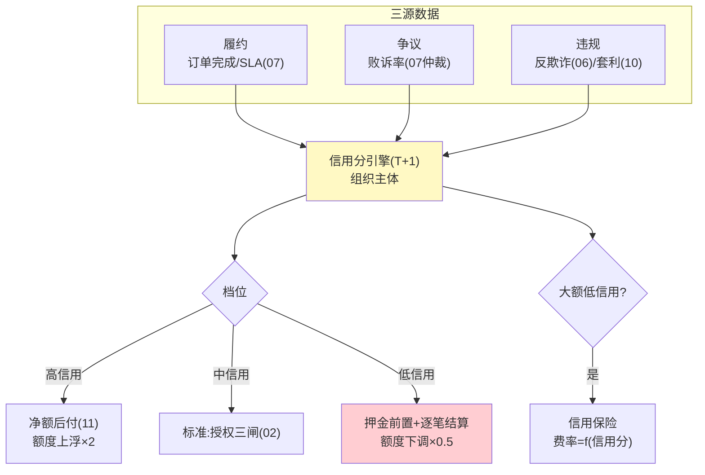
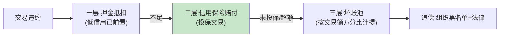

# 13-进阶六：Agent 经济信用体系——履约可量化 / 信用即额度 / 坏账可分担

> **定位**：给交易主体（Agent 及其运营组织）建立**经济信用分**：履约/争议/违规历史量化成信用分，信用分**联动授权闸**（低信用=低额度=押金前置），并与保险机制衔接**分担坏账**。读者画像：要回答"陌生对手方敢不敢赊、违约了怎么办"的读者。前置阅读：[06-迭代五-审计与反欺诈](06-迭代五-审计与反欺诈.md)、[10-进阶三-价值对齐与防套利](10-进阶三-价值对齐与防套利.md)、[12-进阶五-商务协议互操作](12-进阶五-商务协议互操作.md)。
>
> **铁律 0**：信用模型自研「概念代码」。

---

## 一、四问

| 问 | 答 |
|----|----|
| **新增了什么需求** | ① 信用分模型：履约率（订单完成/SLA 达标）、争议率（败诉占比）、违规记录（06 反欺诈命中/10 套利命中）三源加权；主体=组织（Agent 归属组织担责）② 信用联动闸：信用档位映射交易额度与结算模式（高信用=净额后付、低信用=押金前置+逐笔）③ 信用档案披露：交易前可查对手信用摘要（互操作协议 12 的握手扩展）④ 坏账分担：信用保险（低信用大额交易投保，费率=信用函数）+ 坏账池分摊规则 |
| **影响了哪些模块** | 新增 `credit-svc`；02 授权闸加信用档位参数；07/11 结算模式按信用路由；12 握手指纹加信用摘要 |
| **架构如何演进** | 交易可信 → 交易对手可信（钱管住了，再管人） |
| **上一版痛点** | 协议互通后陌生对手方涌入，赊销裸奔：违约只能事后仲裁（周期长、追偿难）（12 §六） |

**本迭代验收**：① 信用分：三源数据 T+1 更新、档位可解释（每分变动可追到事件）② 联动：低信用主体自动降为押金+逐笔模式 ③ 披露：握手可查信用摘要（档位+近期争议率，不泄明细）④ 保险：大额低信用交易自动触发投保流程、费率=信用函数。

---

## 二、信用分与联动闸



**为什么主体是组织不是 Agent**：Agent 可换壳重开（新 ID 清零信用），组织跑不掉——信用锚定组织身份（KYC 主体，09），Agent 是组织的"授权消费行为人"（02 委托凭证的 principal 链）。

## 三、信用档案与反刷分

| 风险 | 防线 |
|------|------|
| 刷履约（虚假订单冲高履约率） | 有效调用闸（10）前置：无下游真实使用的订单不计履约 |
| 争议和解刷低败诉率 | 和解不计入履约，只减半计争议 |
| 换壳重开 | 信用锚定组织 KYC 主体，与 Agent ID 解耦 |
| 恶意差评对手 | 争议按败诉率而非数量计权（仲裁质量过滤） |

## 四、坏账分担（三层递进）



- 计提比例「概念」：池费率 = 平台历史坏账率 × 1.2（滚动 12 个月），每季重算——池是兜底不是利润中心（结余滚入下季计提基数）。

## 五、测试与验证

```bash
# 1. 信用：注入履约/争议/违规事件流 → T+1 分值变动可追源
# 2. 联动：信用降档 → 新交易自动押金+逐笔；额度调整生效
# 3. 反刷：虚假订单（零下游使用）不计履约；和解不计履约
# 4. 分担：押金不足 → 保险赔付 → 池兜底全链一单走通
```

## 六、本迭代痛点

信用体系管住了对手方风险，经济平台自身闭环。→ 14 讲解复盘。

## 七、验收对照

| 验收项 | 标准 | 状态 |
|--------|------|------|
| 三源信用 | 可解释可追源 | ✅ |
| 信用联动 | 档位路由结算模式 | ✅ |
| 反刷分 | 四防线 | ✅ |
| 坏账三层 | 押金→保险→池 | ✅ |

**下一篇**：[14-核心代码讲解](14-核心代码讲解.md)。
