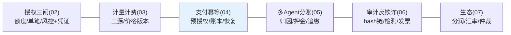
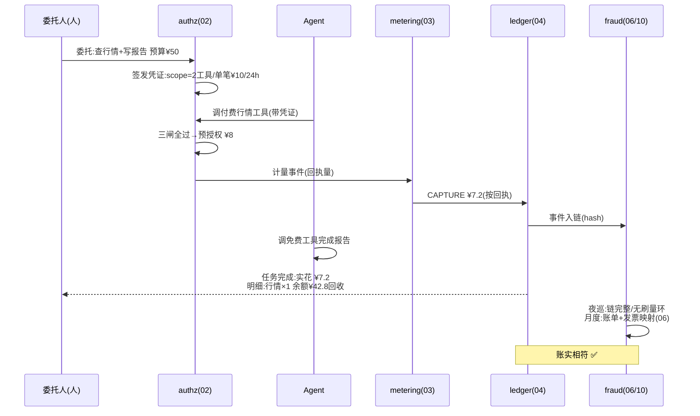

# 14-核心代码讲解：一笔钱的完整旅程

> **定位**：复盘平台关键实现，并以**"委托人授权 ¥50，Agent 完成一次多步付费任务"的完整旅程**串起六迭代+三进阶。前置阅读：[02-授权三闸](02-授权三闸.md) 至 [10-进阶三-价值对齐与防套利](10-进阶三-价值对齐与防套利.md)。

---

## 一、机制速查

## 二、完整旅程（¥50 委托从授权到对账）

**一句话**：每一分钱先有凭证（02）、后有计量（03）、落进不可改的账本（04/06）、多 Agent 也分得清（05）、生态交易按快照结算有仲裁（07）、预算超之前就有人知道（08）、跨境不踩线（09）、倒卖刷量逃不掉（10）。

## 三、关键设计复盘

| # | 设计 | 为什么 |
|---|------|--------|
| 1 | 先扣后花+原子扣减 | 花后记账必超支（01） |
| 2 | 三闸分层 | 各拦一类事故：累积/单次/盗用（02） |
| 3 | 计量以回执为准 | 预估只配预扣，账才对得平（03） |
| 4 | 预授权+幂等键分段 | Agent 高重试环境下唯一可靠扣款法（04） |
| 5 | 账本=事件重放投影 | 余额是事实的函数，不是可改的字段（04/06） |
| 6 | 子凭证只缩不放 | 委托链的权限单调递减不变式（05） |
| 7 | hash 链+外部锚点 | 改账必断链，成本远低于链式记账（06） |
| 8 | 不自持资金 | 记账+指令角色避开牌照高墙（09） |
| 9 | 聚合层套利检测 | 微观合规宏观异化，闸门层看不见（10） |

## 四、测试与验证

按 §二旅程逐跳断言（各迭代已有用例）；全链演练（授权→消费→崩溃恢复→对账→审计）季度例行。

**下一篇**：[15-ADR架构决策记录](15-ADR架构决策记录.md)。
