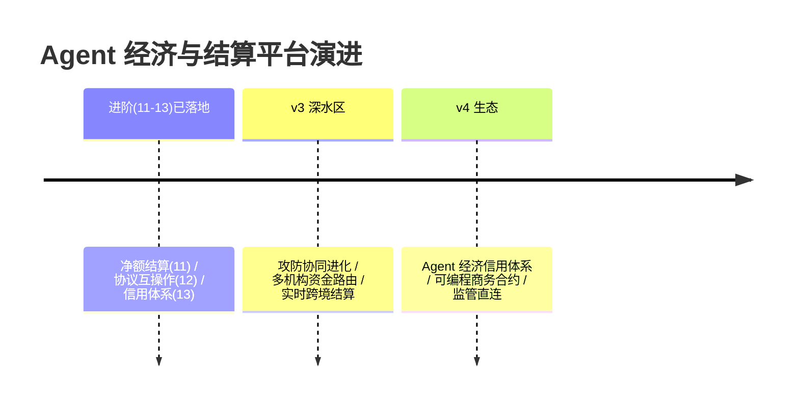

# 16-工业前沿与演进方向：Agent 经济的 2026 校准与收官

> **定位**：用 2026 工业趋势校准方向，给缺口与 v2 演进，项目收官。前置阅读：[15-ADR架构决策记录](15-ADR架构决策记录.md)。

---

## 一、行业信号（公开趋势，落地前需逐条核实最新进展）

- **Agentic Payments 成为支付行业主题**：Stripe、Visa、PayPal 等相继发布 Agent 商务（agentic commerce）能力——为 AI Agent 设计的专用支付凭证（限定商户/金额/时效），与本平台 ADR 20-02 委托凭证同构：**行业共识是"Agent 不能拿人的卡，要拿受限凭证"**。
- **协议层标准化启动**：跨厂商的 Agent 间商务协议探索（订单/支付/争议的互操作标准，如 agentic commerce 相关工作组）——对应本平台 07 分润/仲裁的组织内版本，跨组织互操作是 v2 主战场。
- **模型即计费单元的精细化**：主流推理服务商普遍转向"按 token 分层计价+缓存折扣"——本平台 03 价格目录版本化与缓存计量的衔接是直接受益方。
- **监管关注 Agent 消费**：支付监管机构对"非人类发起交易"的受托责任讨论升温——本平台 02 三闸+09 不自持资金正是受托责任的工程化答案。

### 一.1 本节核对（行业信号四则）

| # | 核对项 | 判据 |
|---|--------|------|
| 1 | 四则信号有平台映射结论 | Stripe/Visa/协议层/计价/监管 四条均指认本平台同构模块（02/07/03/02+09），无悬空趋势 |
| 2 | 与口径一致 | "Agent 拿受限凭证"对应 ADR 20-02，与 15 决策资产互证，非新增主张 |

## 二、现状对照

| # | 前沿能力 | 现状 | 缺口/演进 |
|---|---------|------|----------|
| M1 | Agent 专用支付凭证 | ✅ 02（委托凭证五要素） | ✅ 同构 |
| M2 | 组织间商务协议互操作 | ✅ 12（握手/跨域凭证/往返无损） | ✅ |
| M3 | 微额高频清结算 | ✅ 11（分钟级轧差+多边压缩） | ✅ |
| M4 | 供应商直连对账 | ✅ 03 回执+差异报告 | ✅ |
| M5 | 经济行为对齐治理 | ✅ 10/13（防套利+信用反刷分） | 🔷 v3：策略-检测协同进化（生成式攻防） |
| M6 | 资金合规架构 | ✅ 09 不自持资金 | ✅ |

### 二.1 本节核对（现状对照表）

- [ ] M1-M6 六行现状均指认落地篇（02/12/11/03/10+13/09），与既有篇号一致，无超前能力
- [ ] 唯一缺口 M5（策略-检测协同进化）指向 v3 演进，与 §三 演进路线版本号衔接，非留白

## 三、演进路线



### 三.1 本节核对（演进路线承接缺口）

- [ ] v3/v4 演进项与 §二.1 缺口 M5（攻防协同进化）及行业信号（协议层/监管）逐条对应，非凭空新增路线
- [ ] "进阶 11-13 已落地"与 files *-08~*-13 实际覆盖（净额/互操作/信用）一致，演进不超前于已实现

## 四、七旗舰对照收官（14-20）

| 视角 | 14 平台 | 15 内核 | 16 网格 | 17 实时 | 18 知识 | 19 评测 | **20 经济** |
|------|--------|--------|--------|--------|--------|--------|------------|
| 第一性 | 治理全景 | 资源托管 | 零改造 | 延迟预算 | 知识可信 | 效果可信 | **交易可信** |
| 护城河 | 治理能力 | 运行机制 | 接入规模 | 实时体验 | 知识资产 | 金标资产 | **授权与账本资产** |
| 时间观 | 策略周期 | 进程周期 | 配置周期 | 毫秒 | 知识生命周期 | 版本生命周期 | **结算周期** |

> 七旗舰共同回答"企业级 Agent 基础设施全景"：七种第一性原理七套蓝图，可组合——经济平台为其他六旗舰的所有消费动作提供"资金通行证"（授权+计量+账本），其他六旗舰为经济平台提供治理/运行/接入/体验/知识/信任底座。

### 四.1 本节核对（七旗舰对照）

- [ ] 本平台（20 经济）行"交易可信/授权与账本资产/结算周期"与本项目 00-15 实际主线（授权+计量+账本）一致
- [ ] 与 14-19 六旗舰同表对照且属性列齐全，本项目定位与"资金通行证"叙述互证，非自指

## 五、检验方式

```bash
# 对照：本平台凭证设计 vs 行业 Agent 支付凭证逐项对照自查
# v2 PoC：流式净额结算（1 万笔/分钟轧差 → 净额与逐笔和一致）
```

### 五.1 本节核对（检验方式可执行）

| # | 核对项 | 判据 |
|---|--------|------|
| 1 | 检验方式可落地 | 凭证对照自查对应 §一.1 信号①与 ADR 20-02；v2 PoC 净额校验对应 11 §二.1 一致性断言，均有复现路径 |
| 2 | 不虚构指标 | 检验项均回指既有章节验证，无"全文未测的验收承诺" |

## 六、项目收官

| 阶段 | 篇目 | 交付 |
|------|------|------|
| 基础（00-01） | 三重身份/最小账本 | 预算+记账雏形 |
| 六迭代（02-07） | 授权/计量/支付/分账/审计/生态 | 完整交易可信基础设施 |
| 进阶（08-13） | 预算/跨境/防套利/净额/互操作/信用 | 事前治理+红线+对齐+规模化与信任外溢 |
| 资产（14-16） | 讲解/ADR/前沿 | 旅程复盘+12 条决策+七旗舰收官 |

项目 20 到此收官：**授权三闸、委托凭证、三源计量、幂等账本、多 Agent 分账、hash 链审计、生态分润、不自持资金、防套利对齐**的工业级 Agent 经济与结算平台蓝图。独立项目，无后续依赖。

### 六.1 本节核对（收宫清单逐项有据）

| # | 核对项 | 判据 |
|---|--------|------|
| 1 | 四个阶段篇目齐全 | 基础/六迭代/进阶/资产 各阶段篇号与文件名一致，无跳号、无空阶段 |
| 2 | 收官能力逐项回查 | 授权/计量/账本/分账/审计/分润/不自持资金/防套利 八项能力均可回查到 02-13 对应篇章及其章节验证 |
| 3 | 独立项目无外链依赖 | 收官表述与项目角色（经济平台结算周期、资金通行证）一致，不依赖项目 14-19 才能运行 |
