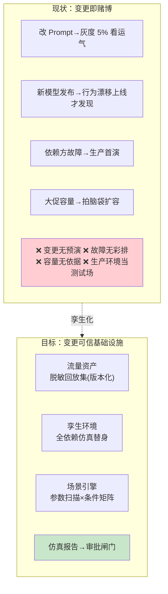
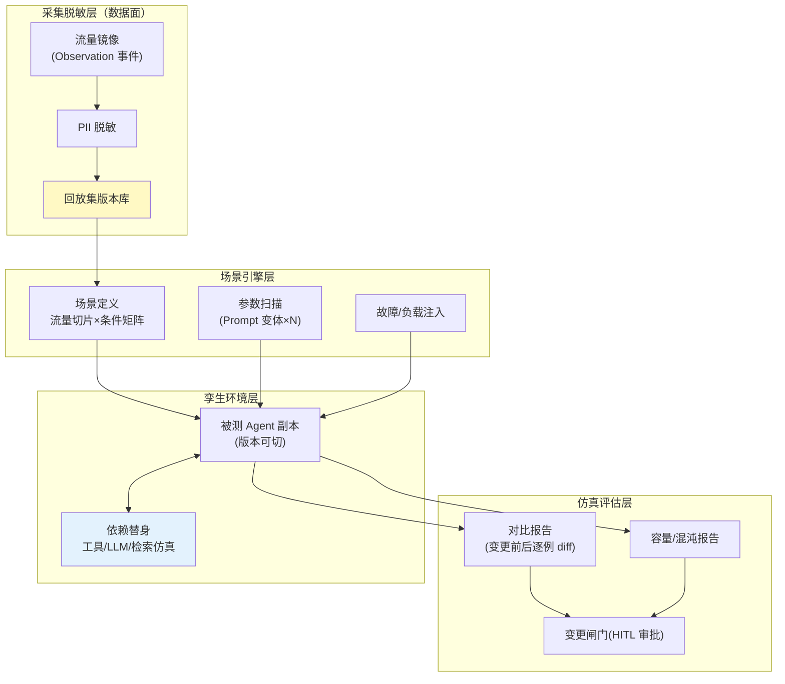
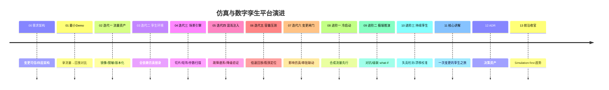

# 00-需求分析与架构设计：企业级 Agent 仿真与数字孪生平台

> **定位**：第八旗舰·**仿真视角**——第一性原理：**变更可信**。任何变更（Prompt/模型/工具/拓扑/配置）先在孪生世界验证：生产流量镜像（脱敏回放集=资产）、全依赖仿真替身、场景与参数扫描、故障混沌注入、容量压测、变更影响仿真联动审批发布。试错零成本：生产环境只见过验证过的变更。呼应 [教程 41-数据飞轮与持续改进]、[教程 35-可观测性]。读者画像：要回答"这次变更上了生产会怎样"的读者。
>
> **铁律 0**：Spring AI 2.0.0 无官方仿真/回放 API（实证结论见 scripts/api-baseline）；流量采集复用已实证 Observation 体系，孪生与场景引擎自研并标注「概念代码」。

---

## ★ 阅读顺序总览（序号 = 阅读顺序）

> 本子文件夹 14 个文件（00-13）：

| 阶段 | 文件 | 读者定位 |
|------|------|---------|
| ① 全貌 | 00-需求分析与架构设计 | **先读**：孪生四层架构 |
| ② 起步 | 01-最小Demo | **动手**：录流量→改 Prompt→回放对比 |
| ③ 主体迭代 | 02~07（流量脱敏/依赖替身/场景扫描/混沌注入/容量压测/变更联动） | **严格顺序** |
| ④ 进阶 | 08~10（新 Agent 冷启动/对抗极端推演/持续孪生校准） | **严格顺序** |
| ⑤ 讲解 | 11-核心代码讲解 | **回顾** |
| ⑥ 资产 | 12-ADR / 13-前沿 | **按需/收官** |

### ★.1 本节核对（阅读顺序总览）

- [ ] 14 个文件（00-13）的「阶段/读者定位」能对上正文：①全貌→②起步→③主体迭代(02-07)→④进阶(08-10)→⑤讲解(11)→⑥资产(12-13)，顺序与文件名编号一致
- [ ] 三、微服务清单中的六个迭代服务（capture/twin/scenario/chaos/load/change-gate）与总览表 ②③ 阶段的迭代篇（02-07）一一对应，无缺漏

---

## 一、为什么仿真是独立问题域

核心判断：传统"灰度 5%"是用**生产用户**当小白鼠；仿真平台用**历史流量的影子**当小白鼠——变更影响在生产之外全量预演，5% 灰度降为最后一道保险而非主要验证手段。

### 一.1 本节核对（为什么仿真是独立问题域）

- [ ] 能不看正文复述「现状=变更即赌博」四痛点（改 Prompt 看运气/行为漂移上线才发现/依赖故障生产首演/容量拍脑袋）与「目标=变更可信基建」四要素（流量资产/依赖替身/场景扫描/仿真闸门）
- [ ] 措辞对比：仿真是用「历史流量影子」而非「生产用户」当小白鼠；5% 灰度被降为最后一道保险而非主要验证手段

## 二、总体架构（四层）

### 二.1 本节核对（总体架构四层）

- [ ] 四层从下到上顺序：采集脱敏层(L1)→孪生环境层(L2)→场景引擎层(L3)→仿真评估层(L4)，每层框（C/T/S/V 组）与正文职责对应，无层序颠倒
- [ ] 关键数据流能沿图复述：流量镜像→脱敏→回放集→场景切片→注入被测副本（依赖替身辅助）→对比/混沌报告→变更闸门(HITL 审批)

## 三、微服务清单与迭代路线

| 服务 | 平面 | 职责 | 迭代 |
|------|------|------|------|
| `capture-svc` | 采集 | 流量镜像/脱敏/版本化 | 02 |
| `twin-svc` | 孪生 | 环境编排/依赖替身 | 03 |
| `scenario-svc` | 场景 | 切片/矩阵/参数扫描 | 04 |
| `chaos-svc` | 注入 | 故障谱系/降级验证 | 05 |
| `load-svc` | 压测 | 倍速回放/瓶颈定位 | 06 |
| `change-gate` | 闸门 | 变更仿真→审批→发布联动 | 07 |

### 三.1 本节核对（微服务清单与迭代路线）

- [ ] 六服务的「平面 + 职责 + 迭代」三列能对照上正文表：capture(采集/02)、twin(孪生/03)、scenario(场景/04)、chaos(注入/05)、load(压测/06)、change-gate(闸门/07)，服务名与迭代编号不串位
- [ ] timeline 中每个版本说明与正文三的迭代一~六（02-07）及后续进阶一~三（08-10）一一对应，无跳号错位

## 四、量化验收（项目级）

| 指标 | 目标 |
|------|------|
| 变更预演 | 100% Prompt/模型/工具变更先过仿真闸门 |
| 回放保真 | 回放结果 vs 生产实测一致率 ≥95%（未变更时） |
| 脱敏 | 抽检 0 PII 泄露；脱敏后语义保持 |
| 故障彩排 | 依赖故障谱系覆盖 top10 故障模式 |
| 压测 | 大促前容量报告给出明确拐点与配额瓶颈 |

### 四.1 本节核对（量化验收）

- [ ] 五条量化指标（变更预演 100%/回放保真 ≥95%/脱敏 0 PII/故障彩排 top10/压测明确拐点）均为带数字的可度量判据，抽查一条能指出其对应正文某处
- [ ] 回放保真"未变更时一致率 ≥95%"的限定语（未变更时）没被省略（否则该指标失去基线意义）

## 五、与教程体系的锚点

[教程 35-可观测性]（流量采集）、[教程 41-数据飞轮与持续改进]（变更闭环）、[教程 30-HumanInTheLoop]（审批闸门）、[教程 29-灰度发布]（仿真+灰度双保险）、[教程 31-安全]（对抗推演）。

### 五.1 本节核对（教程锚点）

- [ ] 每一条锚点（35/41/30/29/31）都能说出其在本项目中的落点（采集/闭环/审批/灰度/对抗），无"挂了锚点却对不上正文"项
- [ ] 与铁律 0 一致：Spring AI 无官方仿真/回放 API，流量采集复用 Observation，孪生/场景引擎属自研「概念代码」

## 六、八旗舰对照

| 视角 | 14 平台 | 15 内核 | 16 网格 | 17 实时 | 18 知识 | 19 评测 | 20 经济 | **21 仿真** |
|------|--------|--------|--------|--------|--------|--------|--------|------------|
| 第一性 | 治理全景 | 资源托管 | 零改造 | 延迟预算 | 知识可信 | 效果可信 | 交易可信 | **变更可信** |
| 一句话 | 什么都能治 | 像 OS 跑 | 像网格罩 | 像真人聊 | 答得有据 | 敢不敢上生产 | 敢让它花钱 | **敢不敢改** |

### 六.1 本节核对（八旗舰对照）

- [ ] 21 在八旗舰表中的第一性 =「变更可信」、一句话 =「敢不敢改」，与本文开篇定位（变更可信·仿真视角）一致，未与其他旗舰（治理/托管/零改造…）串位

## 七、总结

仿真平台的答案只有一个：**生产环境只见过验证过的变更**——流量是资产、依赖可替身、场景可扫描、故障可彩排、容量有依据、变更有闸门。下一篇从"录 100 条流量→改 Prompt→回放对比"跑起。

> 本节核对（一句话）：总结句"生产环境只见过验证过的变更"及其六项（流量资产/依赖替身/场景扫描/故障彩排/容量依据/变更闸门）与 一/二/三/四 各节口径一致，且"下一篇=录制回放"与 01-最小Demo 定位吻合即 PASS。

**下一篇**：[01-最小Demo](01-最小Demo.md)。
