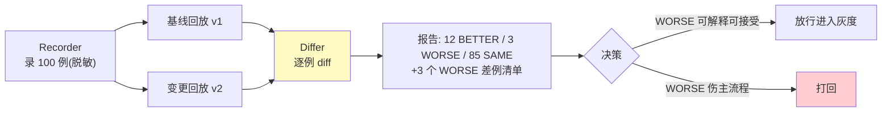

# 01-最小 Demo：录 100 条流量 → 改 Prompt → 回放对比

> **定位**：最小闭环回答"改 Prompt 到底好不好"：录请求（脱敏）→ 同一流量回放两版本 → 逐例对比。内存实现，可测试。前置阅读：[00-需求分析与架构设计](00-需求分析与架构设计.md)、[教程 41-数据飞轮与持续改进]。
>
> **铁律 0**：本篇自研「概念代码」；采集来源为已实证 Observation 事件流。

---

## 一、四问

| 问 | 答 |
|----|----|
| **新增了什么需求** | 最小变更验证闭环：① 录制真实请求（输入+关键上下文）② 固定流量下回放两个版本 ③ 逐例 diff 输出（变好/变坏/持平计数+差例清单） |
| **影响了哪些模块** | 单体三组件：Recorder/Replayer/Differ |
| **架构如何演进** | 从无到有：影子流量优先（先能重放，再谈仿真） |
| **上一版痛点** | 无（起点） |

**本迭代验收**：① 未变更回放自一致（同版本跑两遍 diff=0）② 换版本后 diff 出数且差例可点开 ③ 100 例回放分钟级完成。

---

## 二、核心抽象（三个组件）

```java
// 概念代码：最小回放对比
record CapturedCase(String caseId, String input, Map<String,Object> context) {}

class Replayer {
    // 同流量跑两版本：版本由被测 Agent 的 Prompt 版本参数决定
    Result run(List<CapturedCase> cases, String agentVersion) { /* 逐例调用 */ }
}

record CaseDiff(String caseId, String oldOut, String newOut, Verdict v) {} // BETTER/WORSE/SAME
```

设计要点：
1. **输入冻结**：回放只换 Agent 侧（Prompt/模型/工具），输入与上下文原样重放——变量唯一，因果才成立。
2. **判定三级而非两级**：BETTER/WORSE/SAME 阈值可调——demo 用关键词规则，03 起接 LLM-as-Judge。
3. **caseId 先于一切**：diff 报告以 caseId 锚定回原始请求——报出来的差例必须一键可追。

## 三、闭环流程



## 四、验证包（手工测试与验证）
**前置条件**：实现 Recorder/Replayer/Differ；100 条历史请求（可手工导出 JSON）；两个 Agent Prompt 版本 v1/v2。

**材料 A——录制文件**（`replay-r7.jsonl`，每行一例）：

```json
{"caseId":"c001","input":"查一下订单 8812 的物流","context":{"tenant":"acme","lang":"zh"}}
```

**材料 B——自一致判定**：逐例比对两次输出（字符串相等或 embedding 相似度 ≥0.98 判 SAME）。

**步骤与断言**：

| # | 操作 | 预期（PASS 判据） |
|---|------|------------------|
| 1 | 同版本 v1 回放两遍，材料B 比对 | diff=0（100 例全 SAME） |
| 2 | v1 vs v2 回放 | BETTER/WORSE/SAME 三计数之和=100；WORSE 清单按 caseId 可点开原始请求 |
| 3 | 计时 | 100 例 ≤5min |

**失败排查**：①自不一致→上下文未冻结（时间/随机数混入）或温度>0；②计数不符→去重逻辑吞案例；③超时→无并发（flatMap 并发 8 路）。


## 五、本迭代痛点

① 流量直接拿生产原文——PII 裸奔 ② 回放打真实工具/LLM——费钱且有副作用。→ 02 流量脱敏、03 依赖替身。

## 六、验收对照

| 验收项 | 标准 | 状态 |
|--------|------|------|
| 自一致 | diff=0 | ✅ |
| 逐例 diff | 差例可追 | ✅ |
| 分钟级 | 100 例 ≤5min | ✅ |

**下一篇**：[02-流量采集与脱敏](02-流量采集与脱敏.md)。
