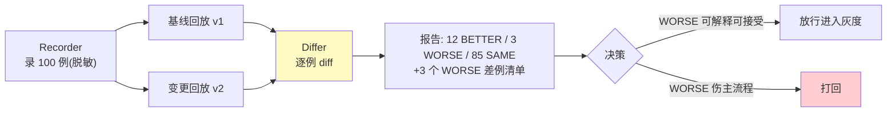

# 01-最小 Demo：录 100 条流量 → 改 Prompt → 回放对比

> **定位**：最小闭环回答"改 Prompt 到底好不好"：录请求（脱敏）→ 同一流量回放两版本 → 逐例对比。内存实现，可测试。前置阅读：[00-需求分析与架构设计](00-需求分析与架构设计.md)、[教程 08-架构师进阶/07-数据飞轮与持续改进]。
>
> **铁律 0**：本篇自研「概念代码」；采集来源为已实证 Observation 事件流。

---

## 一、四问

| 问 | 答 |
|----|----|
| **新增了什么需求** | 最小变更验证闭环：① 录制真实请求（输入+关键上下文）② 固定流量下回放两个版本 ③ 逐例 diff 输出（变好/变坏/持平计数+差例清单） |
| **影响了哪些模块** | 单体三组件：Recorder/Replayer/Differ |
| **架构如何演进** | 从无到有：影子流量优先（先能重放，再谈仿真） |
| **上一版痛点** | 无（起点） |

**本迭代验收**：① 未变更回放自一致（同版本跑两遍 diff=0）② 换版本后 diff 出数且差例可点开 ③ 100 例回放分钟级完成。

### 一.1 本节核对（四问与迭代验收）

| # | 核对项 | 判据 |
|---|--------|------|
| 1 | 四问口径齐全 | 新增需求/影响模块/架构演进/上一版痛点四行均有，无空答；"上一版痛点=无（起点）"表述自洽 |
| 2 | 本迭代验收可度量 | ①自一致 diff=0 ②换版本 diff 出数且差例可追 ③100 例分钟级——三项均是可判定动作，非空话 |

---

## 二、核心抽象（三个组件）

```java
// 概念代码：最小回放对比
record CapturedCase(String caseId, String input, Map<String,Object> context) {}

class Replayer {
    // 同流量跑两版本：版本由被测 Agent 的 Prompt 版本参数决定
    Result run(List<CapturedCase> cases, String agentVersion) { /* 逐例调用 */ }
}

record CaseDiff(String caseId, String oldOut, String newOut, Verdict v) {} // BETTER/WORSE/SAME
```

设计要点：
1. **输入冻结**：回放只换 Agent 侧（Prompt/模型/工具），输入与上下文原样重放——变量唯一，因果才成立。
2. **判定三级而非两级**：BETTER/WORSE/SAME 阈值可调——demo 用关键词规则，03 起接 LLM-as-Judge。
3. **caseId 先于一切**：diff 报告以 caseId 锚定回原始请求——报出来的差例必须一键可追。

### 二.1 本节测试与验证（核心抽象：回放与逐例 diff）

**前置条件**：实现 Recorder/Replayer/Differ；100 条历史请求（可手工导出 JSON）；两个 Agent Prompt 版本 v1/v2。

**材料 A——录制文件**（`replay-r7.jsonl`，每行一例）：

```json
{"caseId":"c001","input":"查一下订单 8812 的物流","context":{"tenant":"acme","lang":"zh"}}
```

**材料 B——自一致判定**：逐例比对两次输出（字符串相等或 embedding 相似度 ≥0.98 判 SAME）。

**步骤与断言**：

| # | 操作 | 预期（PASS 判据） |
|---|------|------------------|
| 1 | 同版本 v1 回放两遍，材料B 比对 | diff=0（100 例全 SAME） |
| 2 | v1 vs v2 回放 | BETTER/WORSE/SAME 三计数之和=100；WORSE 清单按 caseId 可点开原始请求 |
| 3 | 计时 | 100 例 ≤5min |

**失败排查**：①自不一致→上下文未冻结（时间/随机数混入）或温度>0；②计数不符→去重逻辑吞案例；③超时→无并发（flatMap 并发 8 路）。

### 二.2 可执行验证（mvn test）

回放对比闭环可直接以 junit 断言（概念代码，断言仅覆盖本节）：

```java
package com.example.twin.replay;

import java.util.List;
import lombok.extern.slf4j.Slf4j;
import org.junit.jupiter.api.Test;

import static org.junit.jupiter.api.Assertions.*;

/** 断言仅覆盖本节：自一致 diff=0；换版本三计数之和=100。 */
@Slf4j
class ReplayDiffTest {

    @Test
    void 自一致为零_换版本出数() {
        List<CapturedCase> cases = Recorder.load("replay-r7.jsonl");            // 材料 A：100 例
        assertEquals(100, cases.size());
        var base = replayer().run(cases, "v1");
        assertEquals(0, Differ.diff(base, replayer().run(cases, "v1")).size()); // 自一致：diff=0
        DiffReport r = Differ.diffReport(base, replayer().run(cases, "v2"));    // v1 vs v2
        assertEquals(100, r.better() + r.worse() + r.same());                   // 三计数之和=100
        log.info("BETTER={} WORSE={} SAME={}", r.better(), r.worse(), r.same());
    }
}
```

命令与预期输出（3-5 行，计数与 §三 流程图报告一致）：

```bash
mvn test -Dtest=ReplayDiffTest
```

```text
10:15:30 INFO  com.example.twin.replay.ReplayDiffTest - BETTER=12 WORSE=3 SAME=85
[INFO] Tests run: 1, Failures: 0, Errors: 0, Skipped: 0
[INFO] BUILD SUCCESS
```

判据：自一致段 diff=0（验收①）；`BETTER+WORSE+SAME=100` 且 WORSE 差例以 caseId 锚定可点开（验收②）。

### 二.3 运行配置与启动（两段式）

```yaml
# application.yaml（仅 .env import + 激活 profile）
spring:
  config:
    import: optional:file:.env[.properties]
  profiles:
    active: twin
```

```yaml
# application-twin.yaml（端口与模型配置——回放被测 Agent 用）
server:
  port: 8081
spring:
  ai:
    openai:
      base-url: https://api.deepseek.com          # DeepSeek 兼容 OpenAI 协议
      api-key: ${DEEPSEEK_API_KEY}                # 环境变量，不落明文
      chat:
        model: deepseek-v4-flash
twin:
  replay-file: replay-r7.jsonl                    # 材料 A：录制文件
  concurrency: 8                                  # 回放并发（§二.1 排查③：flatMap 8 路）
```

```bash
mvn spring-boot:run -Dspring-boot.run.profiles=twin
```

## 三、闭环流程



### 三.1 本节核对（闭环流程）

- [ ] 流程四步（录制→基线回放+变更回放→逐例 diff→决策）在图上与 二 的三组件一一对应（Recorder/Replayer/Differ），无多余节点
- [ ] 决策双分支（放行进入灰度 / 打回）对应 one-sentence 结论：WORSE 可解释可接受则放行、伤主流程则打回

## 四、全篇回归验证

> §二.1（回放与逐例 diff）与 §三.1（流程核对）通过后的整体验收。

| # | 操作 | 预期（PASS 判据） |
|---|------|------------------|
| 1 | 整体跑一遍"录 100 例→回放 v1/v2→逐例 diff" | 输出三计数之和=100；WORSE 差例可点开原始请求（caseId 锚定） |
| 2 | 重跑自一致（同版本两遍） | 未变更 diff=0，保真基线不破 |
| 3 | 换 v2 观察决策 | 决策能按"WORSE 可解释可接受则放行 / 伤主流程则打回"给出明确方向 |

**失败排查**：任一步 FAIL 按 §二.1 失败排查项回溯（上下文冻结 / 去重逻辑 / 并发耗时 / 温度）。

## 五、本迭代痛点

① 流量直接拿生产原文——PII 裸奔 ② 回放打真实工具/LLM——费钱且有副作用。→ 02 流量脱敏、03 依赖替身。

> 本节核对（一句话）：两条痛点（PII 裸奔→02 流量脱敏；真实工具/LLM 费钱有副作用→03 依赖替身）与后续迭代一一对应，无搁置项即 PASS。

## 六、验收对照

| 验收项 | 标准 | 状态 |
|--------|------|------|
| 自一致 | diff=0 | ✅ |
| 逐例 diff | 差例可追 | ✅ |
| 分钟级 | 100 例 ≤5min | ✅ |

> 本节核对（一句话）：验收对照表三项（自一致/逐例 diff/分钟级）与 P.一.2 本迭代验收三项一一对应，状态全 ✅ 仅当 §四 回归全部 PASS 成立。

**下一篇**：[02-流量采集与脱敏](02-流量采集与脱敏.md)。
