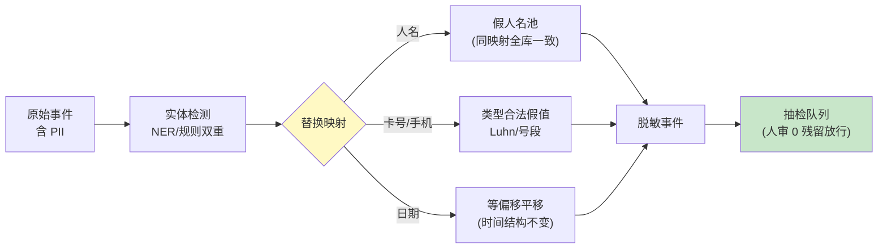

# 02-迭代一：流量采集与脱敏——流量即资产

> **定位**：把 01 的"手工录 100 条"升级为**流量资产体系**：生产流量自动镜像（Observation 事件流）、**PII 脱敏且保语义**（人名换人名、卡号换合规卡号——分布不变形）、回放集**版本化**（流量资产有版本、有指纹、有生命周期）。读者画像：要回答"仿真流量从哪来、敢不敢用"的读者。前置阅读：[01-最小Demo](01-最小Demo.md)、[教程 35-可观测性]。
>
> **铁律 0**：采集复用已实证 Observation 体系（`spring.ai.chat.observations.*`）；脱敏管线自研「概念代码」。

---

## 一、四问

| 问 | 答 |
|----|----|
| **新增了什么需求** | ① 全链路采集：请求/上下文/工具调用与响应/LLM 输入输出全镜像（采集开关与采样率独立于业务观测）② 保语义脱敏：实体替换保持类型与分布（人名→假人名、卡号→Luhn 合法假号、日期→同偏移平移）——脱敏后 Agent 行为不变形 ③ 回放集版本化：版本号+流量指纹（分布摘要哈希）+场景标签；金标级管理（防污染：回放集不可被回写）④ 生命周期：滚动窗口（默认 90 天），过期重新采集 |
| **影响了哪些模块** | 新增 `capture-svc`（镜像管道+脱敏管线+版本库） |
| **架构如何演进** | 手工样本 → 流量资产（可版本化、可审计、可复现） |
| **上一版痛点** | 01 的样本裸录：PII 直接入库违规；打真实依赖费钱有副作用（01 §五） |

**本迭代验收**：① 抽检 1000 例 0 PII 残留；实体类型分布 KS 检验不拒绝（脱敏前后分布一致）② 同版本回放集两次采集指纹稳定（采样固定 seed）③ 回放集只读（回写尝试被拒+告警）④ 90 天滚动执行。

---

## 二、保语义脱敏管线



**一致性映射是关键**：同一真实实体全库映射到同一假名（张三→李四处处一致）——否则多轮会话中"前后指同一个人"的推理被破坏，回放行为变形，仿真结论失真。

## 三、回放集版本化（资产纪律）

| 要素 | 规则 |
|------|------|
| 版本 | `R<vN>`，只增不改；每版带采集窗口/采样 seed/场景标签 |
| 指纹 | 流量分布摘要哈希（输入长度分桶/意图类别占比/工具调用频次）——指纹稳定=分布稳定 |
| 只读 | 版本库挂只读锁；仿真产出一律写新报告，禁止回写数据集 |
| 复现 | 任何历史报告可注明"基于 R7"——结论永远可复现 |

## 四、测试与验证

```bash
# 1. 脱敏：正则+NER 双检 1000 例 → 0 残留；映射一致性抽查（同人全库同假名）
# 2. 分布：脱敏前后输入长度/意图分布 KS 检验 p>0.05
# 3. 只读：尝试回写 → 拒绝+告警
# 4. 复现：R7 重跑历史场景 → 报告一致
```

## 五、本迭代痛点

流量干净了，但回放仍打真实 LLM/工具——成本与副作用没解决；依赖行为还会漂移（供应商改接口）。→ 03 孪生环境与依赖替身。

## 六、验收对照

| 验收项 | 标准 | 状态 |
|--------|------|------|
| 0 PII | 双检+人审 | ✅ |
| 分布保真 | KS 检验过 | ✅ |
| 版本只读 | 回写被拒 | ✅ |
| 可复现 | 指纹+seed | ✅ |

**下一篇**：[03-迭代二-孪生环境与依赖仿真](03-迭代二-孪生环境与依赖仿真.md)。
