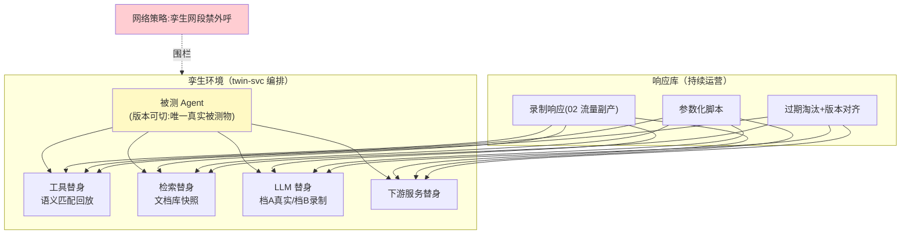

# 03-孪生环境与依赖仿真——工具/LLM/检索的替身

> **定位**：被测 Agent 之外的一切（工具/LLM/检索/下游服务）全部**仿真替身**：录制的真实响应按语义匹配回放、参数化故障、可控延迟——回放零外部成本、零副作用、行为可钉住（供应商漂移不再污染变更结论）。读者画像：要回答"仿真不打真实依赖靠什么"的读者。前置阅读：[02-流量采集与脱敏](02-流量采集与脱敏.md)。
>
> **铁律 0**：替身拦截在 HTTP/SDK 客户端层自研「概念代码」；LLM 替身分两档：档 A 真实 LLM（验证 Prompt 逻辑）/档 B 录制回放（验证编排与工具链）。

---

## 一、四问

| 问 | 答 |
|----|----|
| **新增了什么需求** | ① 替身注册表：每个外部依赖一个替身（工具 API/检索库/LLM），被测 Agent 配置指向替身端点 ② 语义匹配回放：按请求语义（参数指纹+意图嵌入相似度）从响应库取最匹配的录制响应 ③ 参数化行为：替身可注入延迟/错误/脏数据（05 深化）④ 响应库运营：录制响应持续补充、过期淘汰、版本与依赖方 API 版本对齐 |
| **影响了哪些模块** | 新增 `twin-svc`（环境编排+替身注册表+响应库） |
| **架构如何演进** | 影子流量（重放请求）→ 数字孪生（重放整个世界） |
| **上一版痛点** | 回放打真实依赖：Token 账单爆炸、付费工具有副作用、供应商当天改行为导致两次回放结论不可比（02 §五） |

**本迭代验收**：① 零外呼：回放期外部调用 0（网络策略验证）② 匹配命中率 ≥90%（未命中转人工补录队列）③ 钉住可证：同版本连续 7 天回放结论一致（不受供应商漂移影响）④ 成本：仿真 Token 成本降 ≥80%（档 B 场景）。

### 一.1 本节核对（四问与迭代验收）

| # | 核对项 | 判据 |
|---|--------|------|
| 1 | 四问口径齐全 | 新增需求（注册表/语义匹配/参数化/响应库运营）/影响模块(twin-svc)/架构演进(影子流量→数字孪生)/上一版痛点(02 真实依赖成本与漂移)——四行均有，无空答 |
| 2 | 本迭代验收可度量 | ①零外呼 ②命中率≥90%+补录 ③7 天一致 ④成本降≥80%——四项均是可判定动作 |

---

## 二、孪生环境

**被测物唯一原则**：孪生里只有一个"真的"——被测 Agent 本身。它的依赖全是替身，否则变量不唯一：你测的是"你的变更"还是"供应商昨晚上线的行为"，分不清。

### 二.1 本节测试与验证（孪生环境：零外呼/命中率/钉住）

**前置条件**：替身注册表+语义匹配回放+网络围栏实现。

**材料 A——响应库种子**：02 流量的请求-响应对入库 ≥1000 对。

**材料 B——出网监控**：孪生网段流量计数（iptables/cgroup）。

**步骤与断言**：

| # | 操作 | 预期（PASS 判据） |
|---|------|------------------|
| 1 | 回放期材料B 采样 | 孪生网段出网流量=0 |
| 2 | 1 万次替身调用统计 | 命中率 ≥90%；未命中进补录队列 |
| 3 | 连续 7 天同版本每日回放 | 报告逐例一致（供应商漂移隔离证明） |

**失败排查**：①有外呼→某依赖未注册替身（默认直连）；②命中率低→精确参数匹配，应加意图嵌入相似度；③不一致→录制含时间戳动态字段，应参数化。

## 三、两档 LLM 替身

| 档 | 实现 | 用途 | 成本 |
|----|------|------|------|
| A 真实 LLM | 被测 Agent 连真实模型 | 验证 Prompt/模型变更的效果影响（必须真模型） | 高（可采样） |
| B 录制回放 | 按输入语义匹配历史输出 | 验证编排/工具链/故障路径（模型行为非变量） | 零 |

**默认纪律**：编排类变更用档 B（快且稳）；效果类变更用档 A 采样（02 回放集的 20% 分层抽样）——两类变更两类成本。

### 三.1 本节测试与验证（两档 LLM 替身成本）

**前置条件**：档A（真实 LLM）/档B（录制回放）均可用；02 回放集可分层抽样。

**步骤与断言**：

| # | 操作 | 预期（PASS 判据） |
|---|------|------------------|
| 1 | 档B 全量+档A 20% 抽样 vs 纯档A | Token 成本降 ≥80% |

**失败排查**：①成本降幅不足→档A 抽样比例过高，或档B 未命中大量转真实调用（核对替身语义匹配命中率）。

## 四、全篇回归验证

> §二.1（孪生环境）与 §三.1（两档 LLM 成本）均通过后的整体验收。

| # | 操作 | 预期（PASS 判据） |
|---|------|------------------|
| 1 | 被测 Agent 指向孪生环境完成一轮变更仿真 | 出网流量=0、命中率≥90%、7 天一致、Token 成本降≥80% 同时成立 |
| 2 | 核对"被测物唯一"纪律 | 孪生内仅被测 Agent 为真，依赖全为替身（抽查任意依赖确认无直连旁路） |

**失败排查**：任一步 FAIL 按 §二.1/§三.1 失败排查项回溯（替身注册 / 语义匹配 / 动态字段参数化 / 档A 抽样比例）。

## 五、本迭代痛点

替身有了，但场景还是"整库重放"——想知道"只对退款场景、只在高客单价输入下变更的影响"，还得整库跑。→ 04 场景引擎与参数扫描。

> 本节核对（一句话）：痛点=场景只能"整库重放"（想按退款场景/高客单价切片），与 04 场景引擎与参数扫描一一对应，无搁置项即 PASS。

## 六、验收对照

| 验收项 | 标准 | 状态 |
|--------|------|------|
| 零外呼 | 网络围栏 | ✅ |
| 命中率 | ≥90%+补录闭环 | ✅ |
| 行为钉住 | 7 天一致 | ✅ |
| 成本 | -80% | ✅ |

> 本节核对（一句话）：验收对照表四项（零外呼/命中率/行为钉住/成本）与 §一.2 本迭代验收四项一一对应，状态全 ✅ 仅当 §四 回归全部 PASS 成立。

**下一篇**：[04-场景引擎与参数扫描](04-场景引擎与参数扫描.md)。
