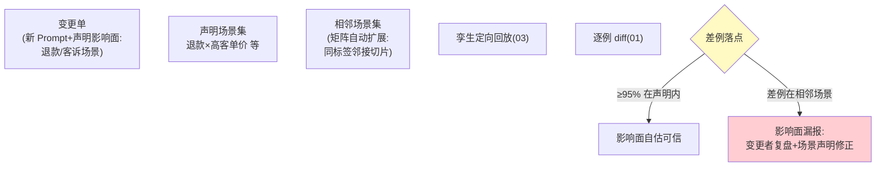
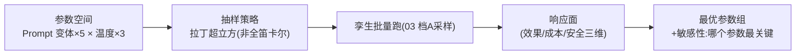

# 04-场景引擎与参数扫描——从整库重放到定向矩阵

> **定位**：场景=**流量切片×条件矩阵**（例："退款类输入 × 高客单价 × 长上下文"）；一次变更不再整库跑，而是按场景定向验证；**参数扫描**把 Prompt 变体×N 个自动全跑，给出参数-效果响应面。读者画像：要回答"变更只影响哪类流量、参数怎么选最优"的读者。前置阅读：[03-孪生环境与依赖仿真](03-孪生环境与依赖仿真.md)。
>
> **铁律 0**：场景定义 DSL 与扫描调度自研「概念代码」。

---

## 一、四问

| 问 | 答 |
|----|----|
| **新增了什么需求** | ① 场景 DSL：切片条件（意图标签/输入长度/实体类型/工具组合）+ 断言（该场景的关键指标阈值）② 条件矩阵：变更声明"影响面"（我认为会动哪些场景）→ 引擎自动跑"声明场景+相邻场景"（我以为不影响的不代表真不影响）③ 参数扫描：Prompt 变体×温度×工具描述改写的笛卡尔积抽样跑，输出响应面与最优参数组 ④ 场景库运营：场景有版本、有负责人、有失败率历史（区分"变更引入"与"场景本来就不稳"） |
| **影响了哪些模块** | 新增 `scenario-svc`；复用 02 回放集+03 孪生 |
| **架构如何演进** | 全量回放 → 定向矩阵（仿真成本的第二次数量级下降） |
| **上一版痛点** | 整库重放慢且钝：小变更也要全量跑；变更者对影响面的自估无人校验（03 §五） |

**本迭代验收**：① 场景命中：声明影响面的变更，其差例 ≥95% 落在声明场景内（否则影响面自估告警）② 相邻场景：未声明但受影响的场景检出（矩阵自动扩展）③ 扫描：5 变体×3 温度抽样跑完出响应面 ④ 场景基线：每场景有 30 天失败率基线。

---

## 二、场景与影响面校验

**相邻场景怎么算**：切片按标签向量表示，与声明场景余弦相似度 top-k 的未声明切片自动纳入——"影响面漏报"是变更事故的头号来源。

## 三、参数扫描与响应面

- 输出三件事：最优参数组、参数敏感性排序（哪个参数动了最伤）、边界案例（某参数组合下突然劣化的样本）——**选参不再拍脑袋**。

## 四、验证包（手工测试与验证）
**前置条件**：场景 DSL+相邻扩展+参数扫描+场景基线库实现。

**材料 A——切片定义**（概念 yaml）：`intent=refund AND input_len>500`。

**材料 B——漏报注入**：构造只伤未声明相邻场景（complaint）的 Prompt 变更，声明只写 refund。

**步骤与断言**：

| # | 操作 | 预期（PASS 判据） |
|---|------|------------------|
| 1 | 正常变更定向回放 | 差例 ≥95% 落声明场景内 |
| 2 | 材料B 注入 | 相邻场景检出差例+影响面漏报告警 |
| 3 | 5 变体×3 温度拉丁超立方 | 响应面出数；两次扫描敏感性 top1 一致 |
| 4 | 查场景 30 天失败率基线 | 可查；diff 前先比基线 |

**失败排查**：①差例散落→意图标签不准；②漏报未警→相邻 top-k 过小；③排序抖→样本不足加大抽样。

## 五、本迭代痛点

场景都在"正常流量"上验证——依赖挂了呢？超时呢？脏数据呢？降级路径从来没彩排过。→ 05 故障与混沌注入。

## 六、验收对照

| 验收项 | 标准 | 状态 |
|--------|------|------|
| 影响面校验 | 差例落点+漏报告警 | ✅ |
| 相邻扩展 | 矩阵自动 | ✅ |
| 响应面 | 最优+敏感性 | ✅ |
| 场景基线 | 30 天失败率 | ✅ |

**下一篇**：[05-故障与混沌注入](05-故障与混沌注入.md)。
