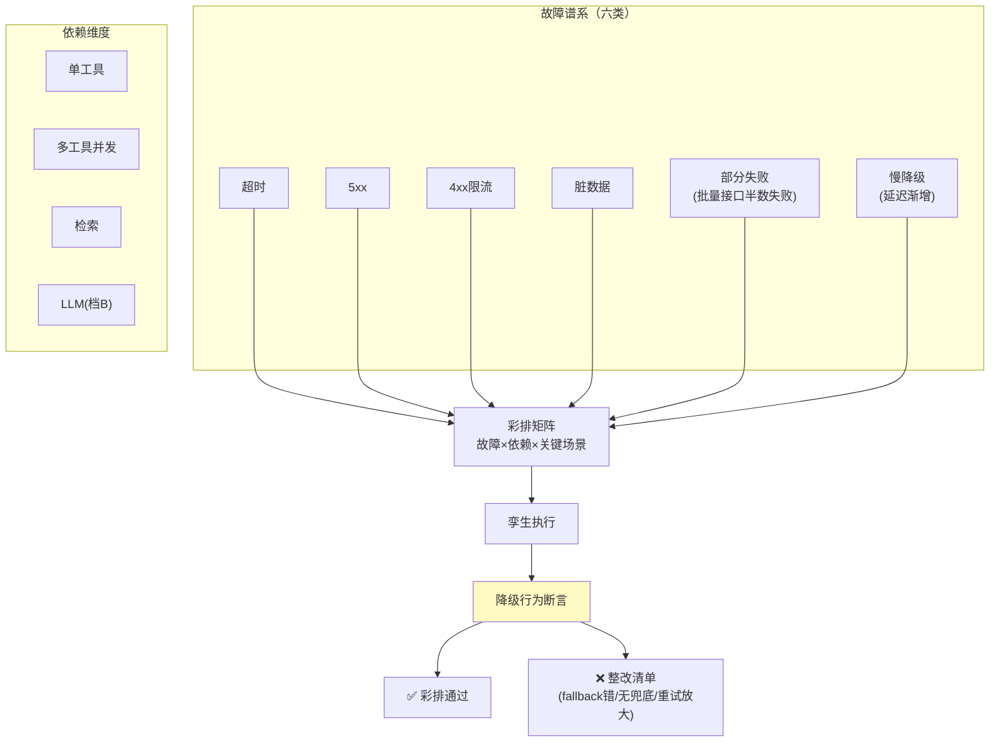

# 05-故障与混沌注入——降级路径彩排

> **定位**：给依赖替身（03）装上**故障谱系**：超时/错误/脏数据/部分失败/慢降级（延迟渐增），按场景批量注入，验证 Agent 的**降级行为**（fallback 是否真生效、重试是否守预算、部分失败是否有兜底）——生产故障在孪生里首演，不在生产里首演。读者画像：要回答"依赖挂了 Agent 会不会烂掉"的读者。前置阅读：[03-孪生环境与依赖仿真](03-孪生环境与依赖仿真.md)。
>
> **铁律 0**：注入引擎自研「概念代码」。

---

## 一、四问

| 问 | 答 |
|----|----|
| **新增了什么需求** | ① 故障谱系：六类（超时/5xx/4xx 限流/脏数据/部分失败/慢降级）×依赖维度（单工具/多工具并发/检索/LLM）② 场景×故障矩阵：关键场景跑全谱系（彩排表），回归时抽样 ③ 降级行为断言：不只是"没崩"，而是**断言行为**（fallback 到免费源/礼貌告知/部分结果标注）④ 重试预算验证：故障下重试不超限、不放大（雪崩检测：故障注入下总调用量 ≤正常×1.2） |
| **影响了哪些模块** | 新增 `chaos-svc`；03 替身加故障注入口 |
| **架构如何演进** | 正常路径仿真 → 全路径仿真（含失败路径——真实世界一半是失败的） |
| **上一版痛点** | 降级代码写了从没跑过：fallback 配置错、重试无上限、部分失败输出半截无标注——全是生产首演（04 §五） |

**本迭代验收**：① 彩排表：top10 故障模式 × 关键场景 100% 覆盖 ② 降级断言通过率 ≥90%（未过项进整改清单）③ 雪崩检测：故障注入下调用放大 ≤1.2× ④ 部分失败输出 100% 有标注（用户可见"数据不完整"）。

### 一.1 本节核对（四问与迭代验收）

| # | 核对项 | 判据 |
|---|--------|------|
| 1 | 四问口径齐全 | 新增需求（故障谱系/场景×故障矩阵/降级行为断言/重试预算）/影响模块(chaos-svc + 03 注入口)/架构演进(正常路径→全路径仿真)/上一版痛点(降级代码从没跑过)——四行均有 |
| 2 | 本迭代验收可度量 | ①top10×关键场景 100% 覆盖 ②断言通过率≥90% ③放大≤1.2× ④部分失败 100% 标注——四项均是可判定动作 |

---

## 二、故障谱系与彩排矩阵

### 二.1 本节测试与验证（故障谱系与彩排矩阵）

**前置条件**：六类注入器+top10 关键场景清单实现。

**材料 A——彩排矩阵**（概念 csv）：`fault_type,dependency,scenario` 6×10=60 行。

**步骤与断言**：

| # | 操作 | 预期（PASS 判据） |
|---|------|------------------|
| 1 | 材料A 全矩阵 | 断言通过率 ≥90%；未过项入整改清单 |

**失败排查**：①某依赖断言集中失败→其 fallback 未实现（核对该故障×依赖组合的注册与注入端点）。

## 三、降级行为断言（不是"没崩"）

| 断言 | 含义 |
|------|------|
| fallback 生效 | 主源失败 → 备源/免费源被调且结果可用 |
| 礼貌降级 | 无可用源 → 用户得到可行动告知而非半截错误 |
| 部分结果标注 | 批量半失败 → 输出明确"3/5 项，缺 2 项" |
| 重试守预算 | 故障期重试次数 ≤配置上限；总放大 ≤1.2× |
| 恢复无残留 | 故障解除 → 行为回到基线（无永久降级卡死） |

### 三.1 本节测试与验证（降级行为断言）

**前置条件**：批量接口 mock 支持部分注入（部分失败）。

**材料 B——部分失败样本**：批量接口 mock 5 项中 2 项 error。

**步骤与断言**：

| # | 操作 | 预期（PASS 判据） |
|---|------|------------------|
| 1 | 材料B 注入 | 输出 100% 含"3/5 项，缺 2 项"标注（部分结果标注断言生效） |

**失败排查**：①无标注→输出模板缺部分失败分支（核对 三 表"部分结果标注"行实现了分类兜底）。

## 四、雪崩检测

- 注入期间统计总调用量对比基线：放大 >1.2× 即雪崩信号（典型根因：无退避重试×并发×多 Agent 叠加）。
- 慢降级（延迟渐增）是隐蔽杀手：不报错只变慢——断言改为延迟 SLO 而非错误率（对齐可观测语义约定，见 [教程 35-可观测性]）。

### 四.1 本节测试与验证（雪崩检测与恢复）

**前置条件**：雪崩检测（总调用量对比基线）实现；注入支持定时增延迟与解除。

**步骤与断言**：

| # | 操作 | 预期（PASS 判据） |
|---|------|------------------|
| 1 | 无退避工具注入超时 | 放大 >1.2× 触发雪崩告警 |
| 2 | 慢降级（延迟每分钟+10%） | 延迟 SLO 告警在 P99 越线触发（对齐延迟语义约定） |
| 3 | 解除注入回放基线 | 行为回基线（无卡死） |

**失败排查**：①放大不超→注入量级不够或无退避工具未注入到（核对重试退避确实被绕过）；⑤卡死→降级开关无复位。

## 五、全篇回归验证

> §二.1（彩排矩阵）与 §三.1（降级断言）、§四.1（雪崩检测）均通过后的整体验收。

| # | 操作 | 预期（PASS 判据） |
|---|------|------------------|
| 1 | 完整彩排一轮（六类×top10 关键场景） | 断言通过率 ≥90%；未过项入整改清单 |
| 2 | 叠加雪崩与恢复演练 | 放大 ≤1.2× 触发告警；解除后行为回基线（无卡死） |
| 3 | 核对部分失败标注 | 任意批量半失败场景输出 100% 含"缺 N 项"标注 |

**失败排查**：任一步 FAIL 按 §二.1/§三.1/§四.1 失败排查项回溯（fallback 实现 / 输出模板 / 雪崩量级 / 降级复位）。

## 六、本迭代痛点

单点故障彩排了；负载呢——大促 10 倍流量下瓶颈在哪、几倍是拐点，没有答案。→ 06 容量与压测。

> 本节核对（一句话）：痛点=单点故障已彩排但负载未知（大促 10 倍流量的瓶颈/拐点），与 06 容量与压测一一对应，无搁置项即 PASS。

## 七、验收对照

| 验收项 | 标准 | 状态 |
|--------|------|------|
| 彩排覆盖 | 六类×top10 | ✅ |
| 断言通过 | ≥90% | ✅ |
| 雪崩防护 | ≤1.2× | ✅ |
| 恢复无残留 | 回基线 | ✅ |

> 本节核对（一句话）：验收对照表四项（彩排覆盖/断言通过/雪崩防护/恢复无残留）与 §一.2 本迭代验收四项一一对应，状态全 ✅ 仅当 §五 回归全部 PASS 成立。

**下一篇**：[06-容量与压测](06-容量与压测.md)。
