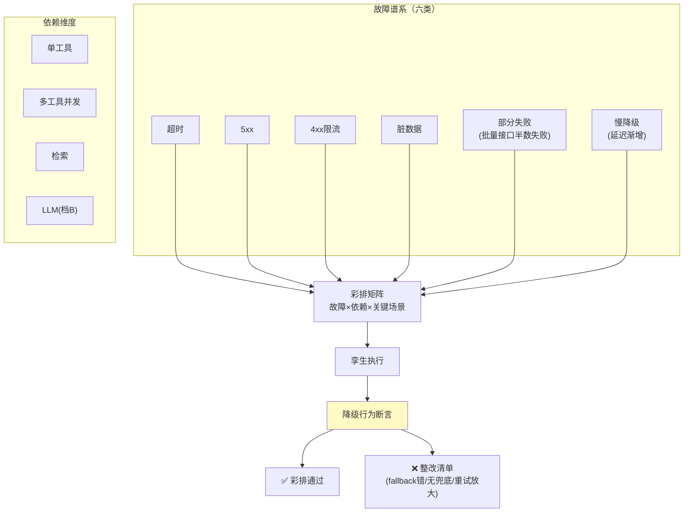

# 05-迭代四：故障与混沌注入——降级路径彩排

> **定位**：给依赖替身（03）装上**故障谱系**：超时/错误/脏数据/部分失败/慢降级（延迟渐增），按场景批量注入，验证 Agent 的**降级行为**（fallback 是否真生效、重试是否守预算、部分失败是否有兜底）——生产故障在孪生里首演，不在生产里首演。读者画像：要回答"依赖挂了 Agent 会不会烂掉"的读者。前置阅读：[03-迭代二-孪生环境与依赖仿真](03-迭代二-孪生环境与依赖仿真.md)。
>
> **铁律 0**：注入引擎自研「概念代码」。

---

## 一、四问

| 问 | 答 |
|----|----|
| **新增了什么需求** | ① 故障谱系：六类（超时/5xx/4xx 限流/脏数据/部分失败/慢降级）×依赖维度（单工具/多工具并发/检索/LLM）② 场景×故障矩阵：关键场景跑全谱系（彩排表），回归时抽样 ③ 降级行为断言：不只是"没崩"，而是**断言行为**（fallback 到免费源/礼貌告知/部分结果标注）④ 重试预算验证：故障下重试不超限、不放大（雪崩检测：故障注入下总调用量 ≤正常×1.2） |
| **影响了哪些模块** | 新增 `chaos-svc`；03 替身加故障注入口 |
| **架构如何演进** | 正常路径仿真 → 全路径仿真（含失败路径——真实世界一半是失败的） |
| **上一版痛点** | 降级代码写了从没跑过：fallback 配置错、重试无上限、部分失败输出半截无标注——全是生产首演（04 §五） |

**本迭代验收**：① 彩排表：top10 故障模式 × 关键场景 100% 覆盖 ② 降级断言通过率 ≥90%（未过项进整改清单）③ 雪崩检测：故障注入下调用放大 ≤1.2× ④ 部分失败输出 100% 有标注（用户可见"数据不完整"）。

---

## 二、故障谱系与彩排矩阵



## 三、降级行为断言（不是"没崩"）

| 断言 | 含义 |
|------|------|
| fallback 生效 | 主源失败 → 备源/免费源被调且结果可用 |
| 礼貌降级 | 无可用源 → 用户得到可行动告知而非半截错误 |
| 部分结果标注 | 批量半失败 → 输出明确"3/5 项，缺 2 项" |
| 重试守预算 | 故障期重试次数 ≤配置上限；总放大 ≤1.2× |
| 恢复无残留 | 故障解除 → 行为回到基线（无永久降级卡死） |

## 四、雪崩检测

- 注入期间统计总调用量对比基线：放大 >1.2× 即雪崩信号（典型根因：无退避重试×并发×多 Agent 叠加）。
- 慢降级（延迟渐增）是隐蔽杀手：不报错只变慢——断言改为延迟 SLO 而非错误率（对齐可观测语义约定，见 [教程 35-可观测性]）。

## 五、测试与验证

```bash
# 1. 彩排：六类故障×top10 场景全跑 → 断言通过率 ≥90%
# 2. 雪崩：注入重试风暴场景 → 放大告警在 >1.2× 时触发
# 3. 标注：半失败批量 → 输出含不完整标注 100%
# 4. 恢复：解除注入 → 回放基线行为恢复
```

## 六、本迭代痛点

单点故障彩排了；负载呢——大促 10 倍流量下瓶颈在哪、几倍是拐点，没有答案。→ 06 容量与压测。

## 七、验收对照

| 验收项 | 标准 | 状态 |
|--------|------|------|
| 彩排覆盖 | 六类×top10 | ✅ |
| 断言通过 | ≥90% | ✅ |
| 雪崩防护 | ≤1.2× | ✅ |
| 恢复无残留 | 回基线 | ✅ |

**下一篇**：[06-迭代五-容量与压测](06-迭代五-容量与压测.md)。
