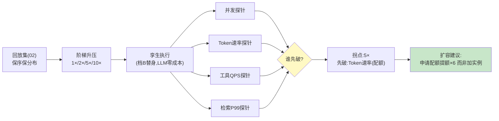

# 06-迭代五：容量与压测——倍速回放 / 瓶颈定位 / SLO 报告

> **定位**：把回放集当**压力源**：倍速回放（1×→10×）找系统拐点、瓶颈定位（并发/Token 速率/工具配额/检索延迟哪个先断）、SLO 压测报告（"几倍流量下哪个 SLO 先破"）——大促扩容有依据，不是拍脑袋。读者画像：要回答"流量×10 系统会先死哪"的读者。前置阅读：[03-迭代二-孪生环境与依赖仿真](03-迭代二-孪生环境与依赖仿真.md)、[教程 35-可观测性]。
>
> **铁律 0**：压测调度自研「概念代码」；指标口径复用已实证 Observation 体系。

---

## 一、四问

| 问 | 答 |
|----|----|
| **新增了什么需求** | ① 倍速回放：回放集按时间压缩比加速（保序保分布），阶梯升压（1×→2×→5×→10×）② 四类瓶颈探针：并发连接/Token 速率（模型配额）/工具 QPS 配额/检索 P99——自动判定"先断的是哪个" ③ SLO 拐点报告：每个 SLO（首字延迟/完成率/错误率）在几倍流量破线 ④ 扩容建议：瓶颈类型→扩容动作映射（配额类→申请提额；并发类→加实例；热路径→缓存/降级） |
| **影响了哪些模块** | 新增 `load-svc`；复用 02 回放集+03 孪生（档 B 为主避免压测打爆真实 LLM） |
| **架构如何演进** | 功能仿真 → 容量仿真（正确性之外回答"扛多少"） |
| **上一版痛点** | 故障彩排了但容量没底：大促扩容拍脑袋、模型配额临场打爆、没人知道拐点（05 §六） |

**本迭代验收**：① 阶梯压测出明确拐点（倍数+先破的 SLO）② 瓶颈归因正确（人为限流工具配额 → 探针判定为配额类）③ 压测不打真实 LLM（档 B，成本 0）④ 报告可直接指导扩容（动作映射）。

---

## 二、阶梯升压与瓶颈探针



**为什么档 B 压测**：压测要打满 10×——档 A（真实 LLM）成本不可承受且会打爆生产配额（副作用）。档 B 替身回放保持时延分布（03 响应库带录制延迟），容量结论对编排链成立；模型侧容量单独用配额数学算（TPM/RPM 上限是确定值，不需要压）。

## 三、SLO 拐点报告

| SLO | 目标 | 拐点 |
|-----|------|------|
| 首字延迟 P99 | ≤1.2s | 7× 破 |
| 任务完成率 | ≥99% | 5× 破（配额拒绝） |
| 错误率 | ≤0.1% | 5× 破 |
| **结论** | 先破=配额，系统拐点 **5×** | 扩容动作：提额，非加机器 |

## 四、测试与验证

```bash
# 1. 拐点：阶梯跑 → 明确倍数+先破 SLO
# 2. 归因：人为限流某工具 → 探针判定配额类
# 3. 零成本：压测期真实 LLM 调用=0（网络围栏验证）
# 4. 动作映射：报告给出"提额/加实例/缓存"三类之一
```

## 五、本迭代痛点

仿真报告有了，但它躺在平台里——变更审批、发布闸门跟仿真还是两张皮。→ 07 变更影响仿真与审批联动。

## 六、验收对照

| 验收项 | 标准 | 状态 |
|--------|------|------|
| 拐点明确 | 倍数+先破 SLO | ✅ |
| 归因正确 | 四探针 | ✅ |
| 零 LLM 成本 | 档 B 压测 | ✅ |
| 动作可执行 | 扩容映射 | ✅ |

**下一篇**：[07-迭代六-变更影响仿真与审批联动](07-迭代六-变更影响仿真与审批联动.md)。
