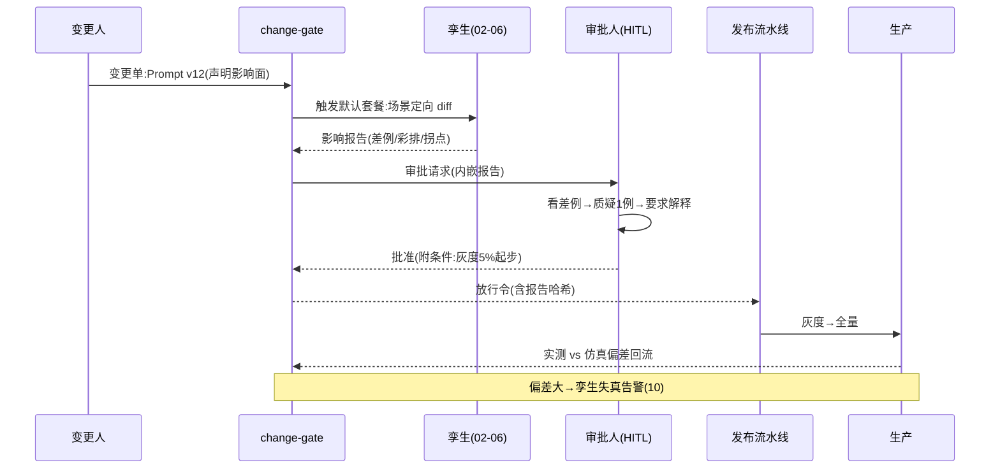

# 07-迭代六：变更影响仿真与审批联动——仿真即闸门

> **定位**：收官闭环：变更单（Prompt/模型/工具/配置）→ 自动触发的定向仿真（04 场景）→ 影响报告（diff/降级/容量三类）→ **HITL 审批**（报告作为审批证据）→ 与发布流程联动（仿真未过不放行）。仿真从"平台里的一张报告"变成"发布流水线的硬闸门"。读者画像：要回答"怎么强制每个变更先仿真"的读者。前置阅读：[06-迭代五-容量与压测](06-迭代五-容量与压测.md)、[教程 30-HumanInTheLoop]、[教程 29-灰度发布]。
>
> **铁律 0**：变更单模型与联动自研「概念代码」；HITL 落点遵循已实证基准（工具/流程装饰层）。

---

## 一、四问

| 问 | 答 |
|----|----|
| **新增了什么需求** | ① 变更单类型化：Prompt/模型切换/工具改描述或换源/配置阈值——每类绑定默认仿真套餐（Prompt→场景 diff；模型→diff+容量；工具→降级彩排）② 报告即证据：审批页内嵌仿真报告（差例可点、彩排结果、拐点）——审批人看证据不靠口头描述 ③ 闸门硬约束：CI/CD 中仿真未过/未跑 → 发布流水线拒绝（可按变更风险分级豁免，豁免需双签）④ 仿真-生产对照回流：上线后实测 vs 仿真预测的偏差回写（10 校准孪生的数据源） |
| **影响了哪些模块** | 新增 `change-gate`；对接发布流水线（Webhook）与审批（HITL 队列） |
| **架构如何演进** | 仿真工具 → 仿真闸门（六迭代能力收口成一个动作：放行/打回） |
| **上一版痛点** | 报告躺在平台里，发布不看它：仿真跑不跑靠自觉、审批人问"应该没问题吧"（06 §六） |

**本迭代验收**：① 未过仿真的变更发布被流水线拒绝 100%（旁路豁免需双签留痕）② 审批页报告内嵌可交互 ③ 变更-仿真-审批-发布-回流五环事件链完整可审计 ④ 风险分级正确（低风险配置变更走快速通道 ≤10min）。

---

## 二、变更旅程（闭环总装）



## 三、变更分级与豁免纪律

| 级别 | 例 | 套餐 | 审批 |
|------|----|------|------|
| 高 | 模型切换/工具换源 | diff+彩排+容量全跑 | 双人审批 |
| 中 | Prompt 主体改动 | 定向 diff+相邻场景 | 单人+报告 |
| 低 | 文案/阈值微调 | 快速抽样 diff | 自动+抽审 |

- **豁免必须贵**：跳过仿真需要变更人+平台 owner 双签，豁免单月公示——让"走后门"有成本，闸门才是闸门。

## 四、仿真-生产偏差回流

- 上线 48h 内：生产实测指标 vs 仿真预测逐项对照；偏差 >15% 记失真事件（孪生环境的健康度输入，10 展开）。
- 回流让闸门自我进化：长期偏差小的场景可提级为"低风险自动放行"，偏差大的场景强制全跑。

## 五、测试与验证

```bash
# 1. 闸门：未跑仿真的变更 → 流水线拒绝；豁免双签后放行且公示
# 2. 报告：审批页差例可点开追原始请求(02 caseId 链)
# 3. 事件链：变更→仿真→审批→发布→回流五环日志完整
# 4. 分级：低风险变更全流程 ≤10min
```

## 六、本迭代痛点

已上线 Agent 有流量可回放；**新 Agent** 没有历史流量，仿真从哪来？→ 08 新 Agent 上线前仿真。

## 七、验收对照

| 验收项 | 标准 | 状态 |
|--------|------|------|
| 闸门强制 | 未仿真 0 直发 | ✅ |
| 报告即证据 | 审批内嵌 | ✅ |
| 五环可审计 | 事件链完整 | ✅ |
| 分级时效 | 低风险 ≤10min | ✅ |

**下一篇**：[08-进阶一-新Agent上线前仿真](08-进阶一-新Agent上线前仿真.md)。
