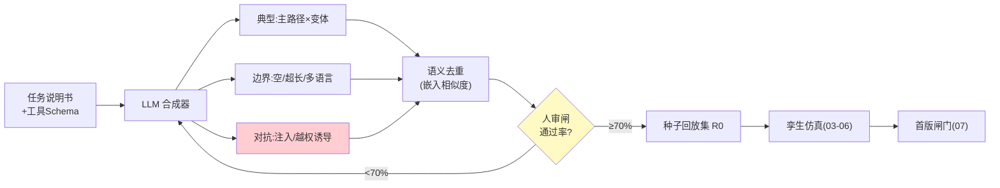
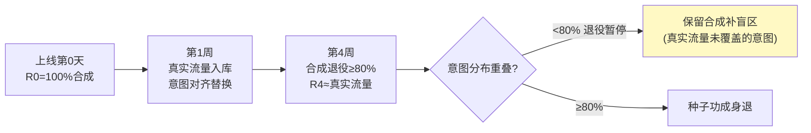

# 08-新 Agent 上线前仿真——冷启动的合成流量

> **定位**：已上线 Agent 有历史流量可回放；**新 Agent 没有**。本篇解决冷启动：用 LLM 从任务说明书**合成流量**（典型/边界/对抗三类）、人审入库成"种子回放集"、上线后真实流量滚动替换合成流量（种子集逐步退役）。读者画像：要回答"新 Agent 没流量怎么仿真"的读者。前置阅读：[07-变更影响仿真与审批联动](07-变更影响仿真与审批联动.md)、[教程 37-自我反思与Agent评估]。
>
> **铁律 0**：合成编排自研「概念代码」（ChatClient 走已实证基准）。

---

## 一、四问

| 问 | 答 |
|----|----|
| **新增了什么需求** | ① 三类合成：典型（说明书主路径）/边界（空输入/超长/多语言/极端参数）/对抗（诱导越权/注入式请求）② 说明书驱动：从 Agent 的任务描述+工具 Schema 自动推导"该被问到什么"——合成不是随机生成 ③ 种子集人审闸：合成样本人审通过才入库（≥70% 通过率，低于则合成 Prompt 迭代）④ 滚动退役：上线后每周用真实流量按意图分布对齐替换合成样本，30 天种子集退役率 ≥80% |
| **影响了哪些模块** | `scenario-svc` 加合成器；`capture-svc` 加种子集版本管理 |
| **架构如何演进** | 流量资产（历史派）→ 流量资产（历史+合成双源） |
| **上一版痛点** | 变更闸门只护得住"已上线"：新 Agent 首版带着零仿真裸奔上线，第二版才开始有闸门（07 §六） |

**本迭代验收**：① 新 Agent 首版 100% 过种子集仿真闸门 ② 种子集三类齐备（典型/边界/对抗），人审通过率 ≥70% ③ 合成-真实分布对齐度：上线 30 天意图分布重叠 ≥80% ④ 种子退役：30 天退役率 ≥80%。

### 一.1 本节核对（四问与迭代验收）

| # | 核对项 | 判据 |
|---|--------|------|
| 1 | 四问口径齐全 | 新增需求（三类合成/说明书驱动/种子人审闸/滚动退役）/影响模块(scenario-svc + capture-svc)/架构演进(历史派→历史+合成双源)/上一版痛点(07 新 Agent 零仿真裸奔)——四行均有 |
| 2 | 本迭代验收可度量 | ①首版 100% 过闸 ②三类齐备+人审≥70% ③分布对齐≥80% ④退役≥80%——四项均是可判定动作 |

---

## 二、合成流水线

**对抗类为什么必须有**：新 Agent 最脆弱的时刻是首版——合成对抗流量让红队式检验提前到上线前（不等真实攻击者来当第一个测试员）。

### 二.1 本节测试与验证（合成流水线与首版闸门）

**前置条件**：合成器+人审闸实现；新 Agent 任务说明书与工具 Schema。

**材料 A——说明书**（10 行：目标/工具/边界）。

**材料 B——对抗检查表**：诱导越权/提示注入样本 ≥30 例。

**步骤与断言**：

| # | 操作 | 预期（PASS 判据） |
|---|------|------------------|
| 1 | 材料A 过合成器 | 三类各 ≥30 例；去重后抽 10 例重复率 <30% |
| 2 | 人审 100 例 | 通过率 ≥70%（低则迭代合成 Prompt） |
| 3 | 对抗类拦截不达标 | 首版闸门打回（红队式检验前置到上线前） |

**失败排查**：①同质化→生成缺多样性指令；②人审低→边界类跑偏（说明书边界模糊）；③对抗未拦→对抗合成样本覆盖上不达标。

## 三、滚动退役（合成→真实）

- **退役不是全退**：真实流量覆盖不到的冷门意图，合成样本永久保留兜底——退役标准是"分布对齐"不是"时间到"。

### 三.1 本节测试与验证（滚动退役）

**前置条件**：滚动退役（按意图分布对齐替换）实现；模拟真实流量源。

**步骤与断言**：

| # | 操作 | 预期（PASS 判据） |
|---|------|------------------|
| 1 | 模拟 4 周真实流量 | 种子退役 ≥80%；冷门意图保留（分布对齐驱动，非纯时间） |

**失败排查**：①过度退役→退役标准是"分布对齐"而非"时间到"（核对意图重叠≥80% 判据生效）；②冷门意图流失→合成兜底保留未开启。

## 四、全篇回归验证

> §二.1（合成流水线）与 §三.1（滚动退役）均通过后的整体验收。

| # | 操作 | 预期（PASS 判据） |
|---|------|------------------|
| 1 | 新 Agent 首版走完整仿真 | 100% 过种子集闸门；三类齐备+人审≥70% |
| 2 | 模拟 30 天上线后滚动退役 | 意图分布对齐≥80%；种子退役≥80%；冷门意图保留 |
| 3 | 抽样核对抗覆盖 | 对抗检查表样本在首版仿真中确有拦截能力（不达标可打回） |

**失败排查**：任一步 FAIL 按 §二.1/§三.1 失败排查项回溯（合成多样性 / 人审门槛 / 分布对齐判据）。

## 五、本迭代痛点

合成+历史都是"善意流量"；极端场景（10×洪峰叠加依赖故障、级联雪崩）日常回放覆盖不了。→ 09 对抗仿真与极端推演。

> 本节核对（一句话）：痛点=合成+历史都是善意流量，极端场景（10×洪峰叠加故障、级联雪崩）未覆盖，与 09 对抗仿真与极端推演一一对应，无搁置项即 PASS。

## 六、验收对照

| 验收项 | 标准 | 状态 |
|--------|------|------|
| 首版闸门 | 100% 过仿真 | ✅ |
| 三类齐备+人审 | ≥70% | ✅ |
| 分布对齐 | ≥80% | ✅ |
| 退役纪律 | 对齐驱动 | ✅ |

> 本节核对（一句话）：验收对照表四项（首版闸门/三类齐备+人审/分布对齐/退役纪律）与 §一.2 本迭代验收四项一一对应，状态全 ✅ 仅当 §四 回归全部 PASS 成立。

**下一篇**：[09-对抗仿真与极端场景](09-对抗仿真与极端场景.md)。
