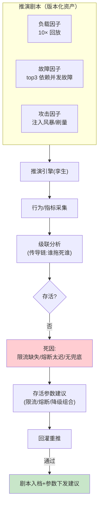

# 09-进阶二：对抗仿真与极端场景——what-if 推演场

> **定位**：日常仿真验证"正常世界的变更"；本篇构建**极端世界的推演场**：攻击流量洪峰（prompt 注入风暴/恶意刷量）、复合故障（10× 负载叠加 top3 依赖同时故障）、级联雪崩（一环慢全链慢）——what-if 推演给出"最坏情况的剧本与存活条件"。读者画像：要回答"最坏情况系统什么死法、怎么活"的读者。前置阅读：[05-迭代四-故障与混沌注入](05-迭代四-故障与混沌注入.md)、[06-迭代五-容量与压测](06-迭代五-容量与压测.md)、[教程 31-Agent安全深度]。
>
> **铁律 0**：推演编排自研「概念代码」。

---

## 一、四问

| 问 | 答 |
|----|----|
| **新增了什么需求** | ① 攻击流量合成：注入风暴/刷量/慢速耗尽（类 Slowloris 的长会话占上下文）三类攻击流量倍速注入 ② 复合故障剧本：负载×N 叠加多依赖故障的预设剧本集（大促+供应商挂+缓存失效）③ 级联推演：单点慢→整链时延传导链分析（谁把谁拖死）④ 存活条件输出：每剧本给出"系统存活的最小配置"（限流阈值/降级开关/熔断参数组合）——推演结论是参数建议不是事故报告 |
| **影响了哪些模块** | `chaos-svc`+`load-svc` 复合编排成推演引擎；剧本库版本化 |
| **架构如何演进** | 单因子注入 → 多因子推演（从"验一个故障"到"演一场事故"） |
| **上一版痛点** | 单因子仿真皆绿≠极端世界安全：真实事故全是复合的——负载高峰+一个依赖抖+一个配置错（08 §五） |

**本迭代验收**：① 剧本库覆盖 top5 历史事故模式+3 个假想极端 ② 每剧本输出存活条件（具体参数组合）③ 存活参数回灌验证（按建议调参重推 → 剧本通过）④ 攻击流量下安全 SLO（注入拦截率）不破。

---

## 二、推演剧本结构

## 三、三类攻击流量

| 攻击 | 合成方式 | 验证目标 |
|------|---------|---------|
| 注入风暴 | 对抗样本（08 合成器对抗类）×倍速 | 注入拦截率不降、安全护栏优先级高于吞吐 |
| 恶意刷量 | 同源高频低成本任务 | 限流/配额先于系统过载生效 |
| 慢速耗尽 | 长会话撑上下文、慢轮次占连接 | 会话超时/上下文预算/连接上限三闸 |

**推演的优先级断言**：攻击场景下**安全 SLO 优先于可用性 SLO**——宁可拒绝服务不可放行注入（这个优先级必须显式断言，不许隐含）。

## 四、级联传导链

- 方法：推演中逐跳采集时延，构建"慢化传导图"（A 慢 200ms → B 队列涨 → C 超时），输出**关键放大节点**（传导系数最高的环节）——限流/熔断应优先加在放大节点，不是拍脑袋加在入口。

## 五、验证包（手工测试与验证）
**前置条件**：推演引擎（负载×故障×攻击）+剧本库+级联传导图实现。

**材料 A——剧本**（5+3）：4 个历史事故+“10×负载+top3 故障+缓存失效”复合剧本。

**材料 B——放大节点注入**：链路中段加一个无超时上限的调用。

**步骤与断言**：

| # | 操作 | 预期（PASS 判据） |
|---|------|------------------|
| 1 | 历史剧本推演 | 复现当年死法；输出存活参数 |
| 2 | 按建议调参重推 | 剧本通过（回灌闭环） |
| 3 | 注入风暴倍速 | 拦截率不降（安全 SLO 优先） |
| 4 | 慢速耗尽 | 在会话超时/上下文预算/连接上限三闸被截 |
| 5 | 材料B 级联分析 | 传导图标出该节点为放大节点 |

**失败排查**：①死因不符→替身故障语义未校准真实日志；③拦截降→吞吐压过安全顺序；⑤未标出→传导系数看绝对延迟，应看放大倍数。

## 六、本迭代痛点

推演结论依赖孪生逼真度——孪生失真则一切仿真与推演结论皆可疑，且失真本身是缓慢发生的。→ 10 持续孪生与漂移校准。

## 七、验收对照

| 验收项 | 标准 | 状态 |
|--------|------|------|
| 剧本库 | top5+3 假想 | ✅ |
| 存活参数 | 回灌通过 | ✅ |
| 攻击三闸 | 安全优先 | ✅ |
| 传导图 | 放大节点可定位 | ✅ |

**下一篇**：[10-进阶三-持续孪生与漂移校准](10-进阶三-持续孪生与漂移校准.md)。
