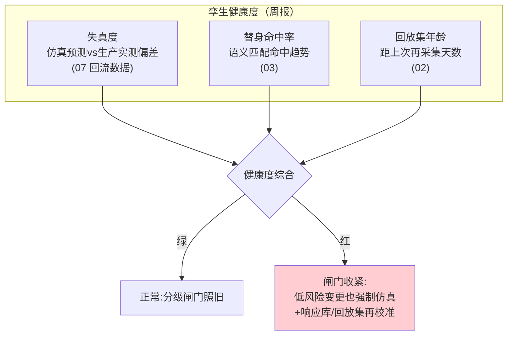
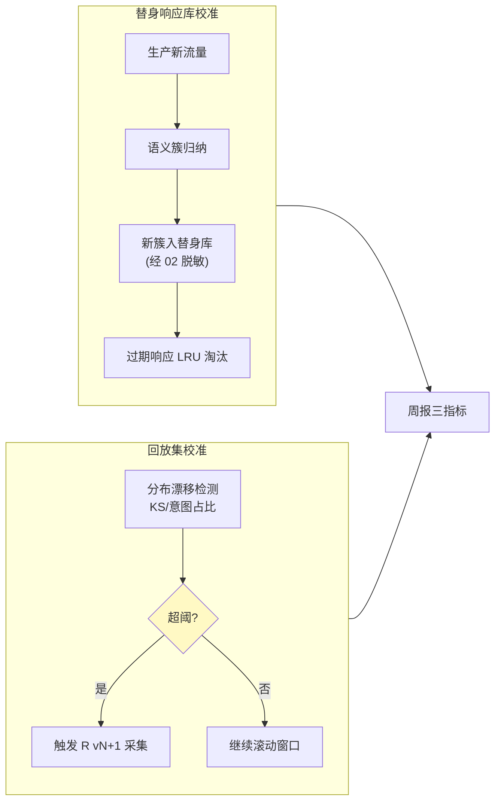

# 10-进阶三：持续孪生与漂移校准——孪生的健康度管理

> **定位**：孪生会**失真**：替身响应库过时、流量分布漂移（业务变了回放集还是去年的）、供应商行为变了录制还是旧的。本篇把"孪生逼真度"本身做成被监控的指标：**失真检测**（仿真预测 vs 生产实测偏差监控）、**响应库自动补录**（生产新流量持续入替身库）、**回放集再校准**（分布漂移触发再采集）。读者画像：要回答"仿真结论还可信吗"的读者。前置阅读：[07-变更影响仿真与审批联动](07-变更影响仿真与审批联动.md)、[教程 41-数据飞轮与持续改进]。
>
> **铁律 0**：校准管线自研「概念代码」。

---

## 一、四问

| 问 | 答 |
|----|----|
| **新增了什么需求** | ① 失真度指标：仿真-生产偏差率（07 已回流）滚动监控 + 替身命中率衰减（03 命中率随时间掉=库过时）② 响应库自动补录：生产新流量（02 采集管道）按语义簇自动入替身库，过期响应 LRU 淘汰 ③ 回放集再校准：流量分布漂移检测（输入分布 KS/意图占比漂移）超阈 → 触发新一版回放集采集（R\<vN+1\>）④ 孪生健康度报告：每周出（失真度/命中率/回放集年龄三指标），失真红牌时变更闸门自动收紧（低风险也强制仿真） |
| **影响了哪些模块** | `capture-svc` 加漂移检测；`twin-svc` 响应库自动补录；`change-gate` 加健康度联动 |
| **架构如何演进** | 一次性孪生 → 持续孪生（孪生是有寿命的资产，需要保养） |
| **上一版痛点** | 推演结论建立在"孪生=生产"的假设上，但假设没人看守：库过时/流量漂移让仿真悄然失真（09 §六） |

**本迭代验收**：① 失真度出数且红牌联动闸门收紧 ② 响应库命中率衰减 ≥20% 自动触发补录并恢复 ③ 分布漂移超阈 7 天内出新一版回放集 ④ 周报三指标齐备。

---

## 二、孪生健康度三指标

## 三、持续校准双管线

**为什么红牌要收紧闸门而不是停平台**：失真时仿真的价值是"保守参考"而非"精确预测"——宁可多变更多跑仿真（成本低），不可放过未验证变更（事故贵）。

## 四、失真根因三分类

| 根因 | 信号 | 处置 |
|------|------|------|
| 替身库过时 | 命中率衰减+差例集中在某依赖 | 补录该依赖簇 |
| 流量漂移 | 回放集年龄大+意图占比变化 | 再采集 R vN+1 |
| 系统性偏差 | 全场景均匀偏差 | 检查替身延迟模型/采样偏差（工程问题） |

## 五、验证包（手工测试与验证）
**前置条件**：三指标监控+自动补录+再校准+闸门联动实现。

**材料 A——失真注入**：替身库某依赖响应结构 mock 改旧版。

**材料 B——业务迁移**：回放集意图占比 60/40 → 30/70。

**步骤与断言**：

| # | 操作 | 预期（PASS 判据） |
|---|------|------------------|
| 1 | 材料A 注入 | 命中率衰减 ≥20% 触发自动补录并恢复 |
| 2 | 材料B 持续 7 天 | 漂移超阈 → 7 天内产出 R vN+1 |
| 3 | 失真指标拉红 | 闸门收紧（低风险也强制仿真） |
| 4 | 连续 4 周周报 | 三指标周周出数；红牌期 0 未仿真直发 |

**失败排查**：①未触发→阈值过高或统计窗口过长；②未产新版→再采集挂人工审批；③未收紧→健康度与闸门无联动。

## 六、本迭代痛点

孪生健康度闭环——平台自身收官。→ 11 讲解复盘。

## 七、验收对照

| 验收项 | 标准 | 状态 |
|--------|------|------|
| 失真监控 | 红牌联动 | ✅ |
| 响应库自补录 | 命中率恢复 | ✅ |
| 回放集再校准 | 7 天新版 | ✅ |
| 周报 | 三指标 | ✅ |

**下一篇**：[11-核心代码讲解](11-核心代码讲解.md)。
