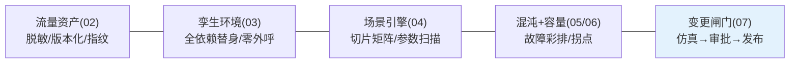
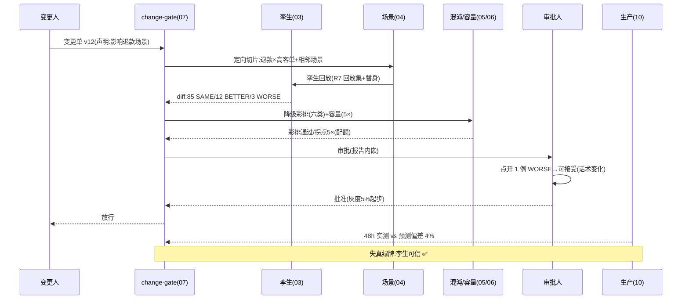

# 11-核心代码讲解：一次变更的孪生之旅

> **定位**：复盘平台关键实现，并以**"Prompt v12 上线"的孪生之旅**串起六迭代+三进阶。前置阅读：[02-流量采集与脱敏](02-流量采集与脱敏.md) 至 [10-持续孪生与漂移校准](10-持续孪生与漂移校准.md)。

---

## 一、机制速查

### 一.1 本节核对（机制速查）

- [ ] 速查链五个环节（流量资产/孪生环境/场景引擎/混沌容量/变更闸门）与对应迭代篇（02/03/04/05-06/07）一一对应，无漏链或串位
- [ ] 每条机制后用一句话说出其能力（脱敏版本化/零外呼/切片矩阵/故障彩排拐点/仿真审批发布），能对上原文定位

## 二、完整旅程（Prompt v12 从变更单到回流）

**一句话**：变更先声明影响面、孪生里定向验差例、彩排故障、压出拐点、报告内嵌审批、上线后偏差回流养孪生健康度——生产只见过验证过的变更。

### 二.1 本节核对（完整旅程）

- [ ] 旅程时序的每一步（变更单→定向切片→孪生回放→diff→彩排容量→审批→放行→偏差回流）与正文 `注` 各迭代能力对应，无跳步
- [ ] 结论句"生产只见过验证过的变更"与旅程末尾"失真绿牌:孪生可信"（48h 偏差 4%）口径一致，未出现"未验证变更被放行"矛盾

## 三、关键设计复盘

| # | 设计 | 为什么 |
|---|------|--------|
| 1 | 变量唯一原则 | 孪生里只有被测 Agent 是真的，依赖全是替身（03） |
| 2 | 保语义脱敏+一致性映射 | 脱敏不变形，回放结论才可信（02） |
| 3 | 两档 LLM 替身 | 编排变更零成本、效果变更真模型（03） |
| 4 | 影响面声明+相邻扩展 | 变更事故头号来源是影响面漏报（04） |
| 5 | 降级断言而非"没崩" | 真实要求是行为正确不是进程活着（05） |
| 6 | 档 B 压测+配额数学 | 压测零 LLM 成本，配额不用压用算（06） |
| 7 | 豁免必须贵 | 双签+公示，闸门才是闸门（07） |
| 8 | 合成三类型+人审闸 | 新 Agent 冷启动不等真实攻击者当测试员（08） |
| 9 | 推演输出存活参数 | 极端仿真的交付物是参数建议不是事故报告（09） |
| 10 | 孪生健康度三指标 | 仿真结论的前提"孪生=生产"需要被看守（10） |

### 三.1 本节核对（关键设计复盘）

- [ ] 10 条设计逐条都能指出其落地迭代篇（03/02/04/05/06/07/08/09/10），无悬空设计条目
- [ ] 每条“为什么”能一句话复述其本质理由（如变量唯一→结论才可信、豁免贵→闸门才硬），而非仅背果

## 四、全篇回归验证

按 §二旅程逐跳断言（各迭代已有用例，§二.1 已核对旅程）；全链演练（变更→仿真→审批→发布→回流→校准）季度例行。

| # | 操作 | 预期（PASS 判据） |
|---|------|------------------|
| 1 | 季度全链演练一轮 | 变更→仿真→审批→发布→回流→校准每环 PASS，事件链可审计 |
| 2 | 抽查旅程中的关键跳跃 | diff（85/12/3 计数之和=100）与彩排通过/拐点出数均与 §二 旅程一致 |

**下一篇**：[12-ADR架构决策记录](12-ADR架构决策记录.md)。
