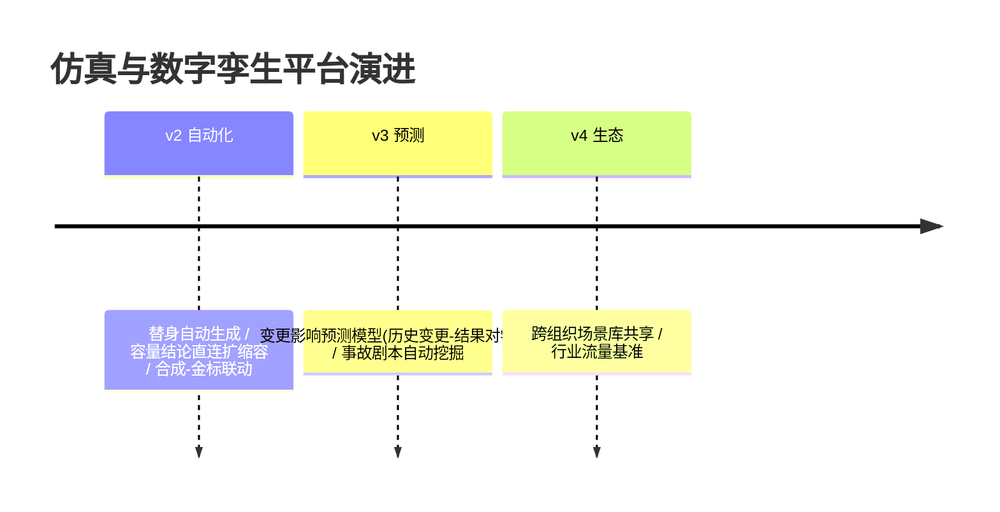

# 13-工业前沿与演进方向：Simulation-first 的 2026 校准与收官

> **定位**：用 2026 工业趋势校准方向，给缺口与 v2 演进，项目收官。前置阅读：[12-ADR架构决策记录](12-ADR架构决策记录.md)。

---

## 一、行业信号（公开趋势，落地前需逐条核实最新进展）

- **Simulation-first 成为上线共识**：主流 Agent 指南（Google 五指南的分阶段上线：单测→轨迹→沙箱→金丝雀；Nebius Blueprint 的 Simulation 先行——上线前批量模拟任务产出回归集）与本平台同构：**沙箱先行、金丝雀殿后**。本平台把"沙箱"做成持续运营的基础设施而非一次性动作。
- **影子评估兴起**：变更前后在影子流量上对比评估成为工程实践标配（shadow evaluation）——对应本平台 04 的变更 diff 场景。
- **数字孪生从工业软件走进软件工程**：IoT 领域成熟的孪生方法论（失真度管理/持续校准）被引入线上系统验证——本平台 10 的孪生健康度是该方法论在 Agent 领域的直接落地。
- **混沌工程平台化**：故障注入从运维工具升级为发布流水线环节（变更单绑定故障彩排）——对应本平台 05/07。

## 二、现状对照

| # | 前沿能力 | 现状 | 缺口/演进 |
|---|---------|------|----------|
| S1 | 沙箱先行/分阶段上线 | ✅ 07（仿真闸门→灰度） | ✅ 同构 |
| S2 | 影子评估 | ✅ 04（定向 diff+相邻扩展） | ✅ |
| S3 | 依赖替身/零外呼孪生 | ✅ 03（两档替身） | 🔷 v2：替身自动生成（从 API 文档/OpenAPI 规范推替身脚本） |
| S4 | 故障谱系+级联推演 | ✅ 05/09 | ✅ |
| S5 | 容量拐点+参数建议 | ✅ 06/09 | 🔷 v2：容量结论直连自动扩缩容（推演→执行闭环） |
| S6 | 合成流量冷启动 | ✅ 08 | 🔷 v2：合成器与评估金标联动（一鱼两吃：合成流量即金标候选） |
| S7 | 孪生失真治理 | ✅ 10 | ✅（行业普遍缺失，本平台领先项） |

## 三、演进路线



## 四、八旗舰对照收官（14-21）

| 视角 | 14 平台 | 15 内核 | 16 网格 | 17 实时 | 18 知识 | 19 评测 | 20 经济 | **21 仿真** |
|------|--------|--------|--------|--------|--------|--------|--------|------------|
| 第一性 | 治理全景 | 资源托管 | 零改造 | 延迟预算 | 知识可信 | 效果可信 | 交易可信 | **变更可信** |
| 护城河 | 治理能力 | 运行机制 | 接入规模 | 实时体验 | 知识资产 | 金标资产 | 授权账本资产 | **流量资产** |
| 时间观 | 策略周期 | 进程周期 | 配置周期 | 毫秒 | 知识生命周期 | 版本生命周期 | 结算周期 | **变更周期** |

> 八旗舰共同回答"企业级 Agent 基础设施全景"：八种第一性原理八套蓝图，可组合——仿真平台为其他七旗舰的所有变更提供"预演通行证"（变更可信），其他七旗舰为仿真提供治理/运行/接入/体验/知识/信任/经济底座。

## 五、检验方式

```bash
# 对照：本平台沙箱先行 vs 行业分阶段上线逐段同构自查
# v2 PoC：从 OpenAPI 规范自动生成替身脚本（文档→脚本→命中率验证）
```

## 六、项目收官

| 阶段 | 篇目 | 交付 |
|------|------|------|
| 基础（00-01） | 四层架构/最小回放对比 | 影子流量雏形 |
| 六迭代（02-07） | 流量/孪生/场景/混沌/容量/闸门 | 完整变更可信基础设施 |
| 进阶（08-10） | 冷启动/极端推演/持续校准 | 全生命周期孪生 |
| 资产（11-13） | 讲解/ADR/前沿 | 旅程复盘+10 条决策+八旗舰收官 |

项目 21 到此收官：**流量资产、保语义脱敏、全依赖替身、场景矩阵扫描、故障彩排、容量拐点、仿真闸门、合成冷启动、极端推演、孪生健康度治理**的工业级 Agent 仿真与数字孪生平台蓝图。独立项目，无后续依赖。
