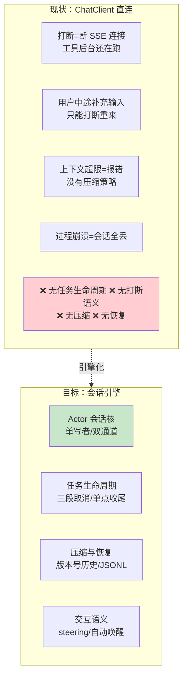
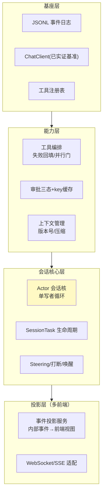
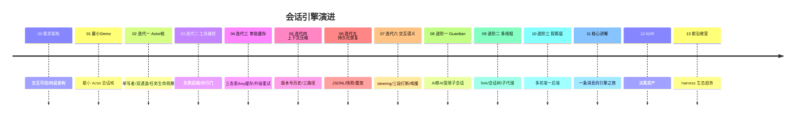

# 00-需求分析与架构设计：企业级 Agent 会话引擎

> **定位**：第九旗舰·**会话引擎视角**——第一性原理：**交互可信**。Spring AI 给了 ChatClient/工具/记忆，但**驱动循环、打断、补充输入、审批缓存、上下文压缩、崩溃恢复**这些"骨架"框架不管。本平台把这些做成企业级会话基础设施：单写者 Actor 会话核、统一任务生命周期与三段取消、工具编排与失败回填、审批三态与 key 缓存、版本号化历史与三路径压缩、JSONL 持久化恢复、steering 与自动唤醒。方法学源自开源 harness 的工程实践（「想深入？→ [附录 15/13-codex-harness/04-Java工程师借鉴手册]」——本篇不引用其内部内容，仅指路）。读者画像：要回答"Agent 会话的核心引擎怎么造"的读者。前置阅读：[教程 02-SpringAI核心机制/02-Agent状态管理]、[教程 03-React前端与AgenticUI/04-流式工具调用与事件协议]、[教程 08-架构师进阶/06-长任务持久化与中断恢复]。
>
> **铁律 0**：Spring AI 2.0.0 无官方会话引擎 API（实证结论见 scripts/api-baseline）；引擎全部自研，模型/工具调用仅用已实证基准（ChatClient/ToolCallback/Usage），引擎层代码标注「概念代码」。

---

## ★ 阅读顺序总览（序号 = 阅读顺序）

> 本子文件夹 14 个文件（00-13）：

| 阶段 | 文件 | 读者定位 |
|------|------|---------|
| ① 全貌 | 00-需求分析与架构设计 | **先读**：会话四层架构 |
| ② 起步 | 01-最小Demo | **动手**：最小 Actor 会话核 |
| ③ 主体迭代 | 02~07（Actor核/工具编排/审批缓存/上下文压缩/持久化恢复/steering打断） | **严格顺序** |
| ④ 进阶 | 08~10（Guardian 自动审阅/多线程 fork/投影层多前端） | **严格顺序** |
| ⑤ 讲解 | 11-核心代码讲解 | **回顾** |
| ⑥ 资产 | 12-ADR / 13-前沿 | **按需/收官** |

---

## 一、为什么会话引擎是独立问题域

核心判断：ChatClient 是"模型客户端"不是"会话引擎"——**一次对话的完整生命**（输入排队、执行、打断、补充、压缩、落盘、恢复、多前端投影）是框架之上必须自建的骨架层。

### 一.1 本节核对（独立问题域判断）

- [ ] 能说出「ChatClient 是客户端不是引擎」的核心证据：一次对话的完整生命周期（排队/打断/补充/压缩/落盘/恢复/投影）框架不管，需自建骨架层
- [ ] 「❌ 现状」四行（打断丢工作/补充须重来/超限即报错/崩溃全丢）与目标四能力（Actor 核/任务生命周期/压缩恢复/交互语义）能一一映射，无错位

## 二、总体架构（四层）

### 二.1 本节核对（四层架构）

- [ ] 四层自下而上顺序能复述：基座层（JSONL/ChatClient/工具注册表）→ 能力层（工具编排/审批缓存/上下文）→ 会话核心层（Actor 核/任务生命周期/steering）→ 投影层（多前端）
- [ ] 底层为上层提供的服务能被指出（如基座的 JSONL 承载会话核心层的落盘、能力层的审批被会话核心层调度）

## 三、微服务清单与迭代路线

| 服务 | 平面 | 职责 | 迭代 |
|------|------|------|------|
| `session-core` | 核心 | Actor 循环/任务生命周期 | 02 |
| `tool-orchestrator` | 能力 | 失败回填/并行门/升级 | 03 |
| `approval-svc` | 能力 | 三态推导/key 缓存 | 04 |
| `context-svc` | 能力 | 版本号历史/三路径压缩 | 05 |
| `recovery-svc` | 基座 | JSONL 重放/快照 | 06 |
| `interaction-svc` | 核心 | steering/打断/唤醒 | 07 |

### 三.1 本节核对（微服务与迭代路线）

- [ ] 六个服务（session-core/tool-orchestrator/approval-svc/context-svc/recovery-svc/interaction-svc）与后续迭代篇 02-07 一一对应，无缺漏错位
- [ ] timeline 中每个版本号（00-13）与对应文件标题挂钩，迭代顺序与阅读顺序一致

## 四、量化验收（项目级）

| 指标 | 目标 |
|------|------|
| 打断语义 | 打断后工具执行 100% 终止（宽限 100ms+强杀） |
| 失败回填 | 工具异常 0 次中断会话（全部转 success:false） |
| 审批体验 | 同类重复操作审批弹窗下降 ≥80%（key 缓存） |
| 压缩 | 超限会话 100% 走压缩续命而非报错 |
| 恢复 | kill -9 后重放，只丢尾行、状态一致 |
| steering | 运行中补充输入 0 打断 0 丢失 |

### 四.1 本节核对（量化验收指标）

- [ ] 六条验收指标均为可度量动作（打断终止 100%、失败回填 0 中断、弹窗降 ≥80%、压缩 100% 续命、恢复只丢尾行、steering 0 丢），非空话
- [ ] 每条指标能指出在后续哪篇迭代的「本迭代验收」中再次出现（如打断→02、失败回填→03、key 缓存→04）

## 五、与教程体系的锚点

[教程 02-SpringAI核心机制/02-Agent状态管理]、[教程 03-React前端与AgenticUI/04-流式工具调用与事件协议]、[教程 03-React前端与AgenticUI/04-流式工具调用与事件协议]（审批联动）、[教程 08-架构师进阶/00-上下文工程]（压缩）、[教程 05-Observation可观测/07-指标治理：Token计量、SLO与基数熔断]（恢复）、[教程 08-架构师进阶/08-响应式错误处理]（取消与重试）。

### 五.1 本节核对（教程锚点映射）

- [ ] 六条教程锚点与各自用途备注（状态管理/事件协议/HITL 审批/上下文压缩/持久化/取消重试）一一对应
- [ ] 每条锚点都能指向本项目对应迭代篇（12→01/02、19→01/03、28→04、34→05、40→06、42→02）

## 六、九旗舰对照

| 视角 | 14 平台 | 15 内核 | 16 网格 | 17 实时 | 18 知识 | 19 评测 | 20 经济 | 21 仿真 | **22 会话引擎** |
|------|--------|--------|--------|--------|--------|--------|--------|--------|--------------|
| 第一性 | 治理全景 | 资源托管 | 零改造 | 延迟预算 | 知识可信 | 效果可信 | 交易可信 | 变更可信 | **交互可信** |
| 一句话 | 什么都能治 | 像 OS 跑 | 像网格罩 | 像真人聊 | 答得有据 | 敢不敢上生产 | 敢让它花钱 | 敢不敢改 | **骨架自己造** |

### 六.1 本节核对（九旗舰对照）

- [ ] 本平台（22）第一性原理定位是「交互可信」、一句话是「骨架自己造」，与其他八旗舰不冲突
- [ ] 「会话引擎是其余八旗舰的运行时底座」这一关系能从表或正文中读出

## 七、总结

会话引擎的答案只有一个：**模型只决定"下一次说什么"，其余一切（排队/执行/打断/补充/压缩/落盘/恢复/投影）都是引擎的责任**。下一篇从最小 Actor 会话核跑起。

> 本节核对（一句话）：总结的核心论断「引擎负责模型『下一次说什么』之外的一切」与 §一 的核心判断同口径，一致即 PASS。

**下一篇**：[01-最小Demo](01-最小Demo.md)。
