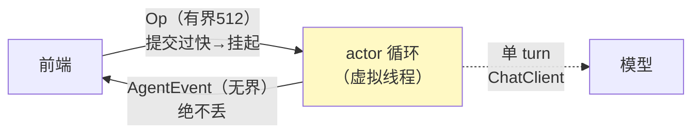

# 01-最小 Demo：最小 Actor 会话核

> **定位**：用 ~100 行造出会话引擎的最小骨架：**单写者 Actor + 双通道（有界命令/无界事件）+ 一次带工具的 turn**。验证四件事：命令有反压、事件不丢、turn 可执行、状态摸不到。前置阅读：[00-需求分析与架构设计](00-需求分析与架构设计.md)、[教程 28-流式工具调用与事件协议]。
>
> **铁律 0**：引擎自研「概念代码」；模型调用用已实证 ChatClient 基准。

---

## 一、四问

| 问 | 答 |
|----|----|
| **新增了什么需求** | 最小骨架：①Op/Event 两个 sealed 契约 ②单消费者循环 ③有界命令队列+无界事件出口 ④一个最小 turn（无工具循环，单次模型调用） |
| **影响了哪些模块** | 单体单类 SessionCore + 两个契约 |
| **架构如何演进** | 从无到有：契约先行（先定 Op/Event 再写实现） |
| **上一版痛点** | 无（起点） |

**本迭代验收**：① 命令洪峰（1000 条/瞬）不 OOM（有界队列挂起提交者）② 事件全量到达（无界出口）③ 前端只握队列与事件口，摸不到内部状态。

### 一.1 本节核对（四问与迭代验收）

- [ ] 四问口径齐全（新增需求/影响模块/架构演进/上一版痛点）且「上一版痛点=无（起点）」表述自洽
- [ ] 三条本迭代验收均为可判定动作（有界挂起/事件全量/封装无状态）

---

## 二、两个契约（先写契约再写实现）

```java
// 概念代码：会话契约（Java 21 sealed interface）
public sealed interface Op permits UserInput, Interrupt, Shutdown {}
public record UserInput(String text) implements Op {}
public record Interrupt() implements Op {}

// ⚠ 事件协议 = 完整的"过程可见性契约"（对照教程 19 的 12 事件类型）
// 不只有生命周期，还含工具调用与思考过程——这是前端渲染"Agent 在干什么"的全部信号源
public sealed interface AgentEvent permits
        TurnStarted, ThoughtStart, ThoughtDelta, ThoughtEnd,
        ToolStart, ToolProgress, ToolEnd,
        Token, TurnComplete, TurnAborted, ErrorEvent {

    long id();                   // 单调 id：断线续传去重依据（06 迭代）
    long ts();                   // 时间戳：前端展示节奏
}

// —— 生命周期 ——
public record TurnStarted(long id, long ts) implements AgentEvent {}
public record TurnComplete(long id, long ts) implements AgentEvent {}
public record TurnAborted(long id, long ts, String reason) implements AgentEvent {}
public record ErrorEvent(long id, long ts, String code, String message) implements AgentEvent {}

// —— 思考过程可见性（"Agent 在想什么"）——
public record ThoughtStart(long id, long ts) implements AgentEvent {}
public record ThoughtDelta(long id, long ts, String delta) implements AgentEvent {}   // 推理文本增量
public record ThoughtEnd(long id, long ts) implements AgentEvent {}

// —— 工具调用可见性（"Agent 在调什么工具/拿到了什么"）——
public record ToolStart(long id, long ts, String toolName, String argsPreview) implements AgentEvent {}
public record ToolProgress(long id, long ts, String delta) implements AgentEvent {}     // 长工具逐步进度
public record ToolEnd(long id, long ts, String toolName, boolean ok,
                      String resultPreview) implements AgentEvent {}                    // preview 截断（防爆）

// —— 输出 ——
public record Token(long id, long ts, String delta) implements AgentEvent {}
```

**为什么契约先行**：Op/Event 枚举就是引擎对外 API 的全部——前端、持久化、测试全部对着契约编程，引擎内部随便重构（对照 [教程 28] 的事件协议，本项目把它下沉为"引擎级契约"）。

**为什么事件必须含工具与思考过程**：企业级 Agent 的信任来自"看得见过程"。若事件只有 `Token`（最终文字），前端只能展示"一个黑盒在挤出文字"——用户不知道它查了哪个工具、检索了什么、为什么停顿。补上 `ThoughtDelta`（推理过程）、`ToolStart/ToolEnd`（调了什么、返回什么），前端才能渲染"Agent 正在查订单 → 已返回 3 条 → 正在组织回答"的完整过程。**这正是教程 19 定义的可见性标准，会话引擎作为过程载体必须内建**。

### 二.1 本节测试与验证（契约完整性：事件含工具与思考过程）

**前置条件**：`Op`/`AgentEvent` 两种 sealed 契约已按本节书写；一个能响应且能调用一次工具（mock 工具）的 ChatClient。

**材料——工具可见性断言**：让模型在回答中调用一次工具（mock 工具），订阅 `handle.events()` 收集事件流。

**步骤与断言**：

| # | 操作 | 预期（PASS 判据） |
|---|------|------------------|
| 1 | 触发一次带工具的 turn，run 收集事件 | 事件流出现 `ThoughtStart→ThoughtDelta*→ThoughtEnd` 与 `ToolStart→ToolEnd` 成对序列（顺序正确、无缺漏） |
| 2 | 检查 `AgentEvent` 的 `id()/ts()` | 每条事件 id 单调、ts 有值（断线去重与展示节奏的契约字段就绪） |
| 3 | 对照契约 `sealed interface` | `Op permits UserInput,Interrupt,Shutdown` 与 `AgentEvent permits` 的 11 种实现与 §二 枚举一致，无多余类型 |

**失败排查**：①事件缺 Tool 序列→契约里少了 `ToolStart/ToolEnd` 类型或 mock 工具未真正被调用；②id 不单调→事件构造未传单调 id。

## 三、最小 Actor

```java
// 概念代码：单写者会话核
public class SessionCore {
    private final BlockingQueue<Op> commands = new ArrayBlockingQueue<>(512); // 有界=反压
    private final Sinks.Many<AgentEvent> events = Sinks.many().unicast().onOverflowBuffer(); // 无界=不丢
    private final ChatClient client; // 已实证基准

    public SessionHandle spawn() {                    // 前端只拿到 handle（封装边界=并发边界）
        Thread.ofVirtual().name("session-actor").start(this::loop);
        return new SessionHandle(commands::offer, events.asFlux());
    }

    private void loop() {                             // 唯一写者：串行处理=天然原子
        while (true) {
            Op op = take(commands);
            switch (op) {
                case UserInput u -> runTurn(u);       // 单 turn：client.prompt().user(u.text()).call()
                case Interrupt i   -> abortActive();  // 02 迭代实现
                case Shutdown s    -> { return; }
            }
        }
    }
}
```

三个要点：
1. **有界 512**：提交过快 `offer/take` 挂起而非撑爆内存；
2. **无界事件**：UI 状态不能缺块（丢事件=前端状态错乱）；
3. **单写者**：所有状态只在 loop 线程读写——零锁。

### 三.1 本节测试与验证（最小 Actor：反压与封装边界）

**前置条件**：`SessionCore`/`SessionHandle` 已按本节实现；一个能响应的 ChatClient（可用 mock：固定返回 "ok"）。

**材料 A——反压压测**（junit）：

```java
@Test void 反压_有界队列挂起不OOM() throws Exception {
    var core = newSession(mockClient);
    var handle = core.spawn();
    var sent = new AtomicInteger();
    var producer = Thread.ofVirtual().start(() -> {
        for (int i = 0; i < 1000; i++) {
            try { handle.submit(new UserInput("m" + i)); sent.incrementAndGet(); }
            catch (InterruptedException e) { return; }
        }
    });
    Thread.sleep(50); // 让队列先填满（容量512）
    assertTrue(sent.get() <= 512 + 1, "队列满后提交者应被挂起，实际 " + sent.get());
    producer.interrupt(); producer.join();
}
```

**步骤与断言**：

| # | 操作 | 预期（PASS 判据） |
|---|------|------------------|
| 1 | 运行材料 A | sent ≤513；无 OutOfMemoryError；进程存活 |
| 2 | 检查 `SessionHandle` 公开成员 | 仅有 `submit()/events()`，无 setter/公开可变字段（编译期验证封装边界） |

**失败排查**：①sent 超限→队列非有界或 `submit` 写成 drop 语义；②handle 暴露状态→字段 `private final` + record 封装。

## 四、通道语义



### 四.1 本节测试与验证（通道语义：事件不丢）

**前置条件**：§二/§三 已验证通过；`Sinks` 事件出口已接通。

**材料 B——事件计数**：订阅 `handle.events()` 收集到 List，提交 N=50 条输入、等全部 TurnComplete 后断言 `events.size() == 100`（每输入 TurnStarted+TurnComplete 各一）。

**步骤与断言**：

| # | 操作 | 预期（PASS 判据） |
|---|------|------------------|
| 1 | 运行材料 B | 事件计数恰好 100，0 丢失（无界出口不丢块） |
| 2 | 事件交错性抽查 | 事件按提交顺序到达，id 单调，无乱序 |

**失败排查**：①事件丢→`Sinks` 用了 `onOverflowDrop`，应改 `onOverflowBuffer`；②乱序→单写者被破坏（存在第二个发射路径）。

## 五、全篇回归验证

> §二.1（契约）/ §三.1（Actor 反压与封装）/ §四.1（事件不丢）均通过后的整体验收。

**步骤与断言**：

| # | 操作 | 预期（PASS 判据） |
|---|------|------------------|
| 1 | 提交 N=50 条输入跑完整 turn | 事件计数 100（0 丢）；sent ≤513 无 OOM（反压） |
| 2 | 触发一次带工具的 turn | Thought*→ToolStart→ToolEnd→(Token*) 成对序列完整 |
| 3 | 编译期检查 SessionHandle | 仅有 submit()/events()，无公开可变字段 |

**失败排查**：任一步 FAIL 按 §二.1/§三.1/§四.1 对应排查项回溯（缺事件类型 / 队列非有界 / 事件丢）。

## 六、本迭代痛点

turn 是"一口气跑完"的：不能打断、不能中途补充输入、没有任务生命周期。→ 02 Actor 核与任务生命周期。

> 本节核对（一句话）：痛点「不能打断/不能补充/无任务生命周期」与 02 主题（任务化生命周期）对应，无搁置项即 PASS。

## 七、验收对照

| 验收项 | 标准 | 状态 |
|--------|------|------|
| 命令反压 | 有界挂起 | ✅ |
| 事件不丢 | 无界缓冲 | ✅ |
| 封装边界 | handle 无状态 | ✅ |

> 本节核对（一句话）：三项验收与 01 本迭代验收（①有界挂起 ②事件全量 ③封装无状态）一一对应，状态全 ✅ 与 §三.1/§四.1 实测一致即 PASS。

**下一篇**：[02-Actor核与任务生命周期](02-Actor核与任务生命周期.md)。
