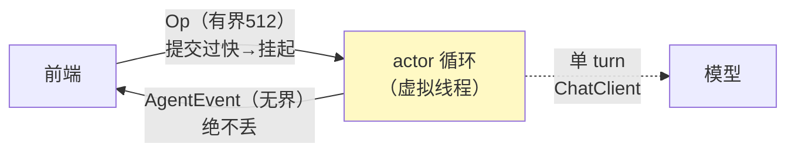

# 01-最小 Demo：最小 Actor 会话核

> **定位**：用 ~100 行造出会话引擎的最小骨架：**单写者 Actor + 双通道（有界命令/无界事件）+ 一次带工具的 turn**。验证四件事：命令有反压、事件不丢、turn 可执行、状态摸不到。前置阅读：[00-需求分析与架构设计](00-需求分析与架构设计.md)、[教程 19-流式工具调用与事件协议]。
>
> **铁律 0**：引擎自研「概念代码」；模型调用用已实证 ChatClient 基准。

---

## 一、四问

| 问 | 答 |
|----|----|
| **新增了什么需求** | 最小骨架：①Op/Event 两个 sealed 契约 ②单消费者循环 ③有界命令队列+无界事件出口 ④一个最小 turn（无工具循环，单次模型调用） |
| **影响了哪些模块** | 单体单类 SessionCore + 两个契约 |
| **架构如何演进** | 从无到有：契约先行（先定 Op/Event 再写实现） |
| **上一版痛点** | 无（起点） |

**本迭代验收**：① 命令洪峰（1000 条/瞬）不 OOM（有界队列挂起提交者）② 事件全量到达（无界出口）③ 前端只握队列与事件口，摸不到内部状态。

---

## 二、两个契约（先写契约再写实现）

```java
// 概念代码：会话契约（Java 21 sealed interface）
public sealed interface Op permits UserInput, Interrupt, Shutdown {}
public record UserInput(String text) implements Op {}
public record Interrupt() implements Op {}

public sealed interface AgentEvent permits TurnStarted, Token, TurnComplete, TurnAborted {}
```

**为什么契约先行**：Op/Event 枚举就是引擎对外 API 的全部——前端、持久化、测试全部对着契约编程，引擎内部随便重构（对照 [教程 19] 的事件协议，本项目把它下沉为"引擎级契约"）。

## 三、最小 Actor

```java
// 概念代码：单写者会话核
public class SessionCore {
    private final BlockingQueue<Op> commands = new ArrayBlockingQueue<>(512); // 有界=反压
    private final Sinks.Many<AgentEvent> events = Sinks.many().unicast().onOverflowBuffer(); // 无界=不丢
    private final ChatClient client; // 已实证基准

    public SessionHandle spawn() {                    // 前端只拿到 handle（封装边界=并发边界）
        Thread.ofVirtual().name("session-actor").start(this::loop);
        return new SessionHandle(commands::offer, events.asFlux());
    }

    private void loop() {                             // 唯一写者：串行处理=天然原子
        while (true) {
            Op op = take(commands);
            switch (op) {
                case UserInput u -> runTurn(u);       // 单 turn：client.prompt().user(u.text())...
                case Interrupt i   -> abortActive();  // 02 迭代实现
                case Shutdown s    -> { return; }
            }
        }
    }
}
```

三个要点：
1. **有界 512**：提交过快 `offer/take` 挂起而非撑爆内存；
2. **无界事件**：UI 状态不能缺块（丢事件=前端状态错乱）；
3. **单写者**：所有状态只在 loop 线程读写——零锁。

## 四、通道语义



## 五、测试与验证

```bash
# 1. 反压：单线程狂发 1000 UserInput → offer 阻塞、无 OOM、全部最终处理
# 2. 事件不丢：处理期间订阅事件 → 计数=处理数
# 3. 封装：SessionHandle 上无任何可变状态暴露（编译期检查）
```

## 六、本迭代痛点

turn 是"一口气跑完"的：不能打断、不能中途补充输入、没有任务生命周期。→ 02 Actor 核与任务生命周期。

## 七、验收对照

| 验收项 | 标准 | 状态 |
|--------|------|------|
| 命令反压 | 有界挂起 | ✅ |
| 事件不丢 | 无界缓冲 | ✅ |
| 封装边界 | handle 无状态 | ✅ |

**下一篇**：[02-迭代一-Actor核与任务生命周期](02-迭代一-Actor核与任务生命周期.md)。
