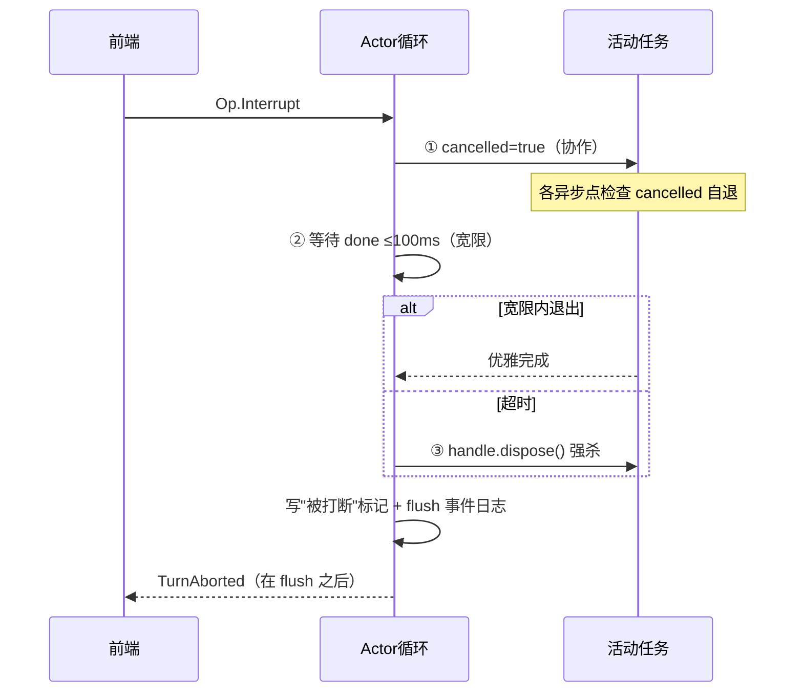

# 02-迭代一：Actor 核与任务生命周期——SessionTask / 三段取消 / 单点收尾

> **定位**：把 01 的"一口气 turn"升级为**任务化生命周期**：SessionTask 接口统一异构工作（对话/压缩/审阅/_shell）、三段式打断（协作取消→100ms 宽限→强杀）、单点收尾（统计/落盘/终态事件/idle 钩子零遗漏）、**持久化先于终态事件**不变式。读者画像：要回答"打断到底是什么语义"的读者。前置阅读：[01-最小Demo](01-最小Demo.md)、[教程 40-长任务持久化与中断恢复]。
>
> **铁律 0**：生命周期自研「概念代码」。

---

## 一、四问

| 问 | 答 |
|----|----|
| **新增了什么需求** | ① SessionTask 接口（kind/run/abort）统一对话/压缩/审阅/shell 四类任务 ② TaskHandle 三件套（完成信号/取消信号/可强杀句柄）③ 三段式打断 ④ 单点收尾钩子 onTaskFinished（统计/历史落盘/终态事件/空闲钩子）⑤ 终态事件必须在持久化 flush 之后发出 |
| **影响了哪些模块** | `session-core`：turn 变为任务；新增任务表与打断路径 |
| **架构如何演进** | 直排处理 → 任务化（加任务类型零成本获得全部生命周期） |
| **上一版痛点** | turn 不可打断不可观测：中途 kill 会话就废、没有统一收尾（统计/落盘散落）（01 §六） |

**本迭代验收**：① 打断：宽限期内任务自退（优雅）与超时强杀两路径均可触发 ② 收尾单点：注入 4 类任务全部走同一 onTaskFinished（断言钩子各执行一次）③ kill -9 恢复后终态与持久化一致（无"中止了却查无此事"）。

---

## 二、SessionTask 与 TaskHandle

```java
// 概念代码：任务统一生命周期
public interface SessionTask {
    TaskKind kind();                       // DIALOG / COMPACT / REVIEW / SHELL
    Mono<Void> run(TaskContext ctx);
    Mono<Void> abort(AbortReason reason);  // 协作取消入口
}

public record TaskHandle(
    CountDownLatch done,                   // 优雅完成信号
    AtomicBoolean cancelled,               // 协作取消
    Disposable handle                      // 强杀句柄（Reactor Disposable）
) {}
```

**所有任务在同一个 spawn 点收尾**：`task.run(ctx).doFinally(sig -> onTaskFinished(task, sig))`——统计、落盘、终态事件、idle 钩子写一次，四类任务通用（开闭原则）。

## 三、三段式打断



**纪律三条**：① run 内**所有长异步点**都要检查 cancelled（否则协作取消形同虚设——用 `takeUntil(cancelSignal)` 包装）② 句柄作用域结束时强制 dispose 防泄漏 ③ **持久化先于终态事件**：`persist().then(emitAborted())` 串行——崩溃重放时不出现状态矛盾。

## 四、单点收尾清单

| 钩子 | 内容 | 为什么必须在单点 |
|------|------|----------------|
| 统计 | token/时长/工具次数 | 散写必漏分支（异常路径最常漏） |
| 落盘 | turn 历史追加 JSONL | 与终态事件保序的锚点 |
| 终态事件 | TurnComplete/TurnAborted/Error | 恰好一次 |
| idle 钩子 | 全空闲时发会话级 idle | 多任务结束判定集中 |

## 五、测试与验证

```bash
# 1. 优雅：任务内检查点自退 → done 计数=1、TurnAborted 延迟<100ms
# 2. 强杀：任务不配合（不检查 cancelled）→ 100ms 后 dispose、无泄漏
# 3. 单点：四类任务各跑一次 → onTaskFinished 断言每钩子恰好 1 次
# 4. 保序：TurnAborted 事件之前 JSONL 必有"被打断"行（重放验证）
```

## 六、本迭代痛点

任务会跑工具了，但工具一抛异常整个 turn 就崩——工具失败应该让模型自己纠正。→ 03 工具编排与失败回填。

## 七、验收对照

| 验收项 | 标准 | 状态 |
|--------|------|------|
| 三段打断 | 两路径覆盖 | ✅ |
| 单点收尾 | 四类任务一致 | ✅ |
| 持久化先于终态 | 重放一致 | ✅ |

**下一篇**：[03-迭代二-工具编排与失败回填](03-迭代二-工具编排与失败回填.md)。
