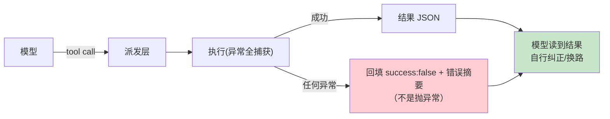

# 03-工具编排与失败回填——三分离 / 并行门 / 恰好一次

> **定位**：给引擎装上**工具编排层**：工具注册表（exposure/parallel 元数据）、失败回填而非抛异常、读写锁并行门、恰好一次通知、交互式命令会话续航。读者画像：要回答"工具执行怎么不崩会话、怎么并行"的读者。前置阅读：[02-Actor核与任务生命周期](02-Actor核与任务生命周期.md)、[教程 00-基础与核心/03-工具调用]、[教程 08-架构师进阶/04-Agent性能优化]。
>
> **铁律 0**：Spring AI `ToolCallback` 已实证基准；注册表与编排自研「概念代码」。

---

## 一、四问

| 问 | 答 |
|----|----|
| **新增了什么需求** | ① 注册表侧元数据：exposure（可见面）/supportsParallel/sideEffect——Spring AI 工具自描述不够，策略放装配层 ② 失败回填：任何工具错误转 `{"success":false,...}` 回给模型，会话不崩 ③ 并行门：读写锁按工具粒度（声明可并行=读锁并发，否则=写锁互斥）④ 恰好一次终态通知（AtomicBool）⑤ 长命令会话续航（session_id/chunk_id/yield 协议） |
| **影响了哪些模块** | 新增 `tool-orchestrator`；注册表包装 ToolCallback 集 |
| **架构如何演进** | 工具直调 → 编排层（策略与执行分离） |
| **上一版痛点** | 工具抛异常=turn 崩；并行全靠模型自觉；同工具并发写互相踩（02 §六） |

**本迭代验收**：① 故意抛异常的工具 100 次调用，0 次会话中断、模型自纠率可观测 ② 并行门：读锁工具并发执行、写锁工具互斥 ③ 终态通知恰好一次 ④ 交互式命令可续读。

### 一.1 本节核对（四问与迭代验收）

- [ ] 四问口径齐全，且「上一版痛点」与 02 §六 痛点（工具异常=turn 崩）衔接
- [ ] 四条本迭代验收可判定（0 中断 / 读写锁 / 恰好一次 / 可续读），与后续 §三/§四/§五 测试对应

---

## 二、注册表：策略与执行分离

```java
// 概念代码：注册表侧元数据（Spring AI ToolCallback 之上的 car data）
package com.example.session.tool;

public record RegisteredTool(
    ToolCallback callback,          // 已实证基准：name/description/call
    Exposure exposure,              // 暴露面：DIRECT 模型直接可见 / HIDDEN 对模型隐藏 / DEFERRED 条件暴露
    boolean supportsParallel,       // 并行门键
    SideEffect sideEffect           // NONE / READ / WRITE —— WRITE 不与 WRITE 并行
) {}
```

**每 turn 装配**：turn 开始按特性门控重算"模型可见工具集"，而非启动时固定——暴露面是策略不是常量。

### 二.1 本节测试与验证（注册表元数据）

**前置条件**：`RegisteredTool`（callback/exposure/supportsParallel/sideEffect）已按本节实现；mock ChatClient 可注入工具集。

**步骤与断言**：

| # | 操作 | 预期（PASS 判据） |
|---|------|------------------|
| 1 | 注册 read 锁工具（`search_docs`，200ms）、写锁工具（`write_file`，200ms）、异常工具（`boom`）、长命令工具（`sleep_yield`） | 四工具元数据（exposure/parallel/sideEffect）被读取且分派正确 |
| 2 | 每 turn 触发特性门控重算 | 模型可见工具集随 turn 特性变化先重算后装配，非启动时固定（编译/日志检查） |

**失败排查**：①工具集固定→每 turn 装配未执行，暴露面写成了启动常量。

## 三、失败回填（最重要的一条纪律）



**为什么**：抛异常中断的是**整条会话**；回填错误信息中断的只是**这一次调用**——模型看到错误可以换参数重试、换工具、或向用户解释。会话永不因工具崩。

### 三.1 本节测试与验证（失败回填）

**前置条件**：§二 注册表已通过；异常工具与回填观测就绪。

**材料 A——异常工具**：

```java
@Tool(description = "总是失败的工具")   // Spring AI 2.0.0
public String boom(String arg) { throw new RuntimeException("db down: " + arg); }
```

**材料 B——回填观测**：mock ChatClient 记录模型每轮收到的工具结果文本，统计"收到 success:false 后换参重试"的轮次。

**步骤与断言**：

| # | 操作 | 预期（PASS 判据） |
|---|------|------------------|
| 1 | 调用材料 A 共 100 次（脚本循环提交） | 0 次 TurnError/TurnAborted；回填文本含 `"success":false` 与错误摘要 |
| 2 | 材料 B：可换参场景（查 id=X 失败后模型改 id=Y） | 至少 1 例自纠成功（回填闭环证明） |

**失败排查**：①会话中断→异常没在编排层 catch，抛出了而非回填；②自纠率为 0→System Prompt 未引导模型消费 `success:false` 结果。

## 四、并行门与恰好一次

- **门**：每 runtime 一把 `ReentrantReadWriteLock`；parallel 工具拿读锁（互相并发），非并行拿写锁（互斥一切）。写副作用工具（sideEffect=WRITE）强制互斥——防竞态。
- **恰好一次**：`AtomicBoolean terminalNotified.compareAndSet(false,true)` 保证终态事件只发一次（异步竞态下重复通知会让上层状态机错乱）。
- **计时分桶**：派发耗时（门前排队）与执行耗时分开计量——瓶颈归因的标准词汇表。

### 四.1 本节测试与验证（并行门与恰好一次）

**前置条件**：read 锁工具（`search_docs`，200ms）、写锁工具（`write_file`，200ms）已注册。

**步骤与断言**：

| # | 操作 | 预期（PASS 判据） |
|---|------|------------------|
| 1 | 并发 10 路 read 锁工具 | 总耗时 ≈ 单路耗时（读锁并发） |
| 2 | 串行 10 次写锁工具 | 总耗时 ≈ 10×单路（写锁互斥） |
| 3 | 两个写工具并发写同一文件 | 内容无交错混合行（写副作用强制互斥） |
| 4 | 10 线程同时等同一工具终态 | 终态事件计数恒=1（compareAndSet 恰好一次） |

**失败排查**：①读不并发/写不互斥→读写锁拿反；②终态重复→通知没用 `compareAndSet`。

## 五、交互式命令续航

`session_id / chunk_id / yield_time_ms` 三件套：工具不是"一问一答"而是可续读会话——长命令（构建/测试 watch）按 yield 时间片返回增量，后续轮询按 session_id 续取。Web 形态映射为 WebSocket 会话续航（对照 [教程 03-React前端与AgenticUI/04-流式工具调用与事件协议] 事件协议）。

### 五.1 本节测试与验证（交互式命令续航）

**前置条件**：长命令工具（`sleep_yield`）已注册，会话续航协议（session_id/chunk_id/yield_time_ms）已实现。

**步骤与断言**：

| # | 操作 | 预期（PASS 判据） |
|---|------|------------------|
| 1 | 长命令 yield_time_ms=1000 分 3 片 | chunk_id 递增；拼接与一次性执行输出一致 |

**失败排查**：①丢片→chunk_id 没随事件携带，续轮询无法对齐。

## 五、工具过程可见性（编辑层的第二职责）

> 工具执行不只是"出结果"，还承担**过程可见性**——前端要能实时知道"正在调什么工具、进度如何、拿到了什么"。这是企业级 Agent 信任的基础（用户看得见过程才敢信）。

编排层在工具执行前后**集中发射可见性事件**（对齐 01 定义的事件协议与教程 02-SpringAI核心机制/00-SSE流式通信）：

```java
// 概念代码：编排层工具可见性发射（对齐 01 的 ToolStart/ToolProgress/ToolEnd）
// 在 ToolCallingManager 装饰层（每个工具调用前后）发射，集中、不散布
void onToolStart(ToolCall tc)  { emit(new ToolStart(id(), now(), tc.name(), truncate(tc.arguments(), 120))); }
void onToolProgress(String d)  { emit(new ToolProgress(id(), now(), d)); }                 // 长工具让渡时发
void onToolEnd(ToolCall tc, ToolExecutionResult r) {
    emit(new ToolEnd(id(), now(), tc.name(), r.failed() ? false : true,
                     truncate(previewOf(r), 500)));                                        // preview 截断防爆
}
```

**四条可见性纪律**：
1. **成对发射**：ToolStart 与 ToolEnd 一一对应——前端据此判断"工具调用未结束"（配合超时/打断显示）。失败路径也发 ToolEnd（`failed=true`），**不因异常吞事件**。孤儿 ToolStart（有 Start 无 End）是前端卡死的信号源，杜绝。
2. **preview 截断**：参数与结果都只发截断预览（120/500 字符），完整内容走按需 REST——事件流不能承载全量工具输出（内存/带宽双爆）。
3. **思考与工具交织**：ThoughtDelta（推理）与 ToolStart 按真实时序交错发布——前端渲染"先思考→再调工具→拿到结果→继续推理"的完整过程，不自作聪明排序。
4. **落点**：这一切在**编排层这一处**发射（01 的可见性事件 + 02 的单点收尾承接），不在各工具内部散落——保证可见性不因某工具实现差异而缺失。

### 五.2 本节测试与验证（工具过程可见性）

**前置条件**：编排层已在工具执行前后集中发射 ToolStart/ToolProgress/ToolEnd；一个正常工具 + 一个异常工具（`boom`）可被调用。

**步骤与断言**：

| # | 操作 | 预期（PASS 判据） |
|---|------|------------------|
| 1 | 含工具 turn：调 1 个正常工具 + 1 个异常工具 | 事件流 ToolStart↔ToolEnd 一一成对（各 1）；异常工具也发 ToolEnd(failed=true) |
| 2 | 检查 ToolEnd.resultPreview | 截断 ≤500 字符；无孤儿 ToolStart（有 Start 无 End） |

**失败排查**：①成对缺漏→可见性发射散布在各工具内部（应在编排层集中）；②孤儿 ToolStart→失败路径吞掉了 ToolEnd。

## 六、全篇回归验证

> §二.1（元数据）/ §三.1（失败回填）/ §四.1（并行门）/ §五.1（续航）/ §五.2（可见性）均通过后的整体验收。

**步骤与断言**：

| # | 操作 | 预期（PASS 判据） |
|---|------|------------------|
| 1 | 同一会话内依次跑：异常工具回合 → 并发读锁回合 → 写锁回合 → 长命令续航 → 工具可见性回合 | 0 次会话中断；回填闭环、并行门、恰好一次、分片续航、成对可见性各自 PASS（验收互不干扰） |
| 2 | 计时分桶抽查 | 派发耗时与执行耗时分开计量（门前排队可归因） |

**失败排查**：任一步 FAIL 按 §三.1/§四.1/§五.1/§五.2 对应排查项回溯（异常未回填 / 读写锁 / 终态重复 / 丢片 / 可见性缺漏）。

## 七、本迭代痛点

工具能安全执行了，但"谁批准它执行"还没工程化——每次都问用户烦死人，永不问又裸奔。→ 04 审批三态与 key 缓存。

> 本节核对（一句话）：痛点「审批没工程化」（问烦 vs 裸奔）与 04 主题（审批三态+key 缓存）对应，无搁置项即 PASS。

## 八、验收对照

| 验收项 | 标准 | 状态 |
|--------|------|------|
| 失败回填 | 0 会话中断 | ✅ |
| 并行门 | 读并发写互斥 | ✅ |
| 恰好一次 | 竞态恒 1 | ✅ |
| 会话续航 | 分片续读 | ✅ |

> 本节核对（一句话）：四项验收与 03 本迭代验收及 §三.1/§四.1/§五.1 实测一一对应，状态全 ✅ 即 PASS。

**下一篇**：[04-审批三态与key缓存](04-审批三态与key缓存.md)。
