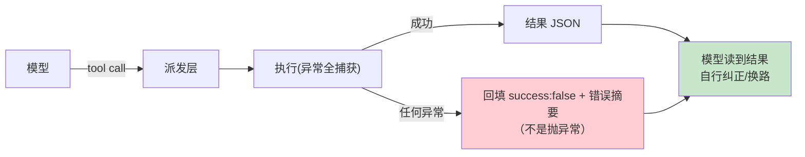

# 03-迭代二：工具编排与失败回填——三分离 / 并行门 / 恰好一次

> **定位**：给引擎装上**工具编排层**：工具注册表（exposure/parallel 元数据）、失败回填而非抛异常、读写锁并行门、恰好一次通知、交互式命令会话续航。读者画像：要回答"工具执行怎么不崩会话、怎么并行"的读者。前置阅读：[02-迭代一-Actor核与任务生命周期](02-迭代一-Actor核与任务生命周期.md)、[教程 03-工具调用]、[教程 38-Agent性能优化]。
>
> **铁律 0**：Spring AI `ToolCallback` 已实证基准；注册表与编排自研「概念代码」。

---

## 一、四问

| 问 | 答 |
|----|----|
| **新增了什么需求** | ① 注册表侧元数据：exposure（可见面）/supportsParallel/sideEffect——Spring AI 工具自描述不够，策略放装配层 ② 失败回填：任何工具错误转 `{"success":false,...}` 回给模型，会话不崩 ③ 并行门：读写锁按工具粒度（声明可并行=读锁并发，否则=写锁互斥）④ 恰好一次终态通知（AtomicBool）⑤ 长命令会话续航（session_id/chunk_id/yield 协议） |
| **影响了哪些模块** | 新增 `tool-orchestrator`；注册表包装 ToolCallback 集 |
| **架构如何演进** | 工具直调 → 编排层（策略与执行分离） |
| **上一版痛点** | 工具抛异常=turn 崩；并行全靠模型自觉；同工具并发写互相踩（02 §六） |

**本迭代验收**：① 故意抛异常的工具 100 次调用，0 次会话中断、模型自纠率可观测 ② 并行门：读锁工具并发执行、写锁工具互斥 ③ 终态通知恰好一次 ④ 交互式命令可续读。

---

## 二、注册表：策略与执行分离

```java
// 概念代码：注册表侧元数据（Spring AI ToolCallback 之上的 car data）
public record RegisteredTool(
    ToolCallback callback,          // 已实证基准：name/description/call
    Exposure exposure,              // DIRECT / HIDDEN / DEFERRED...
    boolean supportsParallel,       // 并行门键
    SideEffect sideEffect           // NONE / READ / WRITE —— WRITE 不与 WRITE 并行
) {}
```

**每 turn 装配**：turn 开始按特性门控重算"模型可见工具集"，而非启动时固定——暴露面是策略不是常量。

## 三、失败回填（最重要的一条纪律）



**为什么**：抛异常中断的是**整条会话**；回填错误信息中断的只是**这一次调用**——模型看到错误可以换参数重试、换工具、或向用户解释。会话永不因工具崩。

## 四、并行门与恰好一次

- **门**：每 runtime 一把 `ReentrantReadWriteLock`；parallel 工具拿读锁（互相并发），非并行拿写锁（互斥一切）。写副作用工具（sideEffect=WRITE）强制互斥——防竞态。
- **恰好一次**：`AtomicBoolean terminalNotified.compareAndSet(false,true)` 保证终态事件只发一次（异步竞态下重复通知会让上层状态机错乱）。
- **计时分桶**：派发耗时（门前排队）与执行耗时分开计量——瓶颈归因的标准词汇表。

## 五、交互式命令续航

`session_id / chunk_id / yield_time_ms` 三件套：工具不是"一问一答"而是可续读会话——长命令（构建/测试 watch）按 yield 时间片返回增量，后续轮询按 session_id 续取。Web 形态映射为 WebSocket 会话续航（对照 [教程 19] 事件协议）。

## 六、测试与验证

```bash
# 1. 回填：异常工具连调 100 次 → 0 中断；模型自纠（重试成功）率出数
# 2. 门：读锁工具并发 10 路（耗时=单路）；写锁工具串行（耗时=10×单路）
# 3. 恰好一次：并发竞态注入 → 终态事件计数恒=1
# 4. 续航：长命令分 3 片 yield 返回 → 拼接完整
```

## 七、本迭代痛点

工具能安全执行了，但"谁批准它执行"还没工程化——每次都问用户烦死人，永不问又裸奔。→ 04 审批三态与 key 缓存。

## 八、验收对照

| 验收项 | 标准 | 状态 |
|--------|------|------|
| 失败回填 | 0 会话中断 | ✅ |
| 并行门 | 读并发写互斥 | ✅ |
| 恰好一次 | 竞态恒 1 | ✅ |
| 会话续航 | 分片续读 | ✅ |

**下一篇**：[04-迭代三-审批三态与key缓存](04-迭代三-审批三态与key缓存.md)。
