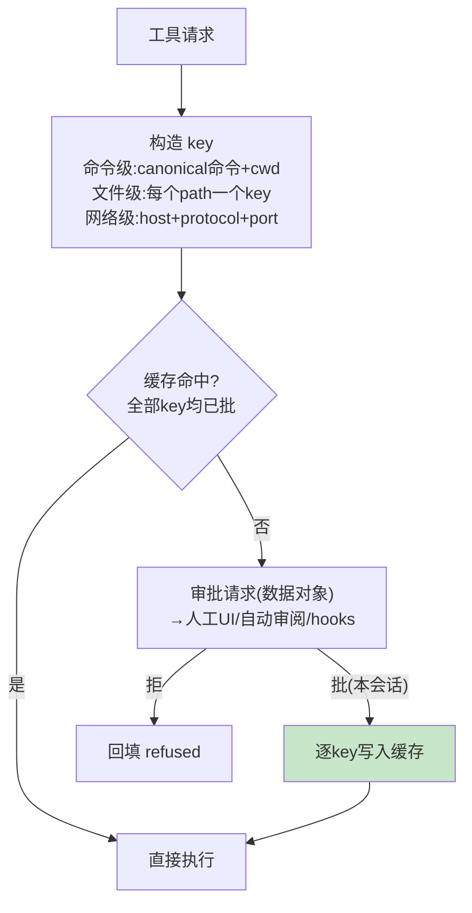

# 04-审批三态与 key 缓存——何时问 / 问一次 / 失败升级

> **定位**：把"要不要问用户"做成**纯函数**（三态推导表），把"问过就别再问"做成**结构化 key 缓存**（命令级/文件级/host+port 级），把"被拒了怎么办"做成**失败升级重试**——HITL 的工程化完整答案。读者画像：要回答"审批怎么既安全又不烦人"的读者。前置阅读：[03-工具编排与失败回填](03-工具编排与失败回填.md)、[教程 28-Human-in-the-Loop与审批流]、[教程 45-授权与最小权限]。
>
> **铁律 0**：审批自研「概念代码」；HITL 拦截落点遵循已实证基准（工具执行装饰层）。

---

## 一、四问

| 问 | 答 |
|----|----|
| **新增了什么需求** | ① 三态推导 `decide(policy, request) → SKIP / NEEDS_APPROVAL / FORBIDDEN` 纯函数（策略×请求维度的推导表）② 结构化 key 会话缓存：key 按资源粒度（canonical 命令/文件 path/host+port），命中=全 key 已批、写入=逐 key ③ 失败升级：沙箱内（受限模式）先试，Denied 且工具声明可升级→升级重试（缓存已批免二次审批）④ fail-closed：审批服务异常/超时/turn 不存在一律落最保守决策 ⑤ 审批请求是数据（可路由给人工 UI/自动审阅者/策略 hooks） |
| **影响了哪些模块** | 新增 `approval-svc`；03 编排层插入审批段 |
| **架构如何演进** | 工具编排 → 审批编排（横切层独立于工具实现） |
| **上一版痛点** | 审批靠布尔开关：全问（用户疯）或全不问（裸奔）；同命令反复弹窗（03 §七） |

**本迭代验收**：① 推导表 4×2 矩阵单测全分支 ② 批准 `git status` 后同命令同 cwd 免问、不同 cwd 再问（key 含 cwd）③ 受限失败→升级重试链路通、缓存命中不重复审批 ④ 全异常路径 fail-closed（审批服务 kill 后请求落 Deny）。

### 一.1 本节核对（四问与迭代验收）

- [ ] 四问口径齐全，且「上一版痛点」（全问 vs 全不问）与 03 §七 痛点衔接
- [ ] 四条本迭代验收可判定（矩阵全分支 / key 含 cwd / 升级重试 / fail-closed），与后续 §二/§三/§四 测试对应

---

## 二、三态推导表

| 策略 \ 请求 | 受限资源 | 非受限 |
|------------|---------|--------|
| Never | SKIP | SKIP |
| OnRequest | NEEDS | SKIP |
| Granular | 不许沙箱审批→**FORBIDDEN**，否则 NEEDS | SKIP |
| UnlessTrusted | NEEDS | NEEDS |

**纯函数的价值**：判定逻辑可单测全矩阵、可文档化、改策略不改代码——对照散落在工具实现里的 if/else 是质的差别。

### 二.1 本节测试与验证（三态推导表）

**前置条件**：`decide(policy, request)` 纯函数已按本节表格实现。

**材料 A——推导表参数化单测**（junit `@ParameterizedTest`）：

```java
static Stream<Arguments> matrix() {  // policy × restricted → expected
    return Stream.of(
        args(NEVER, true, SKIP),          args(NEVER, false, SKIP),
        args(ON_REQUEST, true, NEEDS),    args(ON_REQUEST, false, SKIP),
        args(GRANULAR_NO_SANDBOX, true, FORBIDDEN), args(GRANULAR, false, SKIP),
        args(UNLESS_TRUSTED, true, NEEDS), args(UNLESS_TRUSTED, false, NEEDS));
}
```

**步骤与断言**：

| # | 操作 | 预期（PASS 判据） |
|---|------|------------------|
| 1 | 材料A 8 格全跑 | 每格期望值精确匹配（无一格落 NEEDS 之外的意外态） |

**失败排查**：①矩阵错→把推导写成 if 链漏分支，应改表驱动。

## 三、结构化 key 缓存



**两个精妙处**：① key 按资源粒度设计，批准"这一批 key"后**任何子集**的后续请求自然免问；② 同类并发请求去重（同 key 只弹一个审批框）。

### 三.1 本节测试与验证（结构化 key 缓存）

**前置条件**：`decide` 纯函数已通过；ApprovalKey 缓存已实现。

**材料 B——key 构造样例**：

```json
{"cmd":"git status","cwd":"/repo/a","canonical":"git status"}
{"path":"/etc/hosts"}         // 文件级：patch 内每个路径一个 key
{"host":"api.example.com","protocol":"https","port":443}
```

**步骤与断言**：

| # | 操作 | 预期（PASS 判据） |
|---|------|------------------|
| 1 | 批准 `git status`（本会话）→ 同命令同 cwd 再请求 | 0 弹窗直接执行 |
| 2 | 同命令换 cwd（/repo/b）再请求 | 重新弹窗（key 含 cwd） |
| 3 | 批准 patch{a.md,b.md} 后请求只含 a.md 的 patch | 子集免问 |
| 4 | 请求含 a.md,c.md（c 未批） | 重新弹窗（全 key 已批才命中） |

**失败排查**：①误免问→命中条件写成"任一 key 已批"，应为**全部**。

## 四、失败升级与 fail-closed

- **升级链**：受限模式（只读/临时目录）先试 → 工具声明 `escalatable` 且被 Deny → 升级全权重试（审批缓存已批则免再问）——最小权限优先，体验与安全兼得。
- **安全不变量**：被拒过的读操作永不升级出沙箱；升级重试需新审批（缓存已批除外）；一切异常（审批服务挂/超时/会话不在）落 Deny/Forbidden。

### 四.1 本节测试与验证（失败升级与 fail-closed）

**前置条件**：§二/§三 已通过；升级路径（escalatable 声明）与 fail-closed 默认值已实现。

**步骤与断言**：

| # | 操作 | 预期（PASS 判据） |
|---|------|------------------|
| 1 | 受限执行 Denied 且工具 escalatable → 升级重试 | 升级执行成功；缓存已批时不二次弹窗 |
| 2 | 构造 denied-read 场景升级 | 禁止升级，直接拒绝 |
| 3 | kill 审批服务 → 发起需审批请求 | 落 Deny（0 放行；请求超时也算 Deny） |

**失败排查**：①死循环升级→升级次数上限未加；②升级漏拦→denied-read 检查点不在升级闸门内；③fail-closed 不生效→异常路径默认值写反，未落 Deny。

## 五、全篇回归验证

> §二.1（三态矩阵）/ §三.1（key 缓存）/ §四.1（升级与 fail-closed）均通过后的整体验收。

**步骤与断言**：

| # | 操作 | 预期（PASS 判据） |
|---|------|------------------|
| 1 | 批准 `git status` 后同 cwd 连发 5 次 | 仅首次弹窗，后 4 次 0 弹窗（key 缓存与矩阵联动） |
| 2 | 连发需审批请求且审批服务中途 kill | 全部请求落 Deny，0 异常放行（fail-closed 全路径） |

**失败排查**：任一步 FAIL 按 §二.1/§三.1/§四.1 对应排查项回溯（矩阵分支 / 命中条件 / 升级闸门 / fail-closed 默认值）。

## 六、本迭代痛点

会话越跑越长，上下文逼近上限——没有压缩策略，超限即报错死会话。→ 05 上下文管理与压缩。

> 本节核对（一句话）：痛点「上下文超限=死会话」与 05 主题（三路径压缩）对应，无搁置项即 PASS。

## 七、验收对照

| 验收项 | 标准 | 状态 |
|--------|------|------|
| 三态纯函数 | 全矩阵单测 | ✅ |
| key 缓存 | 子集免问/超集再问 | ✅ |
| 升级重试 | 最小权限先试 | ✅ |
| fail-closed | 异常全落拒 | ✅ |

> 本节核对（一句话）：四项验收与 04 本迭代验收及 §二.1/§三.1/§四.1 实测一一对应，状态全 ✅ 即 PASS。

**下一篇**：[05-上下文管理与压缩](05-上下文管理与压缩.md)。
