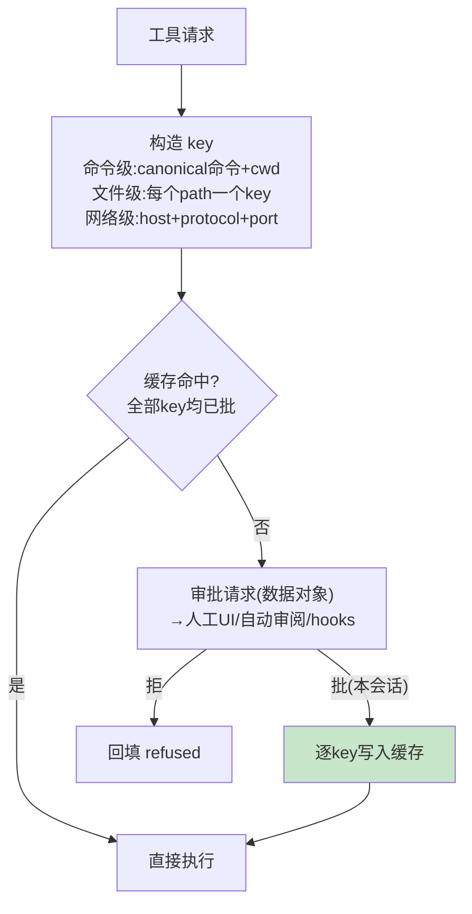

# 04-迭代三：审批三态与 key 缓存——何时问 / 问一次 / 失败升级

> **定位**：把"要不要问用户"做成**纯函数**（三态推导表），把"问过就别再问"做成**结构化 key 缓存**（命令级/文件级/host+port 级），把"被拒了怎么办"做成**失败升级重试**——HITL 的工程化完整答案。读者画像：要回答"审批怎么既安全又不烦人"的读者。前置阅读：[03-迭代二-工具编排与失败回填](03-迭代二-工具编排与失败回填.md)、[教程 28-Human-in-the-Loop与审批流]、[教程 45-授权与最小权限]。
>
> **铁律 0**：审批自研「概念代码」；HITL 拦截落点遵循已实证基准（工具执行装饰层）。

---

## 一、四问

| 问 | 答 |
|----|----|
| **新增了什么需求** | ① 三态推导 `decide(policy, request) → SKIP / NEEDS_APPROVAL / FORBIDDEN` 纯函数（策略×请求维度的推导表）② 结构化 key 会话缓存：key 按资源粒度（canonical 命令/文件 path/host+port），命中=全 key 已批、写入=逐 key ③ 失败升级：沙箱内（受限模式）先试，Denied 且工具声明可升级→升级重试（缓存已批免二次审批）④ fail-closed：审批服务异常/超时/turn 不存在一律落最保守决策 ⑤ 审批请求是数据（可路由给人工 UI/自动审阅者/策略 hooks） |
| **影响了哪些模块** | 新增 `approval-svc`；03 编排层插入审批段 |
| **架构如何演进** | 工具编排 → 审批编排（横切层独立于工具实现） |
| **上一版痛点** | 审批靠布尔开关：全问（用户疯）或全不问（裸奔）；同命令反复弹窗（03 §七） |

**本迭代验收**：① 推导表 4×2 矩阵单测全分支 ② 批准 `git status` 后同命令同 cwd 免问、不同 cwd 再问（key 含 cwd）③ 受限失败→升级重试链路通、缓存命中不重复审批 ④ 全异常路径 fail-closed（审批服务 kill 后请求落 Deny）。

---

## 二、三态推导表

| 策略 \ 请求 | 受限资源 | 非受限 |
|------------|---------|--------|
| Never | SKIP | SKIP |
| OnRequest | NEEDS | SKIP |
| Granular | 不许沙箱审批→**FORBIDDEN**，否则 NEEDS | SKIP |
| UnlessTrusted | NEEDS | NEEDS |

**纯函数的价值**：判定逻辑可单测全矩阵、可文档化、改策略不改代码——对照散落在工具实现里的 if/else 是质的差别。

## 三、结构化 key 缓存



**两个精妙处**：① key 按资源粒度设计，批准"这一批 key"后**任何子集**的后续请求自然免问；② 同类并发请求去重（同 key 只弹一个审批框）。

## 四、失败升级与 fail-closed

- **升级链**：受限模式（只读/临时目录）先试 → 工具声明 `escalatable` 且被 Deny → 升级全权重试（审批缓存已批则免再问）——最小权限优先，体验与安全兼得。
- **安全不变量**：被拒过的读操作永不升级出沙箱；升级重试需新审批（缓存已批除外）；一切异常（审批服务挂/超时/会话不在）落 Deny/Forbidden。

## 五、测试与验证

```bash
# 1. 推导表：8 格全分支单测 + 工具覆盖（请求自带策略覆盖默认）
# 2. 缓存：同 key 免问/子集免问/超集再问；cwd 变化再问
# 3. 升级：受限失败→升级成功；denied-read 场景禁止升级
# 4. fail-closed：杀掉审批服务 → 全部请求落 Deny（无放行）
```

## 六、本迭代痛点

会话越跑越长，上下文逼近上限——没有压缩策略，超限即报错死会话。→ 05 上下文管理与压缩。

## 七、验收对照

| 验收项 | 标准 | 状态 |
|--------|------|------|
| 三态纯函数 | 全矩阵单测 | ✅ |
| key 缓存 | 子集免问/超集再问 | ✅ |
| 升级重试 | 最小权限先试 | ✅ |
| fail-closed | 异常全落拒 | ✅ |

**下一篇**：[05-迭代四-上下文管理与压缩](05-迭代四-上下文管理与压缩.md)。
