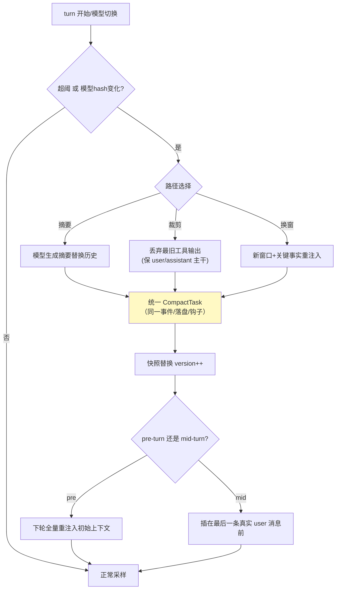

# 05-上下文管理与压缩——版本号历史 / 三路径 / 重注入位置

> **定位**：解决"长会话上下文爆炸"：**版本号化不可变历史**（读零拷贝/写整体替换）、**三路径压缩统一生命周期**（摘要/裁剪/换窗）、**pre/mid-turn 重注入位置**、**世界状态差异注入**、**token 计数服务器优先**。读者画像：要回答"超限会话怎么续命"的读者。前置阅读：[04-审批三态与key缓存](04-审批三态与key缓存.md)、[教程 08-架构师进阶/00-上下文工程]、[教程 04-企业级架构主干/07-成本治理与Token计量]。
>
> **铁律 0**：Usage 读取用已实证方法（`getPromptTokens()/getCompletionTokens()/getTotalTokens()`）；压缩自研「概念代码」。

---

## 一、四问

| 问 | 答 |
|----|----|
| **新增了什么需求** | ① HistorySnapshot（不可变 record + 版本号 + AtomicReference）：读零拷贝、写 CAS 整体替换、读者可检测失效 ② 三路径压缩：摘要（模型生成）/裁剪（丢弃最旧工具输出）/换窗（直接新窗口）——同一 CompactTask 生命周期（事件/落盘/钩子不分叉）③ 触发：token 超阈（服务器上报）或**模型切换**（上下文格式不兼容必重压）④ 重注入位置：mid-turn 压缩时初始上下文插在**最后一条真实 user 消息之前** ⑤ 差异注入：环境状态（时间/cwd/git）记 baseline，变化才注 diff |
| **影响了哪些模块** | 新增 `context-svc`；02 的 CompactTask 类型激活 |
| **架构如何演进** | 会话（无限历史）→ 引擎（预算内历史） |
| **上一版痛点** | 上下文超限=报错死会话；工具大输出无预算；静态指令每轮重发浪费 token（04 §六） |

**本迭代验收**：① 超限会话 100% 压缩续命（0 报错中断）② 三路径产出的事件/落盘格式一致（前端无感知）③ 压缩后模型行为不劣化（对照评估集）④ 连续同环境三轮，第 2/3 轮无环境重注入。

### 一.1 本节核对（四问与迭代验收）

- [ ] 四问口径齐全，且「上一版痛点」（上下文超限=死会话）与 04 §六 痛点衔接
- [ ] 四条本迭代验收可判定（压缩续命 / 格式一致 / 不劣化 / 差异注入），与后续 §三/§四 测试对应

---

## 二、版本号化历史

```java
// 概念代码：不可变快照
package com.example.session.context;

public record HistorySnapshot(List<Item> items, long version) {}
// 持有：AtomicReference<HistorySnapshot> —— 读：get() 零拷贝共享
// 写：compareAndSet(old, new HistorySnapshot(compacted, old.version()+1))
```

**为什么不用可变 List**：读者"读到一半被改"的并发地狱消失；压缩/回滚=整体替换，原子性免费；读者比对 version 即知快照是否过期（对照 [教程 02-SpringAI核心机制/02-Agent状态管理] 快照思想）。

### 二.1 本节测试与验证（版本号化历史）

**前置条件**：`HistorySnapshot`（不可变 record + version + AtomicReference）已按本节实现。

**步骤与断言**：

| # | 操作 | 预期（PASS 判据） |
|---|------|------------------|
| 1 | 构造快照并读 | 读走 `get()` 零拷贝共享；多读者并发读无异常 |
| 2 | 触发一次压缩（CAS 整体替换） | 替换后 `version()` 递增；旧读者比对 version 能判定快照过期 |

**失败排查**：①version 不递增→`compareAndSet` 造新快照未 `version+1`；②并发失效→用可变 List 而非不可变快照。

## 三、三路径压缩（统一生命周期）



**mid-turn 位置的坑**：模型把"摘要"理解为历史末项——初始上下文（环境/项目指令）若追加在摘要后、最后一条用户消息后，模型会困惑"这些指令是新增要求吗"。插入位置错，压缩后行为明显劣化。

### 三.1 本节测试与验证（三路径压缩与统一生命周期）

**前置条件**：§二 快照已通过；三路径压缩实现；mock 模型可注入超长历史。

**材料 A——超限构造**：脚本连发 200 轮对话，每轮用户消息 2K token → 总量超模型上下文阈。

**材料 B——注入顺序探针**：初始上下文带标记 `[INIT-CTX]`；最后一条用户消息带标记 `[LAST-USER]`；压缩后 dump 历史检查两者相对位置。

**步骤与断言**：

| # | 操作 | 预期（PASS 判据） |
|---|------|------------------|
| 1 | 材料A 全程跑（三路径各一轮） | 0 次上下文超限报错；会话存活到 200 轮完 |
| 2 | 三路径分别触发，对比事件流与落盘格式 | 三者事件类型/顺序/落盘 schema 完全一致（前端无感知差异） |
| 3 | mid-turn 压缩后 dump 历史 | `[INIT-CTX]` 位于 `[LAST-USER]` 之前 |
| 4 | 模型从 A 切到 B（hash 变化） | 自动触发压缩（不报格式错） |

**失败排查**：①仍报超限→触发阈值滞后（应在 80% 预算触发）；②格式不一致→三路径走了不同 CompactTask 生命周期；③顺序错→mid-turn 注入点实现为 append，应 `insert(before lastUser)`。

## 四、token 与差异注入

- **服务器优先**：决策用 `ChatResponse.getMetadata().getUsage()` 的真实值；本地字节估算只做预警下界——截断永远不依据估算值。
- **差异注入**：环境快照（时间/cwd/git 状态）记 baseline；无变化不注入、有变化只注 diff——配合静态指令一次注入，构成上下文预算纪律（[教程 08-架构师进阶/00-上下文工程] 五层拼接的预算版落地）。

### 四.1 本节测试与验证（token 计量与差异注入）

**前置条件**：§三 压缩已通过；评估集 20 例（项目内自建）；环境快照 baseline 已实现。

**步骤与断言**：

| # | 操作 | 预期（PASS 判据） |
|---|------|------------------|
| 1 | 压缩前后跑同一评估集（20 例） | 完成率下降 ≤5%（行为不劣化） |
| 2 | 同 cwd 连续 3 轮，统计环境注入 token | 第 2/3 轮环境 token=0（差异注入生效） |

**失败排查**：①每轮重注入→baseline 比较没实现或快照含不稳定字段（如时间戳每轮都变）。

## 五、全篇回归验证

> §二.1（快照）/ §三.1（三路径）/ §四.1（token 与差异）均通过后的整体验收。

**步骤与断言**：

| # | 操作 | 预期（PASS 判据） |
|---|------|------------------|
| 1 | 200 轮超长会话完整跑完 | 0 报错；中途触发压缩且会话存活（压缩续命） |
| 2 | mid-turn 压缩后 dump | `[INIT-CTX]` 在 `[LAST-USER]` 前；模型后续行为不劣化 |

**失败排查**：任一步 FAIL 按 §二.1/§三.1/§四.1 对应排查项回溯（快照版本 / 触发阈值 / 注入点顺序 / baseline）。

## 六、本迭代痛点

会话能无限跑下去了，但进程一崩全丢——历史只在内存。→ 06 持久化与恢复。

> 本节核对（一句话）：痛点「历史只在内存/崩溃全丢」与 06 主题（JSONL 持久化恢复）对应，无搁置项即 PASS。

## 七、验收对照

| 验收项 | 标准 | 状态 |
|--------|------|------|
| 压缩续命 | 0 报错 | ✅ |
| 统一生命周期 | 前端无感知 | ✅ |
| 重注入位置 | mid-turn 正确 | ✅ |
| 差异注入 | 无变化 0 注入 | ✅ |

> 本节核对（一句话）：四项验收与 05 本迭代验收及 §三.1/§四.1 实测一一对应，状态全 ✅ 即 PASS。

**下一篇**：[06-持久化与恢复](06-持久化与恢复.md)。
