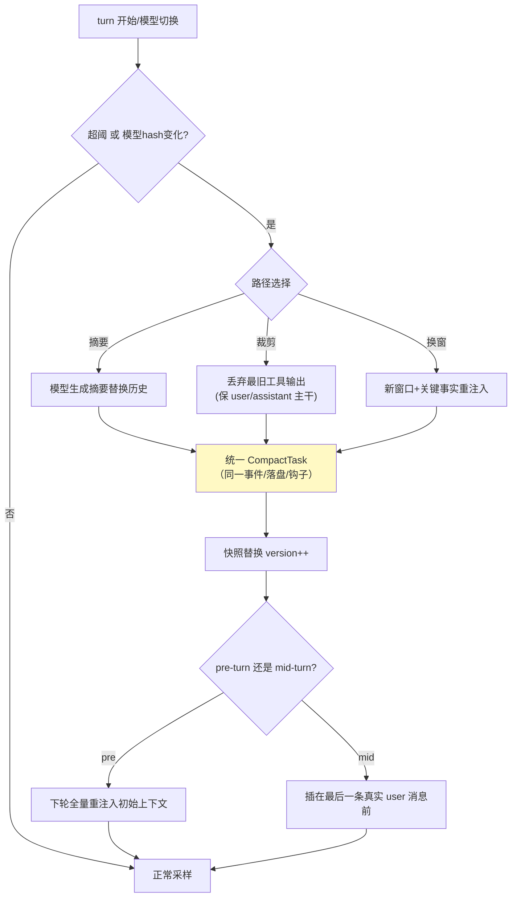

# 05-迭代四：上下文管理与压缩——版本号历史 / 三路径 / 重注入位置

> **定位**：解决"长会话上下文爆炸"：**版本号化不可变历史**（读零拷贝/写整体替换）、**三路径压缩统一生命周期**（摘要/裁剪/换窗）、**pre/mid-turn 重注入位置**、**世界状态差异注入**、**token 计数服务器优先**。读者画像：要回答"超限会话怎么续命"的读者。前置阅读：[04-迭代三-审批三态与key缓存](04-迭代三-审批三态与key缓存.md)、[教程 34-上下文工程]、[教程 27-成本治理与Token计量]。
>
> **铁律 0**：Usage 读取用已实证方法（`getPromptTokens()/getCompletionTokens()/getTotalTokens()`）；压缩自研「概念代码」。

---

## 一、四问

| 问 | 答 |
|----|----|
| **新增了什么需求** | ① HistorySnapshot（不可变 record + 版本号 + AtomicReference）：读零拷贝、写 CAS 整体替换、读者可检测失效 ② 三路径压缩：摘要（模型生成）/裁剪（丢弃最旧工具输出）/换窗（直接新窗口）——同一 CompactTask 生命周期（事件/落盘/钩子不分叉）③ 触发：token 超阈（服务器上报）或**模型切换**（上下文格式不兼容必重压）④ 重注入位置：mid-turn 压缩时初始上下文插在**最后一条真实 user 消息之前** ⑤ 差异注入：环境状态（时间/cwd/git）记 baseline，变化才注 diff |
| **影响了哪些模块** | 新增 `context-svc`；02 的 CompactTask 类型激活 |
| **架构如何演进** | 会话（无限历史）→ 引擎（预算内历史） |
| **上一版痛点** | 上下文超限=报错死会话；工具大输出无预算；静态指令每轮重发浪费 token（04 §六） |

**本迭代验收**：① 超限会话 100% 压缩续命（0 报错中断）② 三路径产出的事件/落盘格式一致（前端无感知）③ 压缩后模型行为不劣化（对照评估集）④ 连续同环境三轮，第 2/3 轮无环境重注入。

---

## 二、版本号化历史

```java
// 概念代码：不可变快照
public record HistorySnapshot(List<Item> items, long version) {}
// 持有：AtomicReference<HistorySnapshot> —— 读：get() 零拷贝共享
// 写：compareAndSet(old, new HistorySnapshot(compacted, old.version()+1))
```

**为什么不用可变 List**：读者"读到一半被改"的并发地狱消失；压缩/回滚=整体替换，原子性免费；读者比对 version 即知快照是否过期（对照 [教程 12] 快照思想）。

## 三、三路径压缩（统一生命周期）



**mid-turn 位置的坑**：模型把"摘要"理解为历史末项——初始上下文（环境/项目指令）若追加在摘要后、最后一条用户消息后，模型会困惑"这些指令是新增要求吗"。插入位置错，压缩后行为明显劣化。

## 四、token 与差异注入

- **服务器优先**：决策用 `ChatResponse.getMetadata().getUsage()` 的真实值；本地字节估算只做预警下界——截断永远不依据估算值。
- **差异注入**：环境快照（时间/cwd/git 状态）记 baseline；无变化不注入、有变化只注 diff——配合静态指令一次注入，构成上下文预算纪律（[教程 34] 五层拼接的预算版落地）。

## 五、测试与验证

```bash
# 1. 续命：构造超限会话 → 三路径各跑 → 0 报错、事件流无差异
# 2. 位置：mid-turn 压缩后注入顺序断言（初始上下文在最后 user 消息前）
# 3. 行为：压缩前后跑同一评估集 → 完成率不降
# 4. 差异：同 cwd 三轮 → 2/3 轮环境 token=0
```

## 六、本迭代痛点

会话能无限跑下去了，但进程一崩全丢——历史只在内存。→ 06 持久化与恢复。

## 七、验收对照

| 验收项 | 标准 | 状态 |
|--------|------|------|
| 压缩续命 | 0 报错 | ✅ |
| 统一生命周期 | 前端无感知 | ✅ |
| 重注入位置 | mid-turn 正确 | ✅ |
| 差异注入 | 无变化 0 注入 | ✅ |

**下一篇**：[06-迭代五-持久化与恢复](06-迭代五-持久化与恢复.md)。
