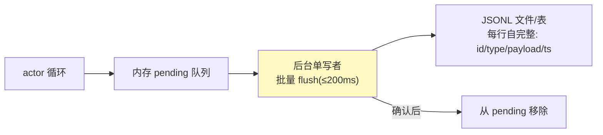

# 06-迭代五：持久化与恢复——JSONL 事件日志 / 快照 / 重放

> **定位**：让会话**崩了能恢复、断了能续传**：append-only JSONL 事件日志（每行自完整）、TurnContext 快照（每 turn/每压缩后落一次）、恢复入口枚举（NEW/RESUMED/FORKED 三种重放语义）、**持久化先于终态事件**的落地。读者画像：要回答"引擎崩溃后会话怎么办"的读者。前置阅读：[05-上下文管理与压缩](05-上下文管理与压缩.md)、[教程 25-历史记录持久化与合规]、[教程 40-长任务持久化与中断恢复]。
>
> **铁律 0**：持久化自研「概念代码」；持久化选型 PostgreSQL（需在 pom.xml 中添加依赖）。

---

## 一、四问

| 问 | 答 |
|----|----|
| **新增了什么需求** | ① 事件日志：每条 AgentEvent + 状态变更追加为一行自完整 JSON（Jackson 序列化）② 后台单写者：异步批量落盘、pending 确认后才移除、幂等（唯一事件 id 去重）③ TurnContext 快照：配置/工具集/模型参数每 turn 与每次压缩后各落一次（崩溃恢复的 durable baseline）④ 恢复入口枚举：NEW（新会话）/RESUMED（重放到最后一致点）/FORKED（从历史分叉新会话）——重放规则纯函数可单测 ⑤ 崩溃演练：写一半 kill -9，最多丢尾行 |
| **影响了哪些模块** | 新增 `recovery-svc`；02 的"持久化先于终态"在此落地；05 快照接持久化 |
| **架构如何演进** | 内存会话 → 可恢复会话（durable session） |
| **上一版痛点** | 历史只在内存：进程重启/发布/崩溃=会话全丢；长任务跑两小时崩一次不可接受（05 §六） |

**本迭代验收**：① kill -9 恢复：重放后状态与崩溃前一致（只丢尾行）② 三种恢复入口各自重放语义正确（FORKED 不污染源会话）③ 终态事件之前必有对应持久化行（不变式断言）④ 落盘不阻塞主循环（异步批量、延迟 <200ms）。

---

## 二、事件日志（append-only JSONL）

- **每行自完整**：损坏最多丢尾行，无级联解析失败——崩溃恢复的最简正确格式；
- **幂等**：事件 id 唯一，重放时重复行跳过（重试产生的重复写入无害）。

## 三、恢复入口（重放是纯函数）

| 入口 | 语义 | 用途 |
|------|------|------|
| NEW | 空历史起步 | 新会话 |
| RESUMED | 重放到最后一致点，续跑 | 崩溃恢复/断线续传 |
| FORKED | 复制历史到分叉点，之后独立 | "从这步重来"/多方案并行 |

**FORKED 的坑**：分叉继承的是**源会话当时的格式与配置**，不是目标会话的默认值——"看起来可以随便选"的地方恰是 bug 高发区（快照必须随行）。

## 四、与 02/05 的闭环

- 02 的不变式"**持久化先于终态事件**"在此实现：`persist(event).then(emit(event))`——终态事件发出前 JSONL 必有该行；
- 05 的 `HistorySnapshot` 快照：每 turn/每压缩后落一次 TurnContext（模型/工具集/参数）——恢复时不只知道"说了什么"还知道"当时怎么配的"。

## 五、验证包（手工测试与验证）
**前置条件**：05 已通过；JSONL 事件日志与 TurnContext 快照落库。

**材料 A——崩溃脚本**：后台线程在写入第 N 条事件后 `Runtime.halt()`（模拟 kill -9；halt 不走 shutdown 钩子，最接近真实崩溃）。

**材料 B——重放校验器**：读 JSONL → 逐行 Jackson 解析 → 按 RESUMED 语义重建状态 → 与崩溃前内存快照（测试前另存）逐字段比对。

**步骤与断言**：

| # | 操作 | 预期（PASS 判据） |
|---|------|------------------|
| 1 | 跑 50 轮后执行材料 A | 重启后材料 B 比对：丢行 ≤1、状态一致 |
| 2 | RESUMED 恢复后续提交新输入 | 历史连贯、模型上下文含崩溃前内容 |
| 3 | FORKED 分叉后两会话各写 10 轮 | 源会话 JSONL 无新行（0 污染）；双方历史各自正确 |
| 4 | 全量事件审计脚本 | 每个终态事件（Complete/Aborted）之前必有对应持久化行（不变式 100%） |
| 5 | 10 事件/s 持续 60s | 落盘延迟 <200ms；actor 循环无阻塞（处理耗时无抖动尖峰） |

**失败排查**：①丢行多→写入无 flush 或缓冲无界被截断；③源污染→fork 复制引用了同一 List，应深拷贝快照；④不变式破→终态事件路径绕过了 persist().then(emit())；⑤阻塞→落盘在 actor 线程同步执行，应移后台写者。

## 六、本迭代痛点

会话可恢复了，但交互语义还糙：用户中途想补充信息只能打断重来；打断工具后台还在跑。→ 07 steering 与打断。

## 七、验收对照

| 验收项 | 标准 | 状态 |
|--------|------|------|
| 崩溃恢复 | 丢行≤1 | ✅ |
| 三入口 | FORKED 不污染 | ✅ |
| 持久化先于终态 | 审计不变式 | ✅ |
| 异步落盘 | <200ms | ✅ |

**下一篇**：[07-Steering与打断](07-Steering与打断.md)。
