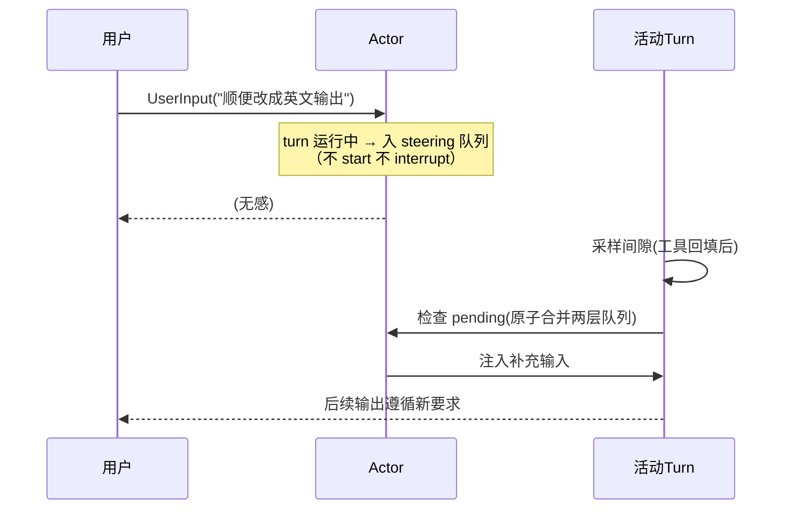
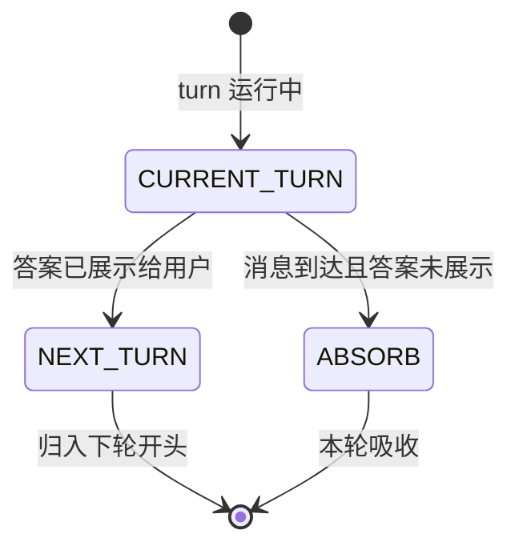

# 07-迭代六：Steering 与打断——不打断也不丢失的第三条路

> **定位**：交互语义收官：**Steering**（运行中补充输入，不打断不丢失，采样间隙合并）、**迟到消息裁决**（已展示给用户的消息归下轮）、**自动唤醒**（空闲会话被待办消息自动开新 turn）。读者画像：要回答"用户中途插话引擎怎么接"的读者。前置阅读：[06-迭代五-持久化与恢复](06-迭代五-持久化与恢复.md)、[教程 19-流式工具调用与事件协议]、[教程 24-多页面流式响应与会话管理]。
>
> **铁律 0**：交互机制自研「概念代码」。

---

## 一、四问

| 问 | 答 |
|----|----|
| **新增了什么需求** | ① Steering 队列：turn 运行中收到 UserInput → 入 pending 队列（不开新 turn 不打断）；当前轮**采样间隙**（工具回填前后）原子合并注入 ② 迟到裁决状态机（CURRENT_TURN/NEXT_TURN）：子代理消息到达时，答案已展示给用户的归下轮——防"用户看到 A、模型却按 B 继续说" ③ 自动唤醒：任务结束若 pending 有带 trigger 的消息 → 自动开新 turn（空闲会话可被"叫醒"）④ 打断闭环：07 与 02 三段式打断打通——打断传播到工具执行与外部调用 |
| **影响了哪些模块** | `session-core` 输入路径重构；`interaction-svc` 落地；19 篇式事件协议补 SteeringInjected 事件 |
| **架构如何演进** | 单轮问答语义 → 连续对话语义（人机真正"对话"） |
| **上一版痛点** | 补充输入=打断重开（丢工作）或排队到轮末（迟半天）；子代理消息到达时机随机，用户所见与模型行为可能分裂（06 §六） |

**本迭代验收**：① steering：流中补充输入 → 不打断、下一间隙合并、模型行为响应新输入 ② 迟到裁决：已展示消息 100% 归下轮 ③ 唤醒：空闲会话被 trigger 消息自动开 turn ④ 打断：工具执行 100% 随打断终止（与 02 联测）。

---

## 二、Steering 流



**价值**：比"打断重开"省（丢的工作保住）、比"排队忽略"准（本周期内生效）——这是真实助手的插话语义。

## 三、迟到裁决与自动唤醒



- **裁决依据是"用户看到了什么"**——模型内部状态与用户视图一致优先于吞吐量。
- **自动唤醒**：会话空闲 ≠ 结束——pending 队列带 trigger 的消息（定时提醒/子代理完成通知）自动开新 turn；配合 idle 事件（02 单点收尾）构成完整调度。

## 四、打断闭环（与 02/03 打通）

打断三段式（02）传播路径补全：Op.Interrupt → 任务取消 → **工具执行取消**（03 编排层监听取消信号，执行中工具收到终止）→ 外部命令进程 destroy → 已有结果按"部分完成"回填。打断不是丢弃，是**定格**——部分结果入历史、标记 interrupted、可续。

## 五、测试与验证

```bash
# 1. steering：流式输出中途注入 → 不断流；模型后续输出响应新指令
# 2. 裁决：构造"答案已展示后消息到达" → 归下轮（断言历史顺序）
# 3. 唤醒：空闲会话投递 trigger 消息 → 自动开新 turn（idle 事件后）
# 4. 打断：工具执行中打断 → 工具进程终止、部分结果定格入历史
```

## 六、本迭代痛点

六迭代闭环——但审批还全靠人。高风险操作自动放行不行、每次都问也不行。→ 08 Guardian 自动审阅。

## 七、验收对照

| 验收项 | 标准 | 状态 |
|--------|------|------|
| steering | 不打断不丢失 | ✅ |
| 迟到裁决 | 用户视图一致 | ✅ |
| 自动唤醒 | idle 后可叫醒 | ✅ |
| 打断定格 | 部分结果保留 | ✅ |

**下一篇**：[08-进阶一-Guardian自动审阅](08-进阶一-Guardian自动审阅.md)。
