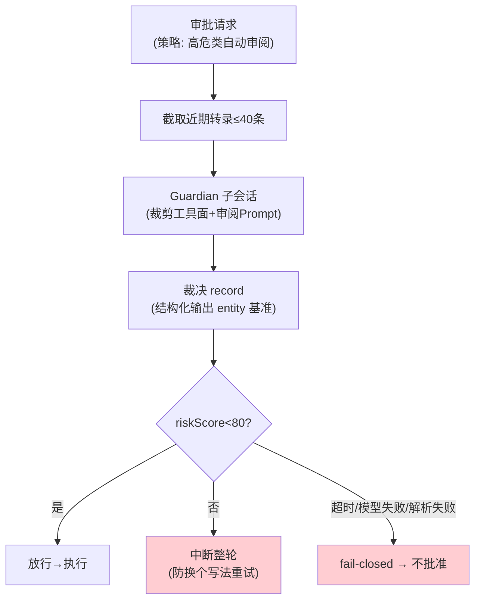

# 08-进阶一：Guardian 自动审阅——"AI 审 AI"的受限子会话

> **定位**：把 04 的审批路由升级出**自动审阅者**：审批请求可路由给一个受限子会话（Guardian）——转录截取→模型评估→结构化裁决→回接审批；fail-closed、拒绝即中断整轮、防套娃。读者画像：要回答"高危操作能不能 AI 先把关"的读者。前置阅读：[04-迭代三-审批三态与key缓存](04-迭代三-审批三态与key缓存.md)、[教程 37-自我反思与Agent评估]、[教程 28-Human-in-the-Loop与审批流]。
>
> **铁律 0**：结构化裁决用已实证 `entity(Class, spec)` 基准；Guardian 编排自研「概念代码」。

---

## 一、四问

| 问 | 答 |
|----|----|
| **新增了什么需求** | ① Guardian 子会话：专用 ChatClient（裁剪工具面=只读审查工具、独立 System Prompt、结构化输出裁决 record）② 评估输入=近期转录截取（上限 40 条，防上下文爆炸）③ 裁决结构化：riskLevel/riskScore/rationale/evidence 四字段 ④ 回接规则：score<80 放行；≥80 或任何失败（超时 90s/模型错/解析错）→ **中断整轮**（不只拒单条——防模型换个写法重试同一危险操作）⑤ 防套娃：Guardian 自己的调用不再进 Guardian ⑥ 会话复用：主干复用+按需 fork 降冷启动 |
| **影响了哪些模块** | `approval-svc`（04）审批路由加 Guardian 分支；新增 guardian 子模块 |
| **架构如何演进** | 人工审批 → 分级审批（hooks → Guardian → 人） |
| **上一版痛点** | 审批全靠人：高频低险操作骚扰用户、真高危时人已疲劳麻木（04 §六未触及自动化） |

**本迭代验收**：① 构造高危操作 → Guardian 拦截并中断整轮（rationale 可读）② fail-closed：Guardian 超时/坏 JSON → 一律不批准 ③ 防套娃：Guardian 内工具调用不进审阅 ④ 复用：连续审阅第 2 次起延迟显著低于首次。

---

## 二、四步法与回接



## 三、"自动审阅者=受限子会话"四件套

| 要素 | 实现 | 为什么 |
|------|------|--------|
| 受限工具面 | 子 ChatClient 只挂只读审查工具（查文件/查日志），无写操作 | 审阅者自己不能闯祸 |
| 结构化裁决 | `entity(GuardianAssessment.class, spec -> spec.validateSchema())` | 可程序判定，不靠文本解析 |
| fail-closed | 超时/异常/校验失败全落"不批准" | 自动系统的默认值必须是保守 |
| 拒绝即整轮中断 | InterruptTurn（07 打断路径） | 单条拒绝会被模型"提示词绕过"式重试 |

## 四、与体系联动

- 裁决事件入事件日志（06）：谁批的（human/guardian/policy）、依据（rationale/evidence）——审计可回溯；
- Guardian 判错样本回流：误拦/漏放案例进入评审集，持续校准审阅 Prompt（数据飞轮思想，[教程 41]）。

## 五、测试与验证

```bash
# 1. 拦截：高危命令样本集 → 拦截率+rationale 人工抽检
# 2. fail-closed：Guardian 依赖 kill → 全部落不批准（0 放行）
# 3. 套娃：Guardian 内调用 → 不触发新审阅（断言路由）
# 4. 复用：第 2 次审阅延迟 < 首次的 50%
```

## 六、本迭代痛点

单会话引擎齐了；但多 Agent 协作需要**多会话**——子代理会话怎么创建、父子怎么通信、fork 怎么管理。→ 09 多线程与 fork。

## 七、验收对照

| 验收项 | 标准 | 状态 |
|--------|------|------|
| 拦截+rationale | 可读可审计 | ✅ |
| fail-closed | 0 异常放行 | ✅ |
| 防套娃 | 路由断言 | ✅ |
| 会话复用 | 延迟降半 | ✅ |

**下一篇**：[09-进阶二-多线程与会话Fork](09-进阶二-多线程与会话Fork.md)。
