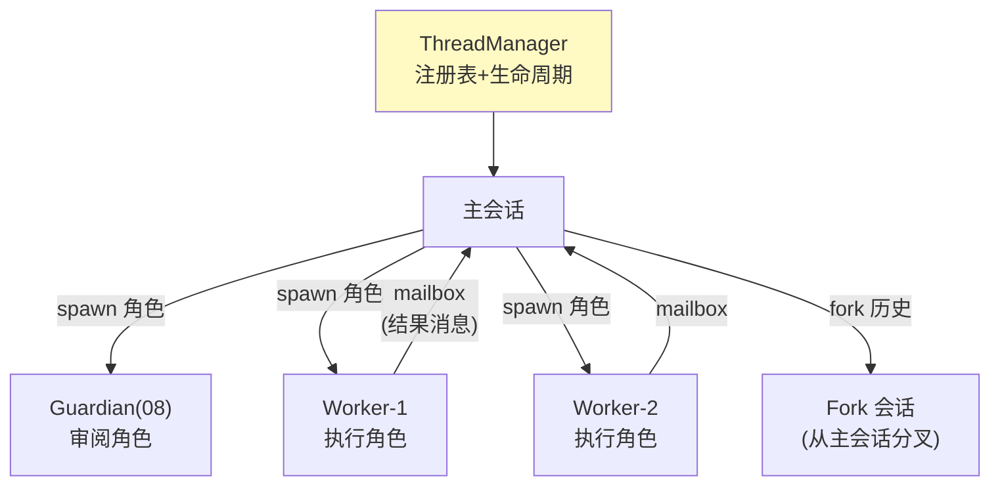

# 09-进阶二：多线程与会话 Fork——会话树 / 父子通信 / 有界关闭

> **定位**：把单会话引擎扩展为**会话树**：ThreadManager 管理主线程与子代理线程（创建/fork/resume/关闭）；父子通过 mailbox 通信（07 迟到裁决的扩展场景）；角色声明式定义（加角色不改代码）；有界关闭防挂死。读者画像：要回答"多 Agent 协作时每个 Agent 一个会话怎么管"的读者。前置阅读：[07-迭代六-Steering与打断](07-迭代六-Steering与打断.md)、[教程 09-多Agent协作]。
>
> **铁律 0**：线程管理自研「概念代码」。

---

## 一、四问

| 问 | 答 |
|----|----|
| **新增了什么需求** | ① ThreadManager：主会话+子代理会话的注册表（创建/fork/resume/shutdown）② fork 语义：从历史分叉点复制快照开新会话（06 FORKED 入口的运行时化）——源会话不被污染 ③ mailbox 父子通信：子代理结果以消息投递回父会话 pending 队列，由 07 的裁决/唤醒机制接住 ④ 角色声明式：子代理角色（审阅者/执行者/研究员）外置配置定义（工具面/审批策略/System Prompt），加角色不改引擎代码 ⑤ 有界关闭：shutdown 全部线程带超时上限，防单线程挂死拖垮全局 |
| **影响了哪些模块** | `session-core` 之上加 thread-manager 层；06 FORKED、07 唤醒在此复用 |
| **架构如何演进** | 单会话引擎 → 会话树运行时 |
| **上一版痛点** | Guardian（08）已用受限子会话但每次冷启动；多 Agent 协作时子任务没有独立会话语义（08 §六） |

**本迭代验收**：① fork：分叉后两会话独立演进、源会话日志无污染 ② mailbox：子代理完成 → 父会话按裁决规则接收（运行中吸收/空闲唤醒）③ 角色配置化：新增"翻译者"角色仅改配置 ④ 有界关闭：挂死子线程不阻塞全局关闭（超时强收）。

---

## 二、会话树



**三条纪律**：① 子代理会话是**受限子会话**（08 模式：工具面裁剪+审批策略独立）② mailbox 消息进入父会话的 pending 队列，由既有裁决/唤醒机制统一处理——**不为父子通信发明第二套机制** ③ fork 继承源会话格式与配置快照（06 的坑在此复验）。

## 三、角色声明式定义

```yaml
# 概念配置：角色定义（加角色不改代码）
roles:
  reviewer:
    systemPrompt: "classpath:prompts/reviewer.st"
    tools: [read_file, search]        # 受限工具面
    approvalPolicy: NEVER             # 审阅者自身不再触发审批
  executor:
    systemPrompt: "classpath:prompts/executor.st"
    tools: [write_file, run_tests]
    approvalPolicy: UNLESS_TRUSTED    # 接 04 三态表
```

审批策略字段直接复用 04 的三态枚举——角色=SystemPrompt+工具面+审批策略+资源配额四元组。

## 四、有界关闭

关闭序列：通知所有活动 turn 优雅退出（02 三段式）→ 逐线程等待（每线程超时上限）→ 超时强杀 → 会话级 flush 终态入日志。**全局关闭必须有自己的总时限**——任何一个挂死线程不能阻塞整个进程退出（对照 [教程 30-容错与弹性设计]）。

## 五、测试与验证

```bash
# 1. fork：分叉后两会话各写 10 turn → 源日志无新行、双方历史正确分叉
# 2. mailbox：父会话运行中/空闲两场景 → 吸收/唤醒各自正确
# 3. 角色：yaml 加 translator → spawn 成功无需改代码
# 4. 有界关闭：注入挂死子线程 → 全局关闭 ≤ 总时限完成
```

## 六、本迭代痛点

会话树有了，但每类前端（桌面/IDE/Web/移动）各接一套事件流——重复适配。→ 10 投影层。

## 七、验收对照

| 验收项 | 标准 | 状态 |
|--------|------|------|
| fork 隔离 | 源无污染 | ✅ |
| mailbox | 裁决/唤醒接住 | ✅ |
| 角色配置化 | 加角色零代码 | ✅ |
| 有界关闭 | 总时限 | ✅ |

**下一篇**：[10-进阶三-投影层与多前端](10-进阶三-投影层与多前端.md)。
