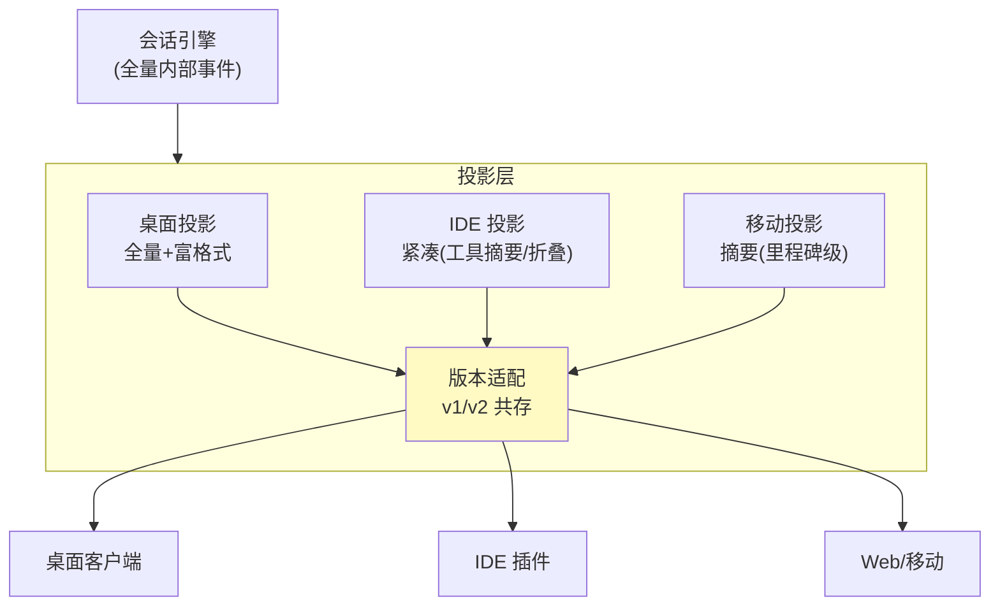

# 10-进阶三：投影层与多前端——一后端多前端的事件视图

> **定位**：把引擎事件与前端视图解耦：**投影层**（内部全量事件 → 各前端定制视图）、协议版本化（v1/v2 共存）、按域拆分处理器、多前端复用一个会话后端进程。读者画像：要回答"桌面/IDE/Web 怎么共用一个会话引擎"的读者。前置阅读：[09-多线程与会话Fork](09-多线程与会话Fork.md)、[教程 19-流式工具调用与事件协议]、[教程 24-多页面流式响应与会话管理]。
>
> **铁律 0**：投影层自研「概念代码」。

---

## 一、四问

| 问 | 答 |
|----|----|
| **新增了什么需求** | ① 投影服务：订阅内部全量 AgentEvent 流，按前端类型输出定制视图（桌面全量/IDE 紧凑/移动摘要）② 协议版本化：事件 schema 带 version，v1/v2 共存（老前端不被迫升级）③ 按域处理器：事件→视图的映射按域拆类（生命周期域/工具域/审批域），新增前端只加投影器 ④ 断线续传锚点：投影层保留事件序号，前端带 Last-Event-ID 重连补发（[教程 24] 思想的引擎侧落地）⑤ 跨前端一致性：同一会话多端同时在线，状态收敛 |
| **影响了哪些模块** | 引擎顶部新增 projection 层；SSE/WebSocket 适配器变为投影器的下游 |
| **架构如何演进** | 单前端直连 → 投影解耦（管控分离在协议层的体现） |
| **上一版痛点** | 事件协议与前端耦合：加一种前端=改引擎事件；老前端随引擎升级被迫重写（09 §六） |

**本迭代验收**：① 三种前端视图各自正确（同事件流三投影）② v1 前端在 v2 事件流下正常工作（版本兼容）③ 断线重连：Last-Event-ID 补发无缺无重 ④ 双端同会话：操作互见、状态一致。

---

## 二、投影层

**关键不变式**：投影是**只读变换**——任何前端不能通过投影层改引擎状态（命令仍走 01 的 Op 通道），双向彻底分离：命令进 Op、视图出投影。

## 三、版本化与续传

| 机制 | 规则 |
|------|------|
| 事件版本 | 每事件带 schemaVersion；投影层向下适配（v2 的字段裁剪成 v1 视图）而非要求前端升级 |
| 断线续传 | 投影层环形缓冲保留最近 N 事件；前端重连带 Last-Event-ID → 补发缺口（对照 19 篇会话缓冲区不变式） |
| 多端一致 | 引擎是唯一事实源；各端视图从同一事件序重放——最终一致由事件序保证 |

## 四、按域处理器

投影器按域拆分（生命周期/工具/审批/资源计量），每域一个纯函数 `view(event) -> viewEvent`——可单测、可组合；新增前端=组合既有域处理器+一份布局配置，而非新写协议解析。

## 五、验证包（手工测试与验证）
**前置条件**：09 已通过；三投影器+版本适配+环形缓冲+续传实现；两个测试前端（桌面全量/SSE 紧凑）。

**材料 A——混合版本事件流**：录制一段含 v2 新字段（如 `costMicro`）的事件序列回放给 v1 投影器。

**材料 B——断连脚本**：订阅 30s 后主动断开，5s 后带 `Last-Event-ID` 重连。

**步骤与断言**：

| # | 操作 | 预期（PASS 判据） |
|---|------|------------------|
| 1 | 同一事件流喂三投影器 | 桌面=全量；IDE=折叠工具摘要；移动=仅里程碑级事件（各自断言样本） |
| 2 | 材料A 喂 v1 投影器 | v1 正常渲染，v2 新字段被裁剪（无解析异常） |
| 3 | 材料B 断线重连 | 补发精确：重连后事件序连续、0 缺失 0 重复 |
| 4 | 双端同会话：A 端提交输入、B 端观察 | B 端 ≤1s 收到对应事件流；两边最终状态一致 |
| 5 | 投影器内尝试调用引擎写接口（代码审查项） | 投影层无写路径（架构断言：投影只读） |

**失败排查**：①投影互相污染→投影器持有共享可变状态，应纯函数；③重复→环形缓冲去重没按事件 id；④不一致→双端各自直连引擎绕过投影（检查拓扑）；⑤有写路径→投影层混入了命令转发，命令必须走 Op 通道。

## 六、本迭代痛点

引擎全能力齐备——复盘。→ 11 核心代码讲解。

## 七、验收对照

| 验收项 | 标准 | 状态 |
|--------|------|------|
| 三投影 | 各自正确 | ✅ |
| 版本共存 | v1 不被迫升级 | ✅ |
| 断线续传 | 无缺无重 | ✅ |
| 多端一致 | 事件序收敛 | ✅ |

**下一篇**：[11-核心代码讲解](11-核心代码讲解.md)。
