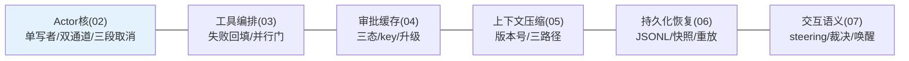
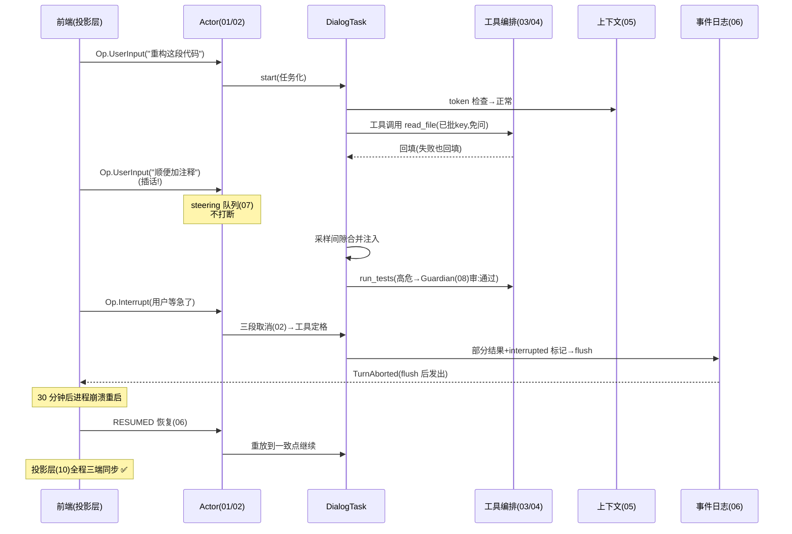

# 11-核心代码讲解：一条消息的引擎之旅

> **定位**：复盘引擎关键实现，并以**"用户插话+工具执行+打断+恢复"的一条完整消息旅程**串起六迭代+三进阶。前置阅读：[02-Actor核与任务生命周期](02-Actor核与任务生命周期.md) 至 [10-进阶三-投影层与多前端](10-进阶三-投影层与多前端.md)。

---

## 一、机制速查

## 二、完整旅程（插话→工具→打断→恢复）

**一句话**：一条消息先入有界队列（01）、变成任务（02）、工具失败不崩（03）、审批问一次（04）、上下文压着跑（05）、崩了能恢复（06）、插话不打断（07）、高危 AI 先审（08）、多代理各占一会话（09）、三端看同一引擎（10）。

## 三、关键设计复盘

| # | 设计 | 为什么 |
|---|------|--------|
| 1 | 契约先行（Op/Event sealed） | 前端/持久化/测试对契约编程，引擎可重构 |
| 2 | 单写者+双通道 | 状态零锁、命令有反压、事件不丢 |
| 3 | 任务化+单点收尾 | 加任务类型零成本获得生命周期 |
| 4 | 三段取消+持久化先于终态 | 打断有语义、崩溃后无矛盾状态 |
| 5 | 失败回填 | 会话永不因工具崩，模型自纠 |
| 6 | 审批=纯函数+key 缓存 | 既安全又不骚扰 |
| 7 | 版本号快照+三路径压缩 | 超限续命、并发零地狱 |
| 8 | FORKED 继承源格式 | 分叉 bug 高发区的显式纪律 |
| 9 | steering+裁决状态机 | 插话不打断、用户视图一致 |
| 10 | 投影只读 | 双向分离，多前端零改引擎 |

## 四、测试与验证

按 §二旅程逐跳断言（各迭代已有用例）；全链演练（插话→工具→Guardian→打断→崩溃→恢复→多端）季度例行。

**下一篇**：[12-ADR架构决策记录](12-ADR架构决策记录.md)。
