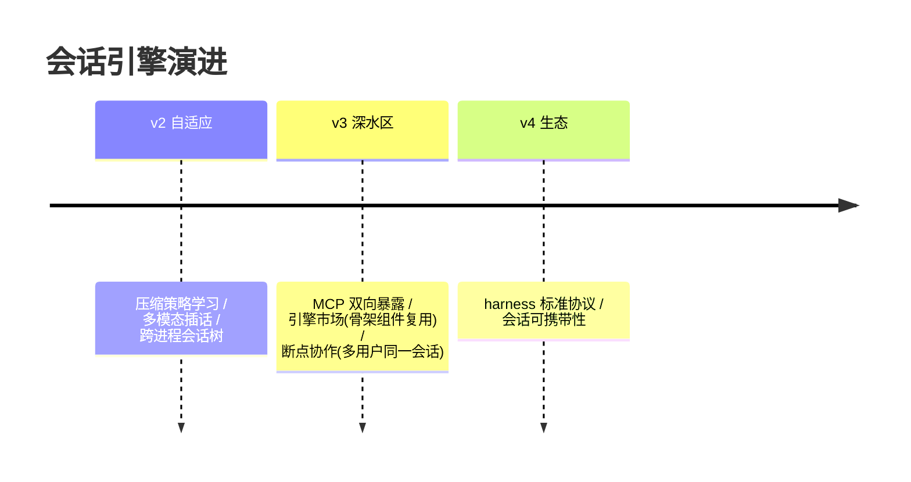

# 13-工业前沿与演进方向：harness 生态的 2026 校准与收官

> **定位**：用 2026 工业趋势校准方向，给缺口与 v2 演进，项目收官。前置阅读：[12-ADR架构决策记录](12-ADR架构决策记录.md)。

---

## 一、行业信号（公开趋势，落地前需逐条核实最新进展）

- **Harness 层成为差异化焦点**：模型能力趋同后，各厂商竞争重心移向运行时骨架——打断/steering/审批/压缩/恢复的工程质量直接决定产品体验。开源 harness（如 codex 系）的机制被广泛转译到各语言生态（本体系的转译实践见「想深入？→ [附录 15/13-codex-harness/04-Java工程师借鉴手册]」）。
- **MCP 双向化**：引擎既消费外部工具，也把自身能力（含审批语义）暴露给其他宿主——工具生态的进与出走同一安全管线。
- **交互式执行单元**：`cell + wait/yield` 让出协议（执行单元主动让出、调用方增量轮询）在长任务场景普及——工具执行从"函数调用"进化为"会话续航"。
- **多前端一后端**：桌面/IDE/Web/移动复用同一会话引擎进程成为标准架构——投影层+协议版本化是刚需而非锦上添花。

## 二、现状对照

| # | 前沿能力 | 现状 | 缺口/演进 |
|---|---------|------|----------|
| H1 | 会话骨架（actor/取消/收尾） | ✅ 01-02 | ✅ |
| H2 | 工具编排（回填/并行门） | ✅ 03 | ✅ |
| H3 | 审批工程化（三态/key/升级） | ✅ 04/08 | ✅ |
| H4 | 上下文压缩（版本号/三路径） | ✅ 05 | 🔷 v2：压缩策略学习（按任务类型自适应选路径） |
| H5 | 持久化恢复 | ✅ 06 | ✅ |
| H6 | 交互语义（steering/裁决/唤醒） | ✅ 07 | 🔷 v2：多模态插话（语音打断与文本 steering 合流） |
| H7 | 多会话/fork/角色 | ✅ 09 | 🔷 v2：跨进程会话树（分布式 thread manager） |
| H8 | MCP 双向 | 🔶 只消费（工具接入） | 🔷 v2：引擎自身能力 MCP 服务化暴露 |

## 三、演进路线



## 四、九旗舰对照收官（14-22）

| 视角 | 14 平台 | 15 内核 | 16 网格 | 17 实时 | 18 知识 | 19 评测 | 20 经济 | 21 仿真 | **22 会话引擎** |
|------|--------|--------|--------|--------|--------|--------|--------|--------|--------------|
| 第一性 | 治理全景 | 资源托管 | 零改造 | 延迟预算 | 知识可信 | 效果可信 | 交易可信 | 变更可信 | **交互可信** |
| 护城河 | 治理能力 | 运行机制 | 接入规模 | 实时体验 | 知识资产 | 金标资产 | 授权账本资产 | 流量资产 | **会话契约资产** |
| 时间观 | 策略周期 | 进程周期 | 配置周期 | 毫秒 | 知识生命周期 | 版本生命周期 | 结算周期 | 变更周期 | **turn 生命周期** |

> 九旗舰共同回答"企业级 Agent 基础设施全景"：九种第一性原理九套蓝图，可组合——会话引擎是其余八旗舰的"运行时底座"（每旗舰的 Agent 都跑在某种会话引擎上），其余八旗舰为引擎提供治理/资源/接入/体验/知识/信任/经济/变更能力。

## 五、检验方式

```bash
# 对照：本引擎机制清单 vs 附录 15/13 转译手册 30 条逐条打勾
# v2 PoC：压缩策略自适应（同一任务集上三路径自动选优）
```

## 六、项目收官

| 阶段 | 篇目 | 交付 |
|------|------|------|
| 基础（00-01） | 四层架构/最小 Actor | 会话核雏形 |
| 六迭代（02-07） | 任务/工具/审批/压缩/恢复/交互 | 完整会话引擎 |
| 进阶（08-10） | Guardian/多线程/投影层 | AI 审 AI+会话树+多前端 |
| 资产（11-13） | 讲解/ADR/前沿 | 旅程复盘+14 条决策+九旗舰收官 |

项目 22 到此收官：**契约先行的 Actor 会话核、三段取消与单点收尾、失败回填工具编排、三态审批与 key 缓存、版本号历史与三路径压缩、JSONL 恢复、steering 交互语义、Guardian 自动审阅、会话树与角色、投影层多前端**的工业级 Agent 会话引擎蓝图。独立项目，无后续依赖。
