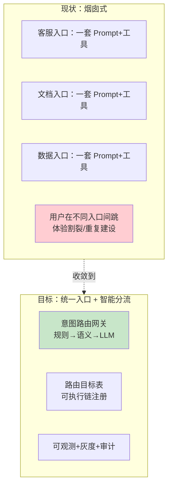
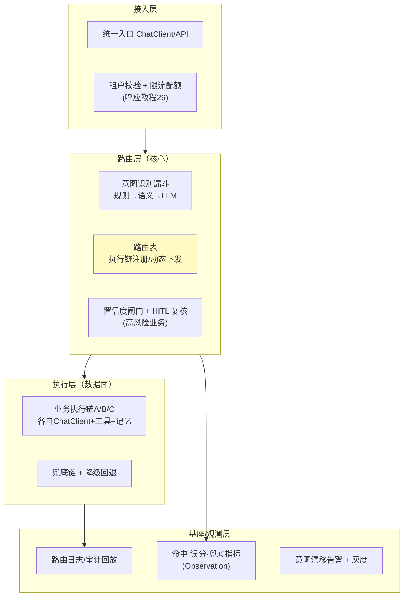

# 00-需求分析与架构设计：企业级 Agent 意图路由网关

> **定位**：第十旗舰·**入口路由视角**——第一性原理：**收敛入口、按意图分流**。一个集团把客服、文档问答、数据分析、审批、风控等多个业务线接进同一 Agent 平台时，**"一条大输入硬塞进一个大 Prompt"是反模式**（[教程 45-反模式](../../教程/88-Agent架构反模式与避坑指南.md)）；正确做法是一个**意图路由网关**：先识别用户要干什么（规则→语义→LLM 三层漏斗），再把请求分发给正确的执行链（专属 Prompt+工具集+记忆+模型+HITL 闸门）。本平台把这做成企业级基础设施：路由目标可执行链表、动态路由配置下发、按意图独立阈值、命中/误分/兜底可观测、意图漂移告警、路由灰度与秒级回滚、审计回放。读者画像：要回答"多业务线共用一个 Agent 入口时怎么架构"的架构师。前置阅读：[教程 93-意图路由与路由编排]、[教程 65-模型路由与降级]、[教程 29-管控分离架构]。
>
> **铁律 0**：Spring AI 2.0.0 **无官方 Router API**（全仓 `jar tf` + `grep -i router` 实证零命中）；语义路由基于已实证的 `EmbeddingModel#embed(String)`（javap 实证返回 `float[]`）自研；模型/业务分发用多 `ChatClient` + `@Qualifier`（教程 32 已实证模式）；路由引擎代码标注「概念代码」。

---

## ★ 阅读顺序总览（序号 = 阅读顺序）

> 本子文件夹 14 个文件（00-13）：

| 阶段 | 文件 | 读者定位 |
|------|------|---------|
| ① 全貌 | 00-需求分析与架构设计 | **先读**：意图路由四层架构 |
| ② 起步 | 01-最小Demo | **动手**：最小规则+语义路由 |
| ③ 主体迭代 | 02~07（语义路由/路由表/观测漂移/命中优化/灰度/兜底降级） | **严格顺序** |
| ④ 进阶 | 08~10（多级缓存/审计回放/策略下发） | **严格顺序** |
| ⑤ 讲解 | 11-核心代码讲解 | **回顾** |
| ⑥ 资产 | 12-ADR / 13-前沿 | **按需/收官** |

---

## 一、为什么要独立的意图路由网关

**三个核心论点**：

1. **入口收敛**：用户/业务方只面对一个入口，由网关按意图分流，而非每业务线一套割裂入口。
2. **执行链复用**（呼应 [教程 20-管控分离](../../教程/29-管控分离架构.md)：控制面统一做路由/策略，数据面每个业务线持有专属 Prompt/工具/记忆/模型/HITL——**路由是控制面能力，执行是数据面能力**。
3. **路由即资产**：路由日志（输入→意图→置信度→目标→产出）是可观测、可灰度、可审计的核心数据——呼应 [31-全链路可观测性](../../教程/31-全链路可观测性.md) / [23-审计](../../教程/32-工具执行可观测与审计.md)。

### 一.1 本节核对（为什么独立路由网关）

- [ ] 能不看正文说出三个核心论点（入口收敛/执行链复用/路由即资产），并指出"路由是控制面能力、执行是数据面能力"这句与 1 中 [教程 20 管控分离] 的对应
- [ ] 图中"烟囱式 vs 统一入口智能分流"的对比能复述，三个核心论点都在图里找到落点（G1/G2/G3）

## 二、总体架构（四层）

### 二.1 本节核对（总体架构四层）

- [ ] 四层（接入/路由/执行/基座观测）各自的 key 能力框能在图上指出（P1-P2 / R1-R3 / E1-E2 / O1-O3），且"路由层是核心"（R2 高亮）表述与上下文一致
- [ ] 图中 `l4 --> l3 --> l2` 的串行流向与"先识别意图再分发到执行链"的语义一致，观测层（O1/O2）为横切不回环

## 三、微服务清单与迭代路线

| 服务 | 职责 | 落地 |
|------|------|------|
| `route-gateway` | 意图识别 + 路由分发（核心） | 主体迭代 |
| `chain-order`/`chain-rag`/`chain-data`… | 各业务执行链（彼此独立） | 简化为一套示例链 |
| `route-config` | 路由表/阈值配置中心（动态下发） | 进阶 3 |
| `route-observability` | 路由指标/漂移告警/审计回放 | 主体 4 + 进阶 2 |

**迭代路线**（每迭代回答四问：新增需求/影响模块/架构演进/上个版本痛点）：

| # | 迭代 | 核心新增 | 痛点回应 |
|---|------|---------|---------|
| 01-最小Demo | 规则路由 + 单一语义路由 | — |
| 02 | 语义路由（EmbeddingModel） | 规则覆盖不全 |
| 03 | 路由表 + 执行链注册 | 硬编码分不清工作流 |
| 04 | 路由观测 + 意图漂移告警 | 路由好坏不可见 |
| 05 | 命中率优化 + 按意图阈值 | 误分/兜底失衡 |
| 06 | 路由灰度 + 秒级回滚 | 改路由怕出事故 |
| 07 | 兜底降级链 + HITL 闸门 | 误分直达高风险业务 |
| 进阶08 | 多级路由缓存 | 路由延迟引入入口 |
| 进阶09 | 审计回放 + 合规 | 高风险需可追溯 |
| 进阶10 | 路由策略动态下发（xDS 式） | 路由需快速变化 |

**量化验收**（呼应 CLAUDE.md 工业级指标）：语义路由命中率 ≥ 85%、误分率 ≤ 3%（抽样标注）；进入路由层的额外延迟 ≤ 10ms（规则）/ ≤ 30ms（语义）/ LLM 分类仅模糊地带触发；兜底率可观测并配基线告警；路由配置变更 P95 生效 ≤ 2s，可秒级回滚。

### 三.1 本节核对（微服务清单与迭代路线）

- [ ] 四个服务（route-gateway/chain-*/route-config/route-observability）的职责能一句话说到位，且与正文"主体迭代/进阶"落地栏对应，无清单外凭空服务
- [ ] 迭代路线表 01→02→…→进阶10 每行都带"痛点回应"，且第 00 页量化验收的指标（命中≥85%/误分≤3%/延迟≤30ms/P95≤2s）能被正文某迭代承载，无"提了但无篇目落地"的指标

---

## 四、与教程/附录的映射

| 本平台能力 | 教程 | 附录 |
|-----------|------|------|
| 语义路由原理 | [93-意图路由与路由编排](../../教程/93-意图路由与路由编排.md) | [20-路由表与语义路由](../../附录/17-路由与推理策略/00-路由表与语义路由.md) |
| 多模型分发 | [65-模型路由与降级](../../教程/65-模型路由与降级.md) | — |
| 管控分离/控制面 | [29-管控分离架构](../../教程/29-管控分离架构.md) | [07-ControlPlane设计模式](../../附录/06-企业级架构模式/00-ControlPlane设计模式.md) |
| 观测/审计 | [22/23](../../教程/31-全链路可观测性.md) | [教程 33-最小闭环：Agent各阶段输出打印到控制台](../../教程/33-最小闭环：Agent各阶段输出打印到控制台.md) |
| 灰度/回滚 | [62-灰度发布与版本管理](../../教程/62-灰度发布与版本管理.md) | — |
| HITL | [28-Human-in-the-Loop](../../教程/61-Human-in-the-Loop与审批流.md) | — |

> **铁律提醒**：本平台路由/观测引擎为**自研（概念代码）**；仅模型调用 `ChatClient`/`EmbeddingModel` 用已实证基准。任何新引入的 SDK 必须 `javap` 实证后方可写入正文。

### 四.1 本节核对（与教程/附录映射）

- [ ] 六行映射每一行的教程/附录篇目都能对上本平台能力主题（语义路由/多模型分发/管控分离/观测审计/灰度/HITL），无跨行错位
- [ ] "铁律 0"（自研「概念代码」、`ChatClient`/`EmbeddingModel` 已实证）能复述，且后续各迭代凡是涉及 Spring AI 处均沿用该铁律，抽查任一篇不违反即 PASS

## 五、全篇回归验证

> 需求架构篇以概念核对为主，全篇回归聚焦"正文承诺与后续迭代篇落地一致"。

| # | 操作 | 预期（PASS 判据） |
|---|------|------------------|
| 1 | 对照 §三 迭代路线表，正向读 01~13 各篇标题 | 每行迭代均有对应篇目，无"清单里有、文件里没有"的迭代 |
| 2 | 对照 §四 教程/附录映射，抽查任一映射在对应文档存在 | 篇目/章节引用存在且跳转可用，无悬空引用 |
| 3 | 对照量化验收指标，标注该指标在后续哪篇验证 | 命中率(05)/误分率(05)/延迟(08缓存)/兜底告警(04)/P95生效(10) 均有承载篇目 |

**回归失败排查**：①迭代表有但文件缺失→综述（00）与后续篇目录未对齐，回查 §三；②量化指标"提了无篇目"→该能力未在迭代真正落地，需补迭代或修正指标。
