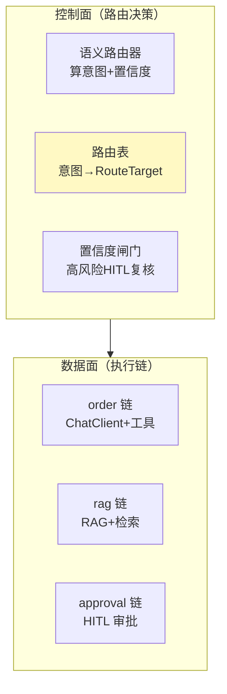

# 03-路由表与执行链注册

> **定位**：把路由目标从"硬编码 ChatClient"升级为**可声明的路由表**：每条路由绑定一条"可执行链"（ChatClient + 专属工具 + HITL 闸门），配置抽离为数据、可动态增改意图。核心转捩点：**路由目标 = 可执行链，而非裸模型**。前置阅读：[02-语义路由工程化](02-语义路由工程化.md)、[附录 20/00-路由表与语义路由](../../附录/20-路由与推理策略/00-路由表与语义路由.md)。
>
> **铁律 0**：执行链基于实证 `ChatClient.builder(model)`；路由目标/配置自研「概念代码」。

---

## 一、四问

| 问 | 答 |
|----|----|
| **新增了什么需求** | ①`RouteTable` 声明式注册（意图 → RouteTarget）②RouteTarget 封装 ChatClient+preGuard+requiresHitl+quota ③路由配置从接口可查 |
| **影响了哪些模块** | SemanticRouter → 拆出路由决策（router）与路由执行（dispatcher） |
| **架构如何演进** | 控制面（路由决策 + 路由表）与数据面（各执行链）开始分离 |
| **上一版痛点** | 路由目标硬编码 switch；加业务要改代码；无法声明式配置 |

**本迭代验收**：加一个新意图只需注册一条 RouteTarget（不改路由逻辑）；RouteTarget 独立声明；每意图可带独立 preGuard/quota。

### 一.1 本节核对（四问与迭代验收）

| # | 核对项 | 判据 |
|---|--------|------|
| 1 | 四问口径齐全 | 新增需求/影响模块（拆出 router 与 dispatcher）/架构演进（控数分离起始）/上一版痛点四行均有 |
| 2 | 本迭代验收可判定 | 加意图只注册 RouteTarget、RouteTarget 独立声明、每意图独立 preGuard/quota——三项可验证 |

## 二、路由表（配置与代码解耦的起点）

```java
// 概念代码：声明式路由目标
public record RouteTarget(
        String name,
        ChatClient chat,
        Predicate<String> preGuard,   // 前置校验，如"审批需带单号"
        boolean requiresHitl,         // 高风险强制人工复核
        String risk) {                // LOW / MEDIUM / HIGH（决定阈值与闸门）
}

// 路由表：构造注入各业务 ChatClient，注册成表
@Component
public class RouteTable {
    private final Map<RouteKey, RouteTarget> table = new EnumMap<>(RouteKey.class);

    public RouteTable(@Qualifier("orderChain") ChatClient order,
                      @Qualifier("ragChain")   ChatClient rag,
                      @Qualifier("dataChain")  ChatClient data,
                      @Qualifier("approvalWorkflow") ApprovalWorkflow approval) {
        table.put(ORDER,     new RouteTarget("order", order,
                     s -> s.matches(".*(订单|物流).*"), false, "LOW"));
        table.put(RAG,       new RouteTarget("rag", rag, s -> true, false, "LOW"));
        table.put(DATA,      new RouteTarget("data", data, s -> true, false, "MEDIUM"));
        table.put(APPROVAL,  new RouteTarget("approval", null,
                     s -> s.matches(".*\\d{6,}.*") /*需带单号*/, true, "HIGH"));
    }

    public RouteTarget resolve(RouteKey key) { return table.getOrDefault(key, FALLBACK); }
}
```

### 二.1 本节测试与验证（RouteTable 注册与解析）

**前置条件**：`RouteTable` 可编译；各业务 `ChatClient`（order/rag/data）与 `ApprovalWorkflow` 已装配；提供了 FALLBACK 目标。

**材料——解析核对**：

| 意图 | 预期 resolve 目标 | 说明 |
|------|------------------|------|
| `ORDER` | order（preGuard 含"订单/物流"，requiresHitl=false） | 低风险查询 |
| `RAG` | rag（preGuard 恒真，false） | 检索类 |
| `APPROVAL` | approval（requiresHitl=true，risk=HIGH，需带单号） | 高风险审批 |

**步骤与断言**：

| # | 操作 | 预期（PASS 判据） |
|---|------|------------------|
| 1 | `resolve(ORDER)` | 返回 order，preGuard 对"订单 x"匹配为 true |
| 2 | `resolve(APPROVAL)` | 返回 approval，`requiresHitl==true`，preGuard 对含 6 位以上数字串匹配 |
| 3 | `resolve(未知key)` | 回退 FALLBACK（`getOrDefault`） |

**失败排查**：①FALLBACK 缺失→`getOrDefault` 抛 NPE；②APPROVAL 未带单号仍放行→preGuard 正则 `\\d{6,}` 未命中；③新意图解析不到→未 `table.put`。

## 三、控制面/数据面分离



**呼应**：这正是 [教程 20-管控分离](../../教程/20-管控分离架构.md) 的路由侧落地——控制面统一策略、数据面异构执行。

### 三.1 本节核对（控制面/数据面分离）

- [ ] 能指出图中控制面（语义路由器/路由表/置信度闸门）与数据面（order/rag/approval 链）两组框的边界，与 [教程 20] 管控分离语义一致
- [ ] approval 链标为"数据面 HITL 审批"与 §二 RouteTarget 的 `requiresHitl=true` 不矛盾

## 四、全篇回归验证

| 能力 | 期望 |
|------|------|
| 新增意图 | 注册一条 RouteTarget + 补示例句，不改路由逻辑 |
| 高风险审批 | 强制 requiresHitl（进 HITL 闸门再放行） |
| 前置校验 | 审批意图无单号 → preGuard 拦截回退 |
| 路由表可查 | 运维接口可列出所有意图与目标 |

**回归断言**：

| # | 操作 | 预期（PASS 判据） |
|---|------|------------------|
| 1 | 新增一个意图并注册 RouteTarget | 路由逻辑未改，仅补示例句 + `table.put` 即生效（对照 §二.1 步骤 3 的 FALLBACK 命中） |
| 2 | 审批意图不带单号走 preGuard | 被拦截回退（对应上表"前置校验"期望） |
| 3 | 抽查运维查列接口 | 能列出所有意图与目标（对应上表"路由表可查"期望） |

**回归失败排查**：①加意图却改路由逻辑→未践行 RouteTarget 声明式，回看 §二；②审批无单号仍放行→preGuard 正则未生效，回查 §二.1 失败排查③；③接口查不到→表未注入或 FALLBACK 覆盖。

> **下一步**：路由表已数据化，但"路由到底准不准、兜底了多少"完全看不见 → 04 迭代加**路由观测 + 意图漂移告警**，让路由好坏有据可依。
