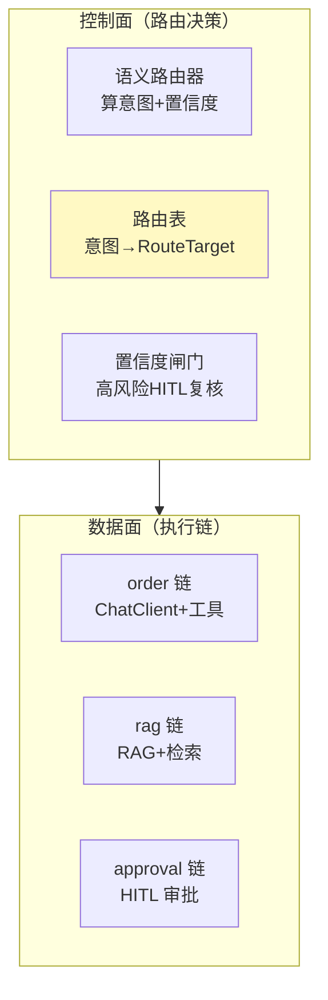

# 03-路由表与执行链注册

> **定位**：把路由目标从"硬编码 ChatClient"升级为**可声明的路由表**：每条路由绑定一条"可执行链"（ChatClient + 专属工具 + HITL 闸门），配置抽离为数据、可动态增改意图。核心转捩点：**路由目标 = 可执行链，而非裸模型**。前置阅读：[02-语义路由工程化](02-语义路由工程化.md)、[附录 20/00-路由表与语义路由](../../附录/20-路由与推理策略/00-路由表与语义路由.md)。
>
> **铁律 0**：执行链基于实证 `ChatClient.builder(model)`；路由目标/配置自研「概念代码」。

---

## 一、四问

| 问 | 答 |
|----|----|
| **新增了什么需求** | ①`RouteTable` 声明式注册（意图 → RouteTarget）②RouteTarget 封装 ChatClient+preGuard+requiresHitl+quota ③路由配置从接口可查 |
| **影响了哪些模块** | SemanticRouter → 拆出路由决策（router）与路由执行（dispatcher） |
| **架构如何演进** | 控制面（路由决策 + 路由表）与数据面（各执行链）开始分离 |
| **上一版痛点** | 路由目标硬编码 switch；加业务要改代码；无法声明式配置 |

**本迭代验收**：加一个新意图只需注册一条 RouteTarget（不改路由逻辑）；RouteTarget 独立声明；每意图可带独立 preGuard/quota。

## 二、路由表（配置与代码解耦的起点）

```java
// 概念代码：声明式路由目标
public record RouteTarget(
        String name,
        ChatClient chat,
        Predicate<String> preGuard,   // 前置校验，如"审批需带单号"
        boolean requiresHitl,         // 高风险强制人工复核
        String risk) {                // LOW / MEDIUM / HIGH（决定阈值与闸门）
}

// 路由表：构造注入各业务 ChatClient，注册成表
@Component
public class RouteTable {
    private final Map<RouteKey, RouteTarget> table = new EnumMap<>(RouteKey.class);

    public RouteTable(@Qualifier("orderChain") ChatClient order,
                      @Qualifier("ragChain")   ChatClient rag,
                      @Qualifier("dataChain")  ChatClient data,
                      @Qualifier("approvalWorkflow") ApprovalWorkflow approval) {
        table.put(ORDER,     new RouteTarget("order", order,
                     s -> s.matches(".*(订单|物流).*"), false, "LOW"));
        table.put(RAG,       new RouteTarget("rag", rag, s -> true, false, "LOW"));
        table.put(DATA,      new RouteTarget("data", data, s -> true, false, "MEDIUM"));
        table.put(APPROVAL,  new RouteTarget("approval", null,
                     s -> s.matches(".*\\d{6,}.*") /*需带单号*/, true, "HIGH"));
    }

    public RouteTarget resolve(RouteKey key) { return table.getOrDefault(key, FALLBACK); }
}
```

## 三、控制面/数据面分离



**呼应**：这正是 [教程 20-管控分离](../../教程/20-管控分离架构.md) 的路由侧落地——控制面统一策略、数据面异构执行。

## 四、验收

| 能力 | 期望 |
|------|------|
| 新增意图 | 注册一条 RouteTarget + 补示例句，不改路由逻辑 |
| 高风险审批 | 强制 requiresHitl（进 HITL 闸门再放行） |
| 前置校验 | 审批意图无单号 → preGuard 拦截回退 |
| 路由表可查 | 运维接口可列出所有意图与目标 |

> **下一步**：路由表已数据化，但"路由到底准不准、兜底了多少"完全看不见 → 04 迭代加**路由观测 + 意图漂移告警**，让路由好坏有据可依。
