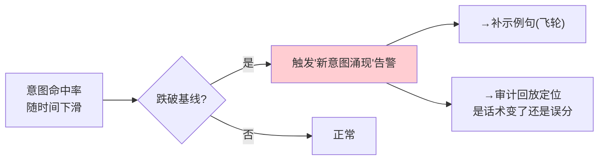

# 04-路由观测与意图漂移告警

> **定位**：让"路由到底准不准、兜底了多少"**第一次看得见**。用 Micrometer Observation（配 [附录 18-Observation](../../附录/18-Observation/00-Observation全景与核心概念.md)）给路由打点：命中维度（意图×命中/兜底/误分）、命中率/兜底率指标、意图漂移告警。核心转捩点：**路由从'拍脑袋'变成'有指标、可告警、可回放'**。前置阅读：[03-路由表与执行链注册](03-路由表与执行链注册.md)、[教程 22-全链路可观测性](../../教程/22-全链路可观测性.md)。
>
> **铁律 0**：Observation 打点基于真实 API（配附录 18 javap 实证）；路由指标/告警引擎自研「概念代码」。

---

## 一、四问

| 问 | 答 |
|----|----|
| **新增了什么需求** | ①路由 Observation 打点（intent×stage×outcome）②命中率/兜底率/误分率指标 ③意图漂移告警（命中率跌破基线）④路由日志落库（供 09 审计回放沉淀） |
| **影响了哪些模块** | SemanticRouter/RouteTable → 打点；新增 路由观测组件 + 漂移告警器 |
| **架构如何演进** | 增加"观测平面"——路由决策过程可被记录、聚合、告警 |
| **上一版痛点** | 路由改完不知道对不对；兜底率高不可见；误分没告警（高风险被误放行也不知道） |

**本迭代验收**：①每个意图出 3 个指标（处理量/命中率/兜底率）②意图漂移告警：某意图 24h 命中率跌破基线 15% → 触发 ③一次路由完整打点可回放到"输入→意图→置信度→目标"。

## 二、路由打点（Observation）

```java
// 概念代码：路由 Observation 打点（配附录18 的真实 API）
private final ObservationRegistry registry;

public RouteKey trackAndRoute(String input, RouteStage stage) {
    return Observation.createNotStarted("agent.intent.route", registry)
        .lowCardinalityKeyValue("intent.key", "")
        .lowCardinalityKeyValue("stage", stage.name())       // RULE/SEMANTIC/LLM
        .lowCardinalityKeyValue("outcome", "unknown")
        .observe(() -> {
            RouteKey key = route(input);
            // 命中计数：观察侧可读 intent/outcome 键聚合出命中率
            return key;
        });
}
```

**三条关键指标**（配 Grafana/Prometheus，呼应 [教程 22](../../教程/22-全链路可观测性.md)）：
- **命中率** = 落到明确意图的请求 / 总请求 —— 反映语义覆盖。
- **兜底率** = 落到 UNKNOWN / 总请求 —— 阈值是否过高、是否有新意图涌现。
- **误分率** = 抽样标注后落到错误意图的比例 —— 语义质量核心（需人工抽样，见 05 迭代）。

## 三、意图漂移告警



**目的是数据飞轮**：告警→补示例句→命中率回升（呼应 [41-数据飞轮与持续改进](../../教程/41-数据飞轮与持续改进.md)、[16-企业级Agent服务网格](../../项目/16-企业级Agent服务网格/00-需求分析与架构设计.md) 的遥测思想）。

## 四、路由日志（供 09 审计沉淀）

每次路由记：`requestId, timestamp, input_hash, intent, confidence, selected_route, outcome, latency_stage`。高风险意图（APPROVAL）**必须落全量明文**供事后审计（呼应 [25-历史记录持久化与合规](../../教程/25-历史记录持久化与合规.md)）。

## 五、验收

| 能力 | 期望 |
|------|------|
| 命中率指标 | Grafana 可见每意图命中率曲线 |
| 兜底率高 | 阈值告警，提示补示例句 |
| 意图漂移 | 命中率跌破基线 → 告警触发 |
| 单条回放 | 从日志还原一次完整路由决策 |

> **下一步**：观测让"路由好坏看得见"，但没让"路由变好"。05 迭代用**误分样本 + 按意图独立阈值 + 补示例句**把命中率真正调上去。
