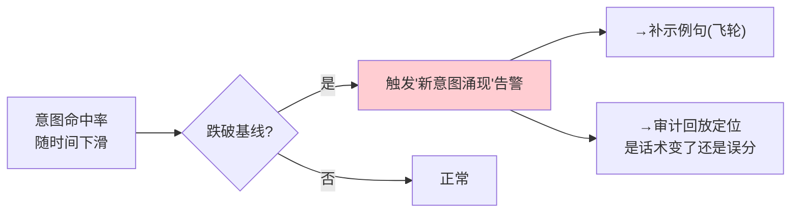

# 04-路由观测与意图漂移告警

> **定位**：让"路由到底准不准、兜底了多少"**第一次看得见**。用 Micrometer Observation（配 [教程 05-Observation可观测/00-最小闭环：Agent各阶段输出打印到控制台](../../教程/05-Observation可观测/00-最小闭环：Agent各阶段输出打印到控制台.md)）给路由打点：命中维度（意图×命中/兜底/误分）、命中率/兜底率指标、意图漂移告警。核心转捩点：**路由从'拍脑袋'变成'有指标、可告警、可回放'**。前置阅读：[03-路由表与执行链注册](03-路由表与执行链注册.md)、[教程 04-企业级架构主干/02-全链路可观测性](../../教程/04-企业级架构主干/02-全链路可观测性.md)。
>
> **铁律 0**：Observation 打点基于真实 API（配附录 18 javap 实证）；路由指标/告警引擎自研「概念代码」。

---

## 一、四问

| 问 | 答 |
|----|----|
| **新增了什么需求** | ①路由 Observation 打点（intent×stage×outcome）②命中率/兜底率/误分率指标 ③意图漂移告警（命中率跌破基线）④路由日志落库（供 09 审计回放沉淀） |
| **影响了哪些模块** | SemanticRouter/RouteTable → 打点；新增 路由观测组件 + 漂移告警器 |
| **架构如何演进** | 增加"观测平面"——路由决策过程可被记录、聚合、告警 |
| **上一版痛点** | 路由改完不知道对不对；兜底率高不可见；误分没告警（高风险被误放行也不知道） |

**本迭代验收**：①每个意图出 3 个指标（处理量/命中率/兜底率）②意图漂移告警：某意图 24h 命中率跌破基线 15% → 触发 ③一次路由完整打点可回放到"输入→意图→置信度→目标"。

### 一.1 本节核对（四问与迭代验收）

| # | 核对项 | 判据 |
|---|--------|------|
| 1 | 四问口径齐全 | 新增需求（打点/三指标/漂移告警/日志落库）/影响模块（打点+观测组件+告警器）/架构演进（增观测平面）/上一版痛点四行均有 |
| 2 | 本迭代验收可度量 | 每意图 3 指标、24h 跌破基线 15% 告警、可回放完整打点——三项可判定 |

## 二、路由打点（Observation）

```java
// 概念代码：路由 Observation 打点（配附录18 的真实 API）
private final ObservationRegistry registry;

public RouteKey trackAndRoute(String input, RouteStage stage) {
    return Observation.createNotStarted("agent.intent.route", registry)
        .lowCardinalityKeyValue("intent.key", "")
        .lowCardinalityKeyValue("stage", stage.name())       // RULE/SEMANTIC/LLM
        .lowCardinalityKeyValue("outcome", "unknown")
        .observe(() -> {
            RouteKey key = route(input);
            // 命中计数：观察侧可读 intent/outcome 键聚合出命中率
            return key;
        });
}
```

**三条关键指标**（配 Grafana/Prometheus，呼应 [教程 04-企业级架构主干/02-全链路可观测性](../../教程/04-企业级架构主干/02-全链路可观测性.md)）：
- **命中率** = 落到明确意图的请求 / 总请求 —— 反映语义覆盖。
- **兜底率** = 落到 UNKNOWN / 总请求 —— 阈值是否过高、是否有新意图涌现。
- **误分率** = 抽样标注后落到错误意图的比例 —— 语义质量核心（需人工抽样，见 05 迭代）。

### 二.1 本节测试与验证（路由 Observation 打点）

**前置条件**：`ObservationRegistry` 已注入；`agent.intent.route` 指标已登记；Prometheus/Grafana 已接入（Mesh 复用 [教程 04-企业级架构主干/02-全链路可观测性]）。

**材料——核对指标名**：

| 指标 | 聚合方式 | 意义 |
|------|---------|------|
| `agent.intent.route` 处理量 | count(intent.key) | 每个意图的请求量 |
| 命中率 | 明确意图 / 总请求 | 语义覆盖度 |
| 兜底率 | UNKNOWN / 总请求 | 阈值是否过高/新意图涌现 |

**步骤与断言**：

| # | 操作 | 预期（PASS 判据） |
|---|------|------------------|
| 1 | 触发若干路由（rule/semantic 各几次） | Grafana 可见 `agent.intent.route` 每意图计数递增，stage/outcome 标签正确 |
| 2 | 构造一次 UNKNOWN 兜底 | 兜底率指标可见上升（UNKNOWN 计入） |
| 3 | 抽查单条打点 | 能从日志还原"输入→意图→置信度→目标"（lowCardinality 键 intent/stage/outcome） |

**失败排查**：①Grafana 无数据→registry/publisher 未接 Prometheus；②标签缺失→`lowCardinalityKeyValue` 未在 observe 前设置；③兜底未计数→outcome 默认值与 UNKNOWN 判定不一致。

### 二.2 标准 Handler 形态（每类 Context 一个泛型 @Bean）

打点要在控制台"看得见"，配 [教程 05-Observation可观测/00-最小闭环：Agent各阶段输出打印到控制台](../../教程/05-Observation可观测/00-最小闭环：Agent各阶段输出打印到控制台.md) 的 demo01 标准形态：`@Configuration @Slf4j` 收拢，**每类 Context 一个 `ObservationHandler<具体Context>` 泛型 @Bean**，`supportsContext` 用 instanceof 判型（回调里的 `context` 无需强转），日志中文 `log.info`。网关涉及三类 Context：路由决策（自定义）、语义向量化（EmbeddingModel）、分发后执行链的模型调用（ChatModel）——以下 getter 均已 javap 实证（本地 2.0.0 jar / micrometer-observation）：

```java
// Spring Boot 4.1 / Spring AI 2.0.0 —— 路由观测标准 Handler
package com.example.route.observation;

import io.micrometer.observation.Observation;
import io.micrometer.observation.ObservationHandler;
import lombok.extern.slf4j.Slf4j;
import org.springframework.ai.chat.observation.ChatModelObservationContext;
import org.springframework.ai.embedding.observation.EmbeddingModelObservationContext;
import org.springframework.context.annotation.Bean;
import org.springframework.context.annotation.Configuration;
import org.springframework.util.ObjectUtils;

/** 路由观测：每类 Context 一个类型化 Handler Bean（demo01 代码习惯）。 */
@Configuration
@Slf4j
public class RouteObservationHandlers {

    /** ① 路由决策：每个请求恰好一个观测（自定义 Context） */
    @Bean
    public ObservationHandler<RouteObservationContext> routeHandler() {
        return new ObservationHandler<>() {
            @Override
            public boolean supportsContext(Observation.Context context) {
                return context instanceof RouteObservationContext;
            }

            @Override
            public void onStart(RouteObservationContext context) {
                log.info("开始路由，输入长度：{}，起始阶段：{}", context.getInputLength(), context.getStage());
            }

            @Override
            public void onStop(RouteObservationContext context) {
                log.info("路由结束，意图：{}，命中阶段：{}，结果：{}",
                        context.getIntent(), context.getStage(), context.getOutcome());
            }
        };
    }

    /** ② 语义路由向量化：语义兜底每次 embed 一个观测 */
    @Bean
    public ObservationHandler<EmbeddingModelObservationContext> embeddingHandler() {
        return new ObservationHandler<>() {
            @Override
            public boolean supportsContext(Observation.Context context) {
                return context instanceof EmbeddingModelObservationContext;
            }

            @Override
            public void onStart(EmbeddingModelObservationContext context) {
                log.info("语义路由开始向量化，输入条数：{}", context.getRequest().getInstructions().size());
            }

            @Override
            public void onStop(EmbeddingModelObservationContext context) {
                // 响应侧信息 stop 前才写入，取值前判空
                if (!ObjectUtils.isEmpty(context.getResponse())
                        && !ObjectUtils.isEmpty(context.getResponse().getResults())) {
                    log.info("语义路由向量化完成，返回向量条数：{}，维度：{}",
                            context.getResponse().getResults().size(),
                            context.getResponse().getResults().get(0).getOutput().length);
                }
            }
        };
    }

    /** ③ 分发后的模型调用：路由到哪条执行链，就看得到哪条链的 LLM 往返 */
    @Bean
    public ObservationHandler<ChatModelObservationContext> chatModelHandler() {
        return new ObservationHandler<>() {
            @Override
            public boolean supportsContext(Observation.Context context) {
                return context instanceof ChatModelObservationContext;
            }

            @Override
            public void onStart(ChatModelObservationContext context) {
                log.info("路由分发后开始调用模型，用户输入：{}", context.getRequest().getUserMessage().getText());
            }

            @Override
            public void onStop(ChatModelObservationContext context) {
                if (!ObjectUtils.isEmpty(context.getResponse())
                        && !ObjectUtils.isEmpty(context.getResponse().getResult())) {
                    log.info("路由分发后的模型响应：{}", context.getResponse().getResult().getOutput().getText());
                }
            }
        };
    }
}
```

自定义路由 Context 只需继承 `Observation.Context` 挂业务字段（概念代码）：

```java
package com.example.route.observation;

import io.micrometer.observation.Observation;
import lombok.Data;

/** 概念代码：路由观测 Context——intent/stage/outcome 供 Handler 强类型取值 */
@Data
public class RouteObservationContext extends Observation.Context {
    private int inputLength;
    private String intent = "";
    private String stage = "";     // RULE / SEMANTIC / LLM / FALLBACK
    private String outcome = "";   // HIT / FALLBACK / MISROUTE
}
```

打点侧把 §二 的 `createNotStarted(name, registry)` 换成**三参版**（`Observation.createNotStarted(String, Supplier<T>, ObservationRegistry)`，javap 实证 micrometer-observation 真实存在），传入 `RouteObservationContext::new`，Handler 即可强类型读到字段：

```java
Observation.createNotStarted("agent.intent.route", RouteObservationContext::new, registry)
    .lowCardinalityKeyValue("stage", stage.name())
    .observe(() -> { /* 同 §二：路由判定并回写 intent/outcome */ });
```

> **为什么 `supportsContext` 仍要 instanceof**：Spring 把**所有** `ObservationHandler` Bean 注册进同一个 `ObservationRegistry`——泛型 `T` 决定回调拿到的类型，`supportsContext` 决定"这个观测归不归我管"。泛型写具体 Context + instanceof 判型，一个 Bean 管一类 Context，是"观测谁"与"怎么打日志"内聚的最小结构。

## 三、意图漂移告警



**目的是数据飞轮**：告警→补示例句→命中率回升（呼应 [84-数据飞轮与持续改进](../../教程/08-架构师进阶/07-数据飞轮与持续改进.md)、[16-企业级Agent服务网格](../../项目/16-企业级Agent服务网格/00-需求分析与架构设计.md) 的遥测思想）。

### 三.1 本节核对（意图漂移告警）

- [ ] "告警→补示例句→命中率回升"飞轮闭环能复述，且与正文验收"24h 跌破基线 15% 触发"口径一致
- [ ] 图中"新意图涌现"告警归因到"话术变了 vs 误分"两条出路能指出（审计回放定位）

## 四、路由日志（供 09 审计沉淀）

每次路由记：`requestId, timestamp, input_hash, intent, confidence, selected_route, outcome, latency_stage`。高风险意图（APPROVAL）**必须落全量明文**供事后审计（呼应 [58-历史记录持久化与合规](../../教程/04-企业级架构主干/05-历史记录持久化与合规.md)）。

### 四.1 本节核对（路由日志）

- [ ] 九个日志字段（requestId/timestamp/input_hash/intent/confidence/selected_route/outcome/latency_stage）能说不缺，且与 09 审计回放的还原链自洽
- [ ] "高风险 APPROVAL 必须落全量明文"这一合规点被强调，与 [25 历史记录持久化] 口径一致

## 五、全篇回归验证

| 能力 | 期望 |
|------|------|
| 命中率指标 | Grafana 可见每意图命中率曲线 |
| 兜底率高 | 阈值告警，提示补示例句 |
| 意图漂移 | 命中率跌破基线 → 告警触发 |
| 单条回放 | 从日志还原一次完整路由决策 |

**回归断言**：

| # | 操作 | 预期（PASS 判据） |
|---|------|------------------|
| 1 | 统计本轮路由的命中率/兜底率 | 每意图 3 指标（处理量/命中率/兜底率）在 Grafana 均可查（对应上表前两行） |
| 2 | 人为制造命中率跌破基线 15% 场景 | 意图漂移告警触发（对应上表第三行） |
| 3 | 抽一条 APPROVAL 请求 | 路由日志含全量明文（非 hash），可从日志还原一次完整路由决策（对应上表"单条回放"） |

**回归失败排查**：①指标查不到→打点未落 registry 或 Grafana 数据源未接（回 §二.1）；②告警未触发→基线/阈值配置未生效；③APPROVAL 无明文留痕→四.1 合规点未落地，回查日志字段。

> **下一步**：观测让"路由好坏看得见"，但没让"路由变好"。05 迭代用**误分样本 + 按意图独立阈值 + 补示例句**把命中率真正调上去。

## 六、验收对照

| 验收项 | 标准 | 状态 |
|--------|------|------|
| 每意图三指标 | 处理量/命中率/兜底率可查 | ✅（§二.1 断言 1，§五 回归断言 1） |
| 兜底率可观测并配基线告警 | UNKNOWN 计入 + 阈值告警（00 量化验收拆解） | ✅（§二.1 断言 2、§三.1） |
| 意图漂移告警 | 24h 命中率跌破基线 15% 触发 | ✅（§五 回归断言 2） |
| 单条路由可回放 | 输入→意图→置信度→目标 全链还原 | ✅（§二.1 断言 3、§五 回归断言 3） |
| Handler 标准形态 | 三类 Context 各一个泛型 @Bean，instanceof 判型 | ✅（§二.2） |

> 本节核对（一句话）：验收项拆自 [00-需求分析与架构设计](00-需求分析与架构设计.md) §三 量化验收（兜底率可观测+基线告警）与本篇 §一 本迭代验收三项，逐条锚定 §二.1/§二.2 测验与 §五 回归断言编号，无"验收了但没验证"项即 PASS。
