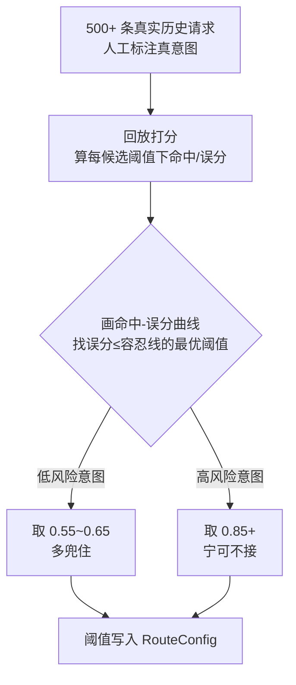

# 05-命中率优化与按意图阈值

> **定位**：在"路由好坏看得见"（04）基础上，把命中率真正调上去。两条杠杆：**① 按意图独立阈值**（高风险低误分、低风险多兜住）② **误分样本回放标定**（带标注语料跑命中-误分曲线取甜点）。核心洞察：**阈值不是全局一个，而是按风险分档、每个意图独立**。前置阅读：[04-路由观测与意图漂移告警](04-路由观测与意图漂移告警.md)、[附录 20/00-路由表与语义路由](../../附录/20-路由与推理策略/00-路由表与语义路由.md)。
>
> **铁律 0**：阈值标定用打分表 + 语料回放（确定性）；不引入未实证 API。

---

## 一、四问

| 问 | 答 |
|----|----|
| **新增了什么需求** | ①RouteConfig 支持每意图独立阈值 ②风险分档（HIGH/MEDIUM/LOW）联动阈值 ③带标注语料回放，打印命中-误分曲线取甜点 |
| **影响了哪些模块** | SemanticRouter（用 per-intent 阈值）；RouteConfig（阈值数据化）；新增 误分样本标注库 |
| **架构如何演进** | 路由参数从"拍脑袋常量"演进为"按意图可配置 + 数据标定" |
| **上一版痛点** | 全平台一个阈值 0.6；低风险意图接不住、高风险意图误放行 |

**本迭代验收**：①高风险意图（APPROVAL）阈值 0.85、低风险（RAG）阈值 0.6 可独立配 ②用 500 条标注语料回放，画出阈值-命中/误分曲线 ③误分率 ≤ 3%（高风险意图 ≤ 1%）。

### 一.1 本节核对（四问与迭代验收）

| # | 核对项 | 判据 |
|---|--------|------|
| 1 | 四问口径齐全 | 新增需求（独立阈值/风险分档/语料回放）/影响模块（SemanticRouter+RouteConfig+标注库）/架构演进/上一版痛点四行均有 |
| 2 | 本迭代验收可度量 | APPROVAL 0.85 独立配、500 条回放出曲线、误分率≤3%（高风险≤1%）——三项可判定 |

## 二、按意图独立阈值

```java
// 概念代码：风险分档 → 每意图独立阈值
public record IntentThreshold(RouteKey intent, double threshold, String risk) {}

@Component
public class RouteConfig {
    public double intentThreshold(RouteKey key) {
        // 高风险业务：宁可兜底到 HITL，不可误放行 → 高阈值
        // 低风险业务：多兜住，可接受略高误分 → 低阈值
        return switch (key) {
            case APPROVAL -> 0.85;   // 支付/审批，强制高门槛
            case DATA     -> 0.75;   // 数据分析，中门槛
            case RAG, ORDER -> 0.60; // 低风险查询，低门槛多兜住
            default      -> 0.0;     // UNKNOWN
        };
    }
}
```

**为什么按意图**：不同业务的误分代价差一个数量级——"把我闲聊天路由进支付工具"和"把搜文档路由进客服"完全不可同日而语。误分代价高 → 阈值宁高勿错；代价低 → 阈值宁低多接（呼应 [26-多租户隔离与资源治理](../../教程/26-多租户隔离与资源治理.md) 的分级思想）。

### 二.1 本节测试与验证（按意图独立阈值）

**前置条件**：`RouteConfig.intentThreshold(key)` 已实现；`SemanticRouter` 已改用 per-intent 阈值。

**材料——阈值核对**：

| 意图 | 预期阈值 | 误分容忍 |
|------|---------|---------|
| APPROVAL | 0.85（高风险宁高勿错） | 严 |
| DATA | 0.75（中门槛） | 中 |
| RAG / ORDER | 0.60（低风险多兜住） | 松 |

**步骤与断言**：

| # | 操作 | 预期（PASS 判据） |
|---|------|------------------|
| 1 | 提问"帮我审批 X 报销"，语义分数落在 0.6~0.85 | 未达 APPROVAL 阈值(0.85) → 不入审批，兑现"高风险宁可不接" |
| 2 | 问"搜某制度文档"，分数落到 0.5~0.6 | 达 RAG 阈值(0.6) → 兜住（低风险多接） |
| 3 | 核对 `intentThreshold` 返回 | APPROVAL=0.85 / DATA=0.75 / RAG+ORDER=0.6 / 默认=0.0 |

**失败排查**：①审批阈值未生效→`SemanticRouter` 仍用全局阈值而非读 `RouteConfig`；②RAG 兜不住→阈值写反或 switch 未匹配；③低分仍进审批→`case APPROVAL` 常量未对齐。

## 三、带标注语料回放（取阈值甜点）



**要点**：这是 ROC/PR 思路在意图路由上的应用（呼应 [附录 12/03-在线实验与AB统计](../../附录/12-评估与可观测生态/03-在线实验与AB统计.md)）。标注语料本身是 09 审计与 13 前沿的沉淀资产。

### 三.1 本节核对（带标注语料回放）

- [ ] "500+ 条标注 → 回放打分 → 命中-误分曲线 → 取误分≤容忍线的最优阈值"流程能复述，低风险取低阈值、高风险取高阈值口径与 §二 一致
- [ ] 与正文验收"用 500 条标注语料回放、画出阈值-命中/误分曲线"一致，无提了不做

## 四、误分样本回流（飞轮）

04 的意图漂移告警 + 抽样标注出的误分样本，**人工修正后回流成新示例句或新意图**——这是路由侧数据飞轮的日常循环（呼应 [41-数据飞轮与持续改进](../../教程/41-数据飞轮与持续改进.md)）。

### 四.1 本节核对（误分样本回流）

- [ ] "告警/抽样 → 误分样本 → 人工修正 → 回流新示例句/新意图"闭环能复述，与 04 漂移告警衔接无断裂
- [ ] 回流方向明确（补示例句或新增意图二选一），不是笼统"改进"

## 五、全篇回归验证

| 测试 | 期望 |
|------|------|
| "帮我审批 X 报销" | APPROVAL 阈值 0.85，置信度不足 → 兜底 HITL |
| "搜某制度文档" | RAG 阈值 0.6，多兜住 |
| 500 条回放 | 命中-误分曲线可出，误分率达标 |
| 误分样本 | 人工修正后可回流补示例句 |

**回归断言**：

| # | 操作 | 预期（PASS 判据） |
|---|------|------------------|
| 1 | 重跑上方四测试 | 四行期望均达成 |
| 2 | 用 500 条标注语料回放全部意图 | 命中-误分曲线可出，全局误分率 ≤3%、高风险意图 ≤1%（对应正文 05 验收 ③） |
| 3 | 取 1 条误分样本人工修正 | 回流后补成示例句，再路由该输入命中率回升（飞轮闭环） |

**回归失败排查**：①误分率超标→阈值甜点未落到 RouteConfig，回 §二/§三；②回放曲线出不来→语料标注缺失或打分未持久化；③回流不生效→新示例句未进 `intentExamples` 或未重算向量缓存。

> **下一步**：阈值已调准，但只在当前版本生效。改路由（阈值/示例句/新意图）怕出事故 → 06 迭代加**灰度 + 秒级回滚**，让调参可以安全上线。
